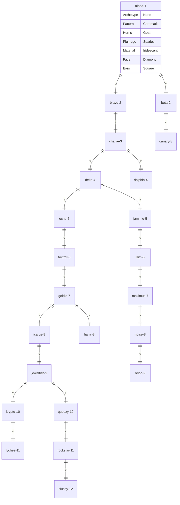

```mermaid
classDiagram

class alpha-1 {
    Archetype None
    Pattern Chromatic
    Horns Goat
    Plumage Spades
    Material Iridescent
    Face Diamond
    Ears Square
    Archetype None()
}
``````