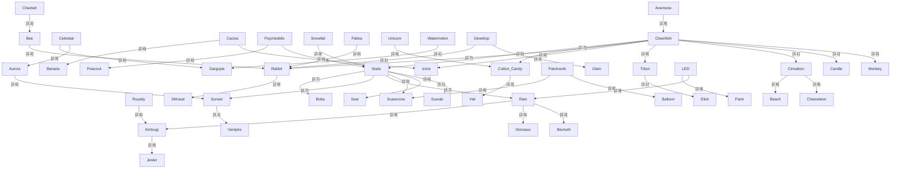

# Peridot Family Tree

```mermaid
flowchart

Clownfish--[2.5]-->Static
Celestial--[2.6]-->Gargoyle
Royalty--[2.6]-->Kintsugi
Cactus--[2.6]-->Banana
Psychedelic--[2.6]-->Peacock
Aurora--[2.6]-->Sunset
Static--[2.7]-->Boba
Static--[2.7]-->Sunset
Clownfish--[2.7]-->Cotton_Candy
Static--[2.7]-->Ram
Clownfish--[2.7]-->Rabbit
Cinnabon--[2.8]-->Beach
Patchwork--[2.8]-->Scarecrow
Patchwork--[2.8]-->Balloon
Cinnabon--[2.8]-->Chameleon
Celestial--[2.9]-->Aurora
Clownfish--[2.9]-->Icicle
Clownfish--[2.9]-->Triton
Snowfall--[2.9]-->Static
LED--[2.9]-->Paint
LED--[2.9]-->Ram
Cactus--[2.9]-->Icicle
Static--[2.9]-->Scarecrow
Psychedelic--[2.9]-->Static
Anemone--[2.9]-->Clownfish
Rabbit--[2.9]-->24Karat
Patina--[2.9]-->Rabbit
Ram--[2.9]-->Kintsugi
Ram--[2.9]-->Dinosaur
Kintsugi--[2.9]-->Jester
Unicorn--[2.9]-->Cotton_Candy
Clownfish--[3.1]-->Cinnabon
Watermelon--[3.1]-->Gargoyle
Dewdrop--[3.1]-->Rabbit
Clownfish--[3.1]-->Candle
Static--[3.1]-->Seal
Sunset--[3.1]-->Vampire
Triton--[3.1]-->Elixir
Cotton_Candy--[3.3]-->Yeti
Clownfish--[3.3]-->Monkey
Bee--[3.3]-->Rabbit
Dewdrop--[3.3]-->Glam
Cheetah--[3.3]-->Bee
Ram--[3.3]-->Bismuth
Static--[3.6]-->Scarab
```

