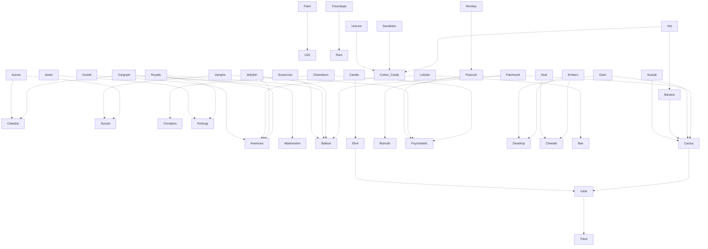

# Peridot Archetype MST Tree

```mermaid
flowchart

Gargoyle -...-> Celestial
Gargoyle -....-> Anemone
Gargoyle -....-> Watermelon
Patchwork -....-> Balloon
Patchwork -....-> Cactus
Patchwork -....-> Bismuth
Cactus -....-> Icicle
Icicle -....-> Triton
Aurora -...-> Celestial
Aurora -...-> Sunset
Chameleon -...-> Cinnabon
Chameleon -....-> Psychedelic
Embers -....-> Dewdrop
Embers -....-> Cheetah
Glam -....-> Cactus
Glam -....-> Dewdrop
Jellyfish -....-> Anemone
Jellyfish -....-> Balloon
Lobster -....-> Anemone
Lobster -....-> Bee
Royalty -...-> Kintsugi
Royalty -....-> Balloon
Vampire -...-> Sunset
Vampire -....-> Psychedelic
Yeti -...-> Cotton_Candy
Yeti -....-> Banana
Banana -...-> Cactus
Axolotl -....-> Anemone
Candle -....-> Elixir
Elixir -....-> Icicle
Dandelion -...-> Cotton_Candy
Jester -...-> Kintsugi
Monkey -....-> Peacock
Peacock -....-> Psychedelic
Paint -...-> LED
Scarab -....-> Cactus
Scarecrow -....-> Balloon
Seal -....-> Cheetah
Triceratops -...-> Ram
Unicorn -...-> Cotton_Candy
```

