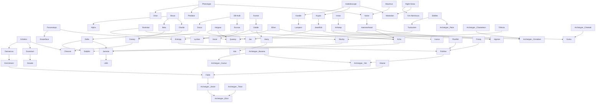

# Peridot Archetype MST Tree

```mermaid
flowchart

Phenotype --> Orion
Echelon --> Damascus
Farceratops --> Grazerface
Echelon --> Duranium
Echelon --> Chevron
Bravo --> Alpha
Rockstar --> Queezy
Kandle --> Lampent
Delta --> Dolphin
Goldie --> Goral
Dill-Hulk --> Draco
Foxtrot --> Goldie
Phenotype --> Predator
Kalypso --> Jax
Jewelfish --> Jax
Jewelfish --> Icarus
Kaleidoscope --> Kandle
Beta --> Canary
Draco --> Canary
Enrichment --> Fable
Ether --> Entropy
Kaleidoscope --> Krypto
Imhotep --> Hypnos
Instar --> Imhotep
Hammerhead --> Guina
Charlie --> Delta
Delta --> Jammie
Goldie --> Echo
Fishline --> Archetype:_Yeti
Echo --> Jammie
Krypto --> Jewelfish
Bravo --> Beta
Bravo --> Charlie
Maximus --> Noise
Goldie --> Harry
Dill-Hulk --> Escrow
Duranium --> Dorado
Kaleidoscope --> Mastodon
Turducken --> Queezy
Kalypso --> Queezy
Night-Snow --> Om-Nominous
Damascus --> Enrichment
Floofish --> Fishline
Skittles --> Turducken
Frosty --> Fishline
Farceratops --> Entropy
Rockstar --> Slushy
Jammie --> Lilith
Entropy --> Fishline
Canary --> Chevron
Archetype:_Banana --> Archetype:_Cactus
Slushy --> Dolphin
Noise --> Hammerhead
Hammerhead --> Echo
Ether --> Echo
Harry --> Isla
Phenotype --> Noise
Hammerhead --> Hypnos
Escrow --> Lychee
Glacier --> Fable
Skittles --> Archetype:_Paint
Night-Snow --> Mastodon
Archetype:_Chameleon --> Archetype:_Cinnabon
Archetype:_Banana --> Archetype:_Yeti
Archetype:_Jester --> Archetype:_Elixir
Archetype:_Triton --> Archetype:_Elixir
Trifecta --> Slushy
Archetype:_Cheetah --> Guina
Imhotep --> Archetype:_Cinnabon
Fable --> Archetype:_Jester
```

