# Peridot with Multi Archetype

## Archetypes: Anemone, Clownfish, Rabbit, Count: 3
### Compatibility Table:
|Name|Ear|Face|Horn|Material|Pattern|Plumage|Tail|
|:--|:--|:--|:--|:--|:--|:--|:--|
|Anemone|||Demon|Slimy||Tentacles||
|Clownfish|||||Tropical Fish|||
|Rabbit|Rabbit||||||Rabbit|

### Example(s):
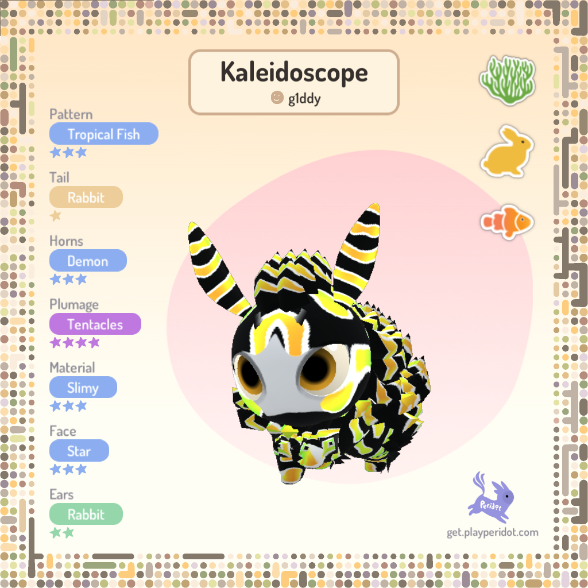

## Archetypes: Balloon, Rabbit, Static, Count: 3
### Compatibility Table:
|Name|Ear|Face|Horn|Material|Pattern|Plumage|Tail|
|:--|:--|:--|:--|:--|:--|:--|:--|
|Balloon|||Stacked||Patchwork|Tutu||
|Rabbit|Rabbit||||||Rabbit|
|Static||||Static||||

### Example(s):
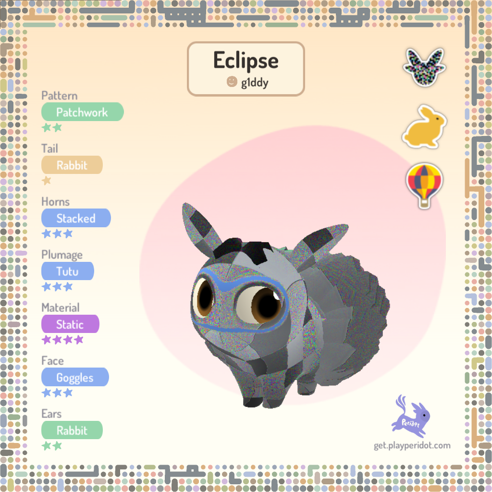

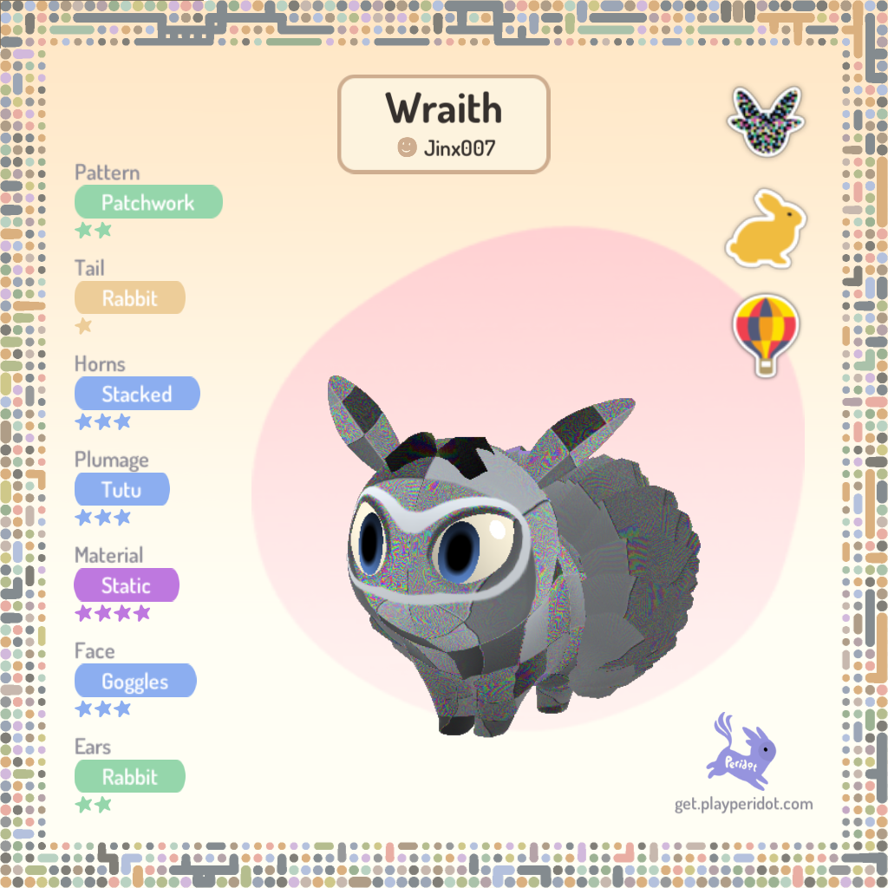

## Archetypes: Boba, Rabbit, Static, Count: 3
### Compatibility Table:
|Name|Ear|Face|Horn|Material|Pattern|Plumage|Tail|
|:--|:--|:--|:--|:--|:--|:--|:--|
|Boba|||Straw||Bubbles|||
|Rabbit|Rabbit||||||Rabbit|
|Static||||Static||||

### Example(s):
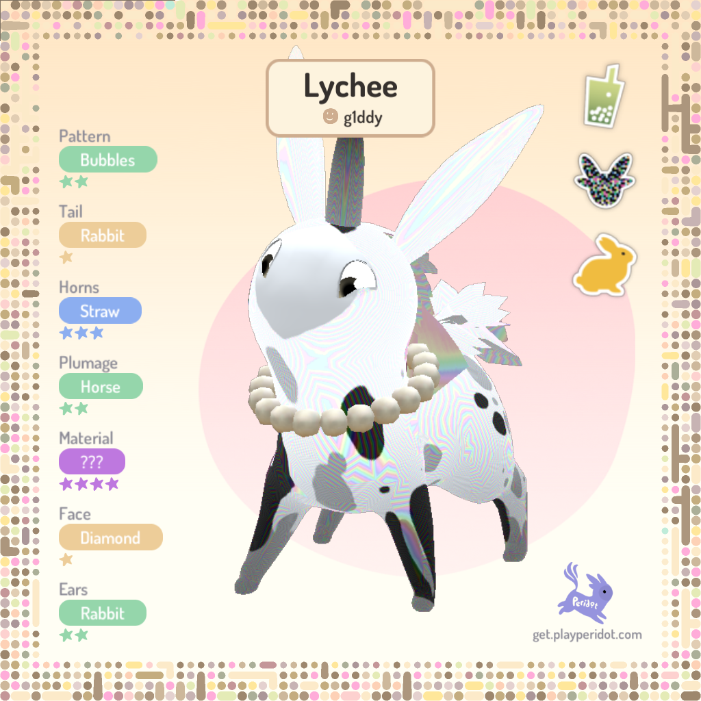

## Archetypes: Cinnabon, Clownfish, Static, Count: 3
### Compatibility Table:
|Name|Ear|Face|Horn|Material|Pattern|Plumage|Tail|
|:--|:--|:--|:--|:--|:--|:--|:--|
|Cinnabon|Mouse|Fangs|Buns||||Shell|
|Clownfish|||||Tropical Fish|||
|Static||||Static||||

## Archetypes: Clownfish, Cotton Candy, Dandelion, Count: 3
### Compatibility Table:
|Name|Ear|Face|Horn|Material|Pattern|Plumage|Tail|
|:--|:--|:--|:--|:--|:--|:--|:--|
|Clownfish|||||Tropical Fish|||
|Cotton Candy|||Narwhal|Furry||||
|Dandelion||||Furry||Dandelion|Dandelion|

## Archetypes: Clownfish, Cotton Candy, Rabbit, Count: 3
### Compatibility Table:
|Name|Ear|Face|Horn|Material|Pattern|Plumage|Tail|
|:--|:--|:--|:--|:--|:--|:--|:--|
|Clownfish|||||Tropical Fish|||
|Cotton Candy|||Narwhal|Furry||||
|Rabbit|Rabbit||||||Rabbit|

## Archetypes: Clownfish, Icicle, Rabbit, Count: 3
### Compatibility Table:
|Name|Ear|Face|Horn|Material|Pattern|Plumage|Tail|
|:--|:--|:--|:--|:--|:--|:--|:--|
|Clownfish|||||Tropical Fish|||
|Icicle|||Crown|Glimmer||Thorns||
|Rabbit|Rabbit||||||Rabbit|

## Archetypes: Clownfish, Peacock, Static, Count: 3
### Compatibility Table:
|Name|Ear|Face|Horn|Material|Pattern|Plumage|Tail|
|:--|:--|:--|:--|:--|:--|:--|:--|
|Clownfish|||||Tropical Fish|||
|Peacock|||None|||Spades|Peacock|
|Static||||Static||||

## Archetypes: Clownfish, Rabbit, Royalty, Count: 3
### Compatibility Table:
|Name|Ear|Face|Horn|Material|Pattern|Plumage|Tail|
|:--|:--|:--|:--|:--|:--|:--|:--|
|Clownfish|||||Tropical Fish|||
|Rabbit|Rabbit||||||Rabbit|
|Royalty||Countess|Crown|Ore||Tutu||

## Archetypes: Clownfish, Rabbit, Static, Count: 3
### Compatibility Table:
|Name|Ear|Face|Horn|Material|Pattern|Plumage|Tail|
|:--|:--|:--|:--|:--|:--|:--|:--|
|Clownfish|||||Tropical Fish|||
|Rabbit|Rabbit||||||Rabbit|
|Static||||Static||||

### Example(s):
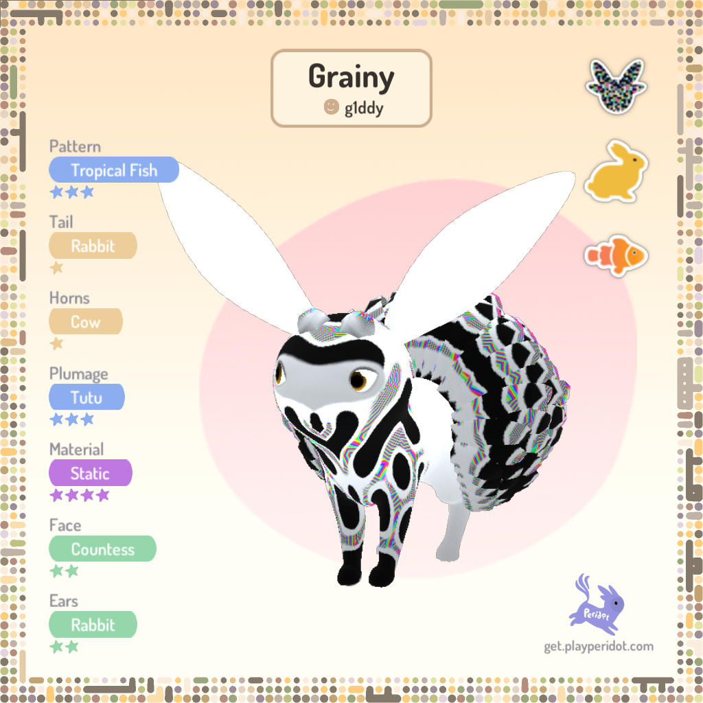

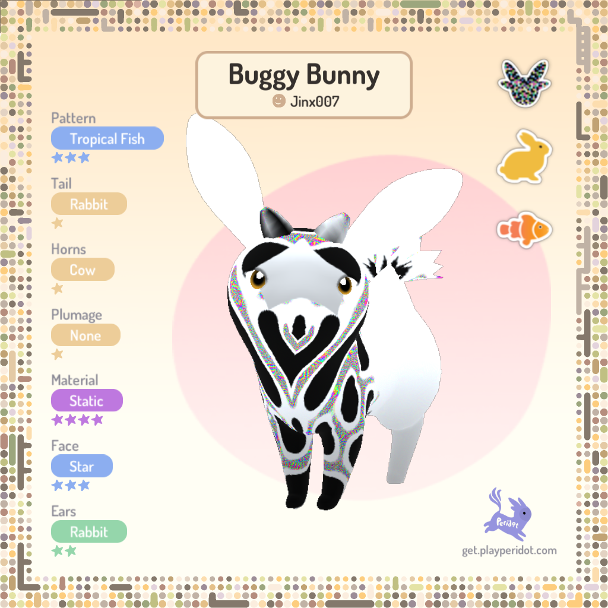

## Archetypes: Clownfish, Ram, Static, Count: 3
### Compatibility Table:
|Name|Ear|Face|Horn|Material|Pattern|Plumage|Tail|
|:--|:--|:--|:--|:--|:--|:--|:--|
|Clownfish|||||Tropical Fish|||
|Ram|||Ram||||Asparagus|
|Static||||Static||||

### Example(s):
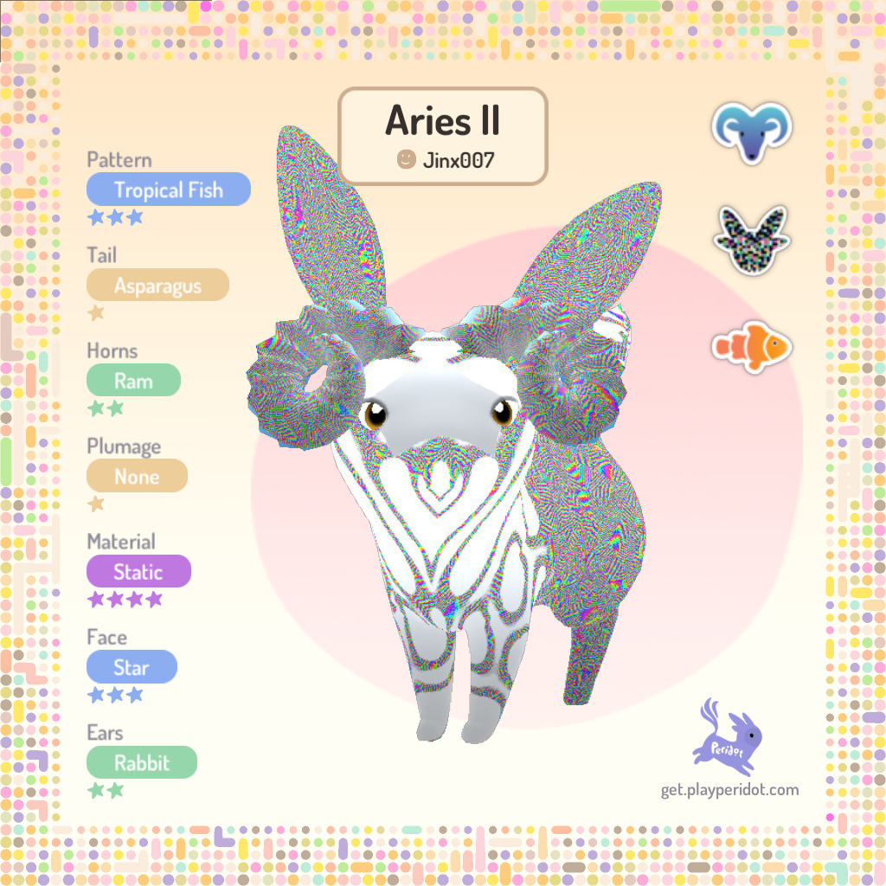

## Archetypes: Kintsugi, Rabbit, Royalty, Count: 3
### Compatibility Table:
|Name|Ear|Face|Horn|Material|Pattern|Plumage|Tail|
|:--|:--|:--|:--|:--|:--|:--|:--|
|Kintsugi||||Ore|Cracked|||
|Rabbit|Rabbit||||||Rabbit|
|Royalty||Countess|Crown|Ore||Tutu||

### Example(s):
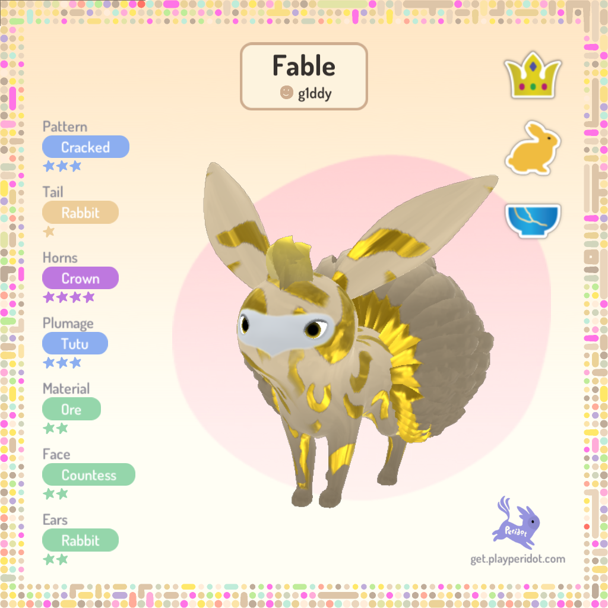

## Archetypes: Peacock, Psychedelic, Static, Count: 3
### Compatibility Table:
|Name|Ear|Face|Horn|Material|Pattern|Plumage|Tail|
|:--|:--|:--|:--|:--|:--|:--|:--|
|Peacock|||None|||Spades|Peacock|
|Psychedelic||Octopus|||Breezy||Peacock|
|Static||||Static||||

### Example(s):
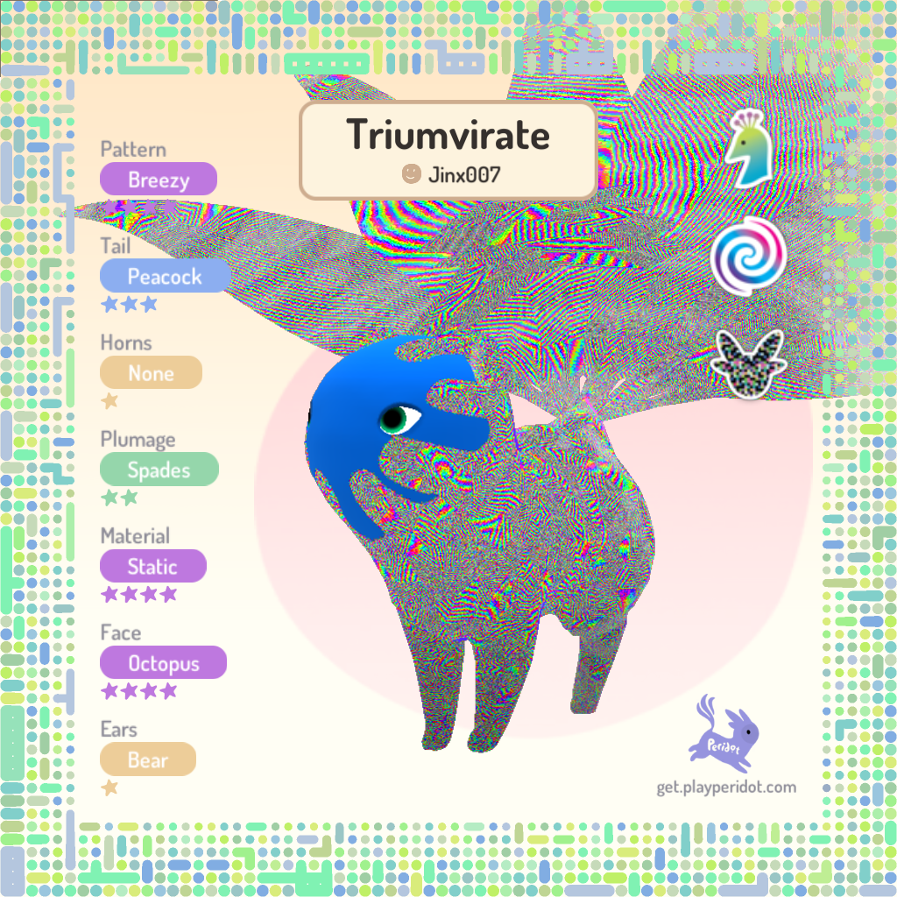

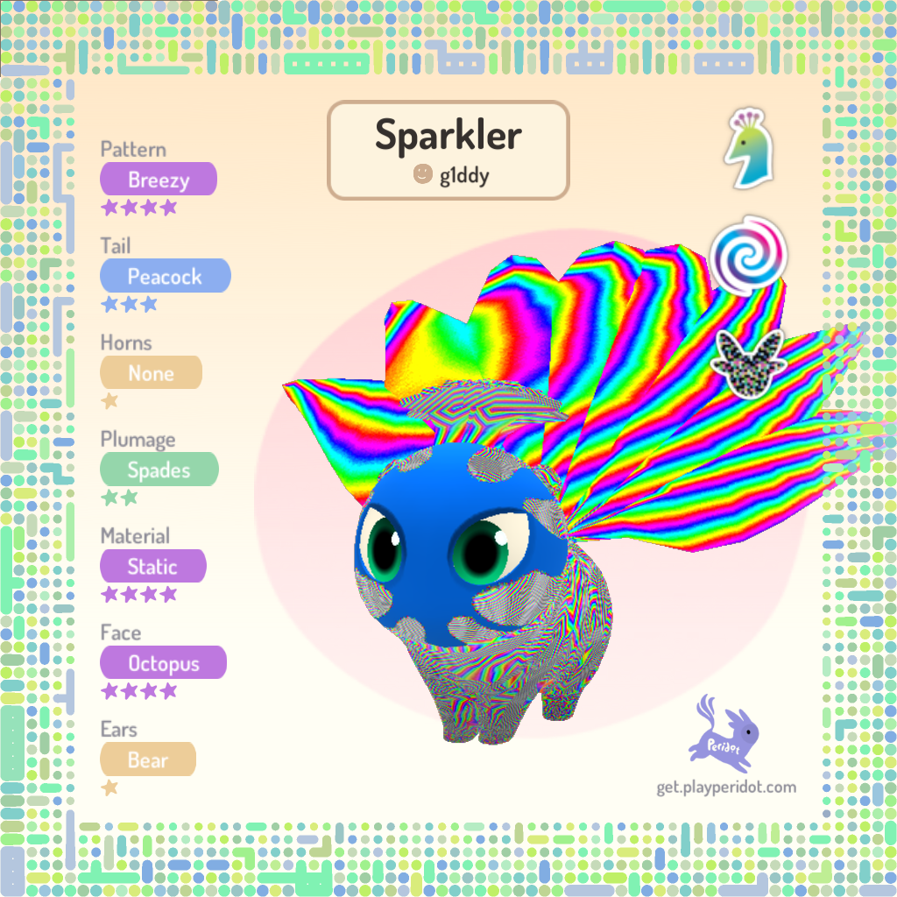

## Archetypes: Rabbit, Scarecrow, Static, Count: 3
### Compatibility Table:
|Name|Ear|Face|Horn|Material|Pattern|Plumage|Tail|
|:--|:--|:--|:--|:--|:--|:--|:--|
|Rabbit|Rabbit||||||Rabbit|
|Scarecrow|||Pitchfork||Patchwork|Quetzal||
|Static||||Static||||

### Example(s):
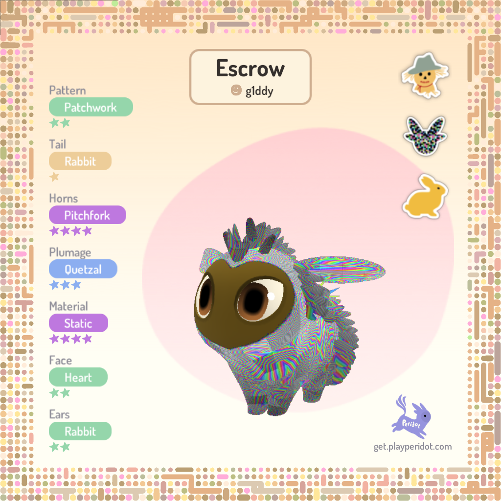

## Archetypes: 24Karat, Cinnabon, Count: 2
### Compatibility Table:
|Name|Ear|Face|Horn|Material|Pattern|Plumage|Tail|
|:--|:--|:--|:--|:--|:--|:--|:--|
|24Karat||||Chrome|Solid|||
|Cinnabon|Mouse|Fangs|Buns||||Shell|

## Archetypes: 24Karat, Peacock, Count: 2
### Compatibility Table:
|Name|Ear|Face|Horn|Material|Pattern|Plumage|Tail|
|:--|:--|:--|:--|:--|:--|:--|:--|
|24Karat||||Chrome|Solid|||
|Peacock|||None|||Spades|Peacock|

## Archetypes: 24Karat, Rabbit, Count: 2
### Compatibility Table:
|Name|Ear|Face|Horn|Material|Pattern|Plumage|Tail|
|:--|:--|:--|:--|:--|:--|:--|:--|
|24Karat||||Chrome|Solid|||
|Rabbit|Rabbit||||||Rabbit|

### Example(s):
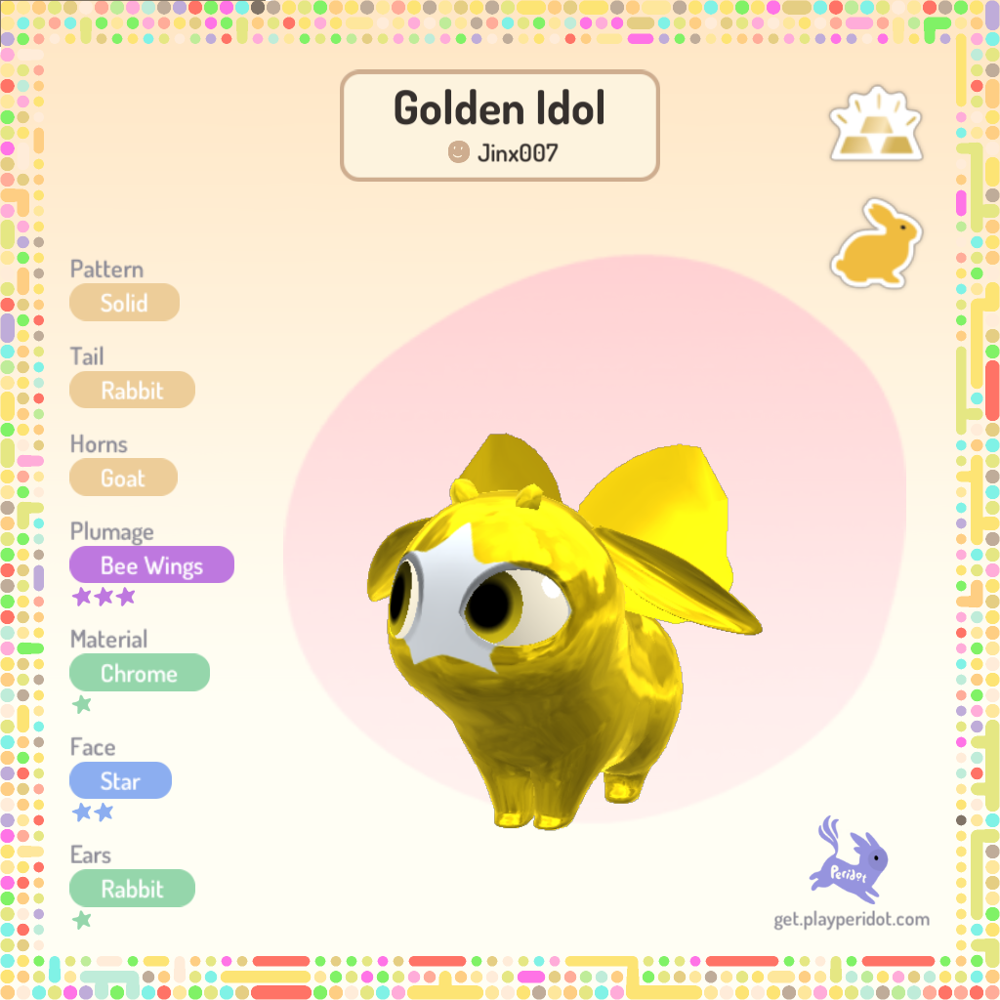

## Archetypes: 24Karat, Ram, Count: 2
### Compatibility Table:
|Name|Ear|Face|Horn|Material|Pattern|Plumage|Tail|
|:--|:--|:--|:--|:--|:--|:--|:--|
|24Karat||||Chrome|Solid|||
|Ram|||Ram||||Asparagus|

### Example(s):
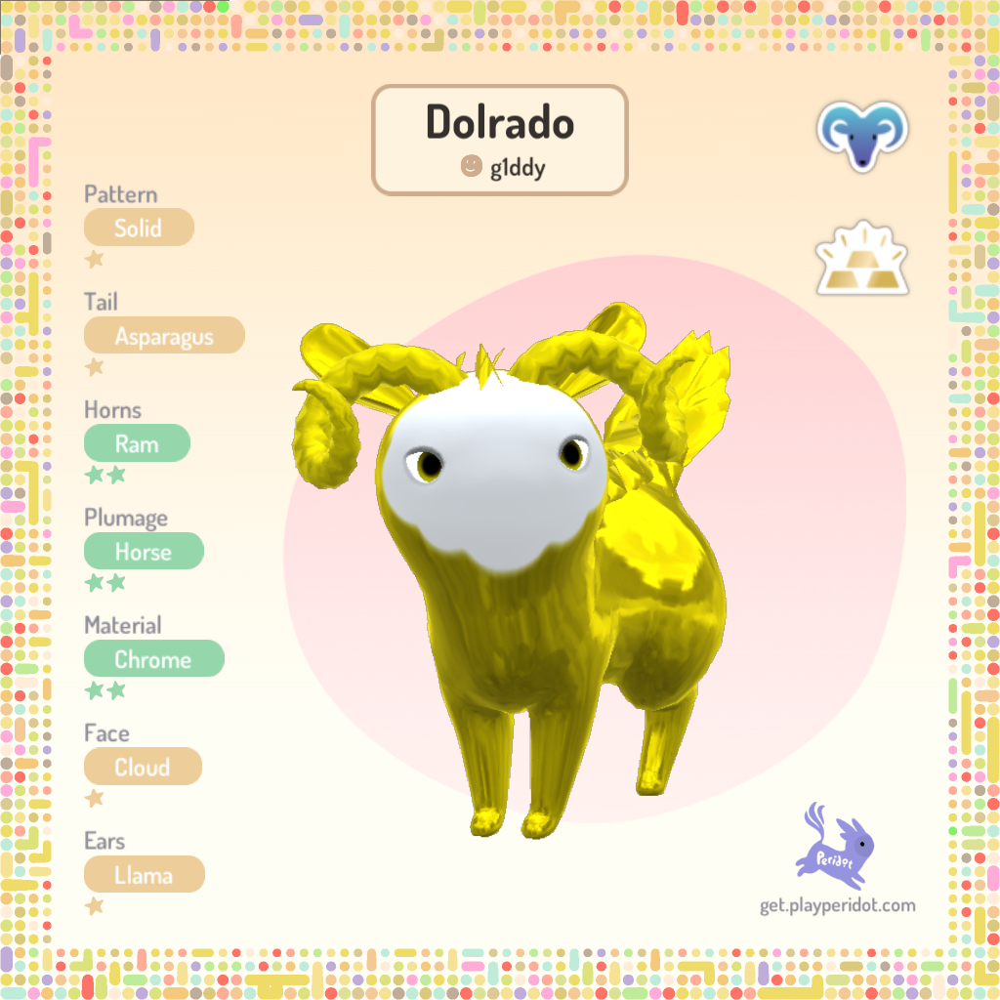

## Archetypes: Anemone, Clownfish, Count: 2
### Compatibility Table:
|Name|Ear|Face|Horn|Material|Pattern|Plumage|Tail|
|:--|:--|:--|:--|:--|:--|:--|:--|
|Anemone|||Demon|Slimy||Tentacles||
|Clownfish|||||Tropical Fish|||

## Archetypes: Anemone, Psychedelic, Count: 2
### Compatibility Table:
|Name|Ear|Face|Horn|Material|Pattern|Plumage|Tail|
|:--|:--|:--|:--|:--|:--|:--|:--|
|Anemone|||Demon|Slimy||Tentacles||
|Psychedelic||Octopus|||Breezy||Peacock|

### Example(s):
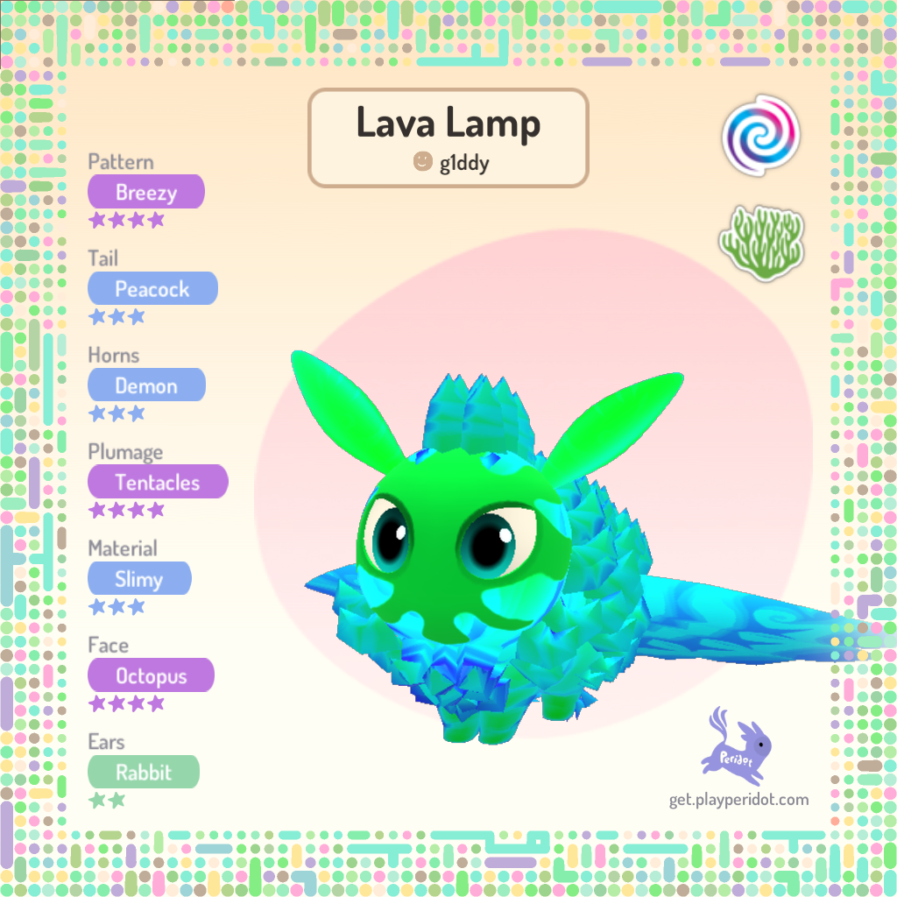

## Archetypes: Anemone, Rabbit, Count: 2
### Compatibility Table:
|Name|Ear|Face|Horn|Material|Pattern|Plumage|Tail|
|:--|:--|:--|:--|:--|:--|:--|:--|
|Anemone|||Demon|Slimy||Tentacles||
|Rabbit|Rabbit||||||Rabbit|

## Archetypes: Anemone, Snowfall, Count: 2
### Compatibility Table:
|Name|Ear|Face|Horn|Material|Pattern|Plumage|Tail|
|:--|:--|:--|:--|:--|:--|:--|:--|
|Anemone|||Demon|Slimy||Tentacles||
|Snowfall||Dots|||Snowfall||Snowflake|

### Example(s):

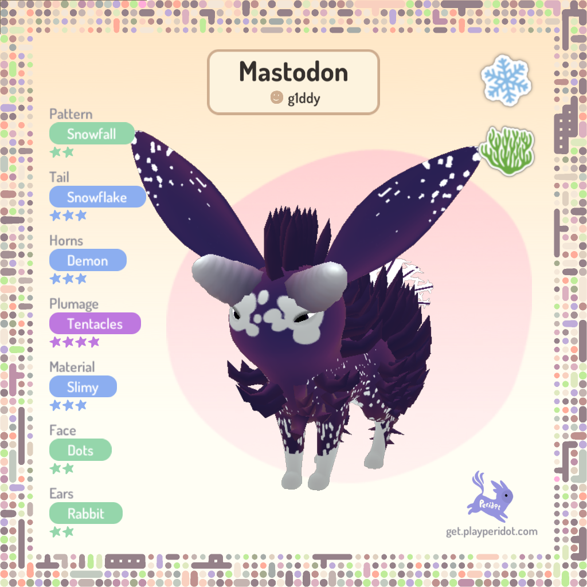

## Archetypes: Anemone, Sunset, Count: 2
### Compatibility Table:
|Name|Ear|Face|Horn|Material|Pattern|Plumage|Tail|
|:--|:--|:--|:--|:--|:--|:--|:--|
|Anemone|||Demon|Slimy||Tentacles||
|Sunset|||||Sunset||Fleur|

### Example(s):
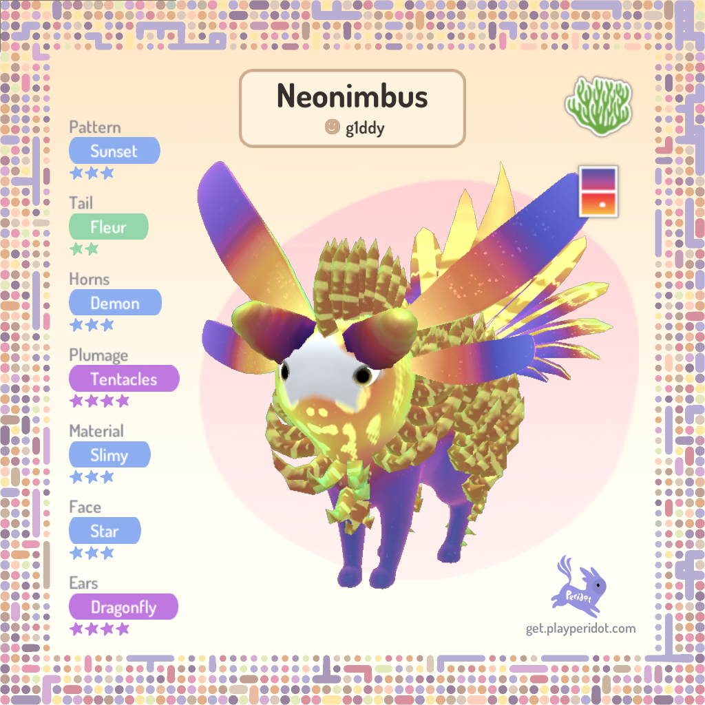

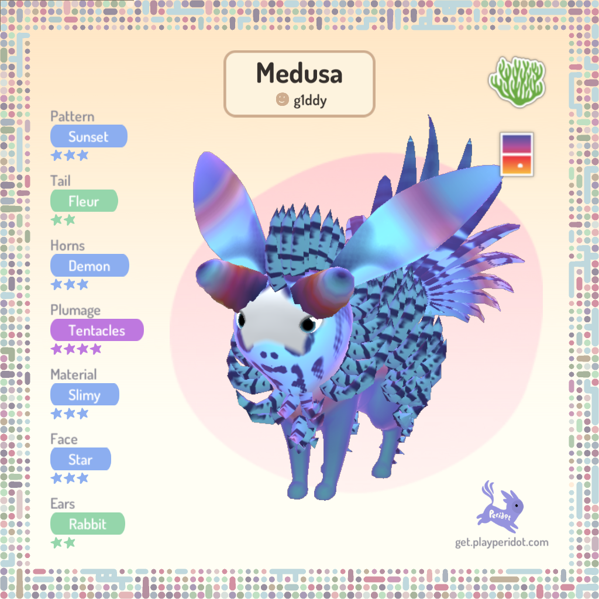

## Archetypes: Aurora, Sunset, Count: 2
### Compatibility Table:
|Name|Ear|Face|Horn|Material|Pattern|Plumage|Tail|
|:--|:--|:--|:--|:--|:--|:--|:--|
|Aurora|Seraph||Bharal|Starry|Sunset|||
|Sunset|||||Sunset||Fleur|

## Archetypes: Axolotl, Clownfish, Count: 2
### Compatibility Table:
|Name|Ear|Face|Horn|Material|Pattern|Plumage|Tail|
|:--|:--|:--|:--|:--|:--|:--|:--|
|Axolotl|None|Kawaii|None|Slimy||Moth|Scalloped|
|Clownfish|||||Tropical Fish|||

### Example(s):
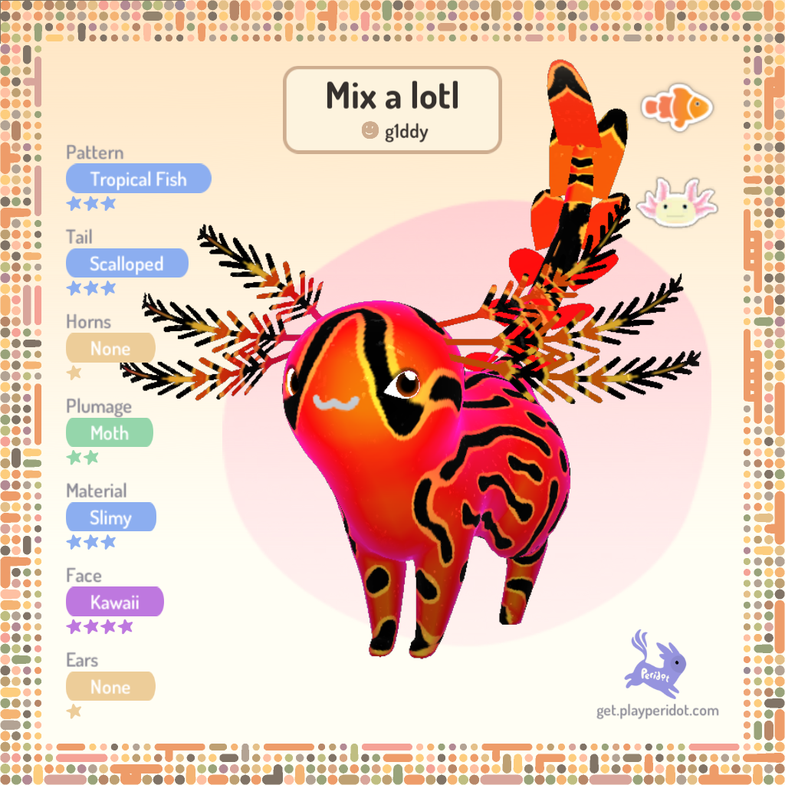

## Archetypes: Balloon, Patchwork, Count: 2
### Compatibility Table:
|Name|Ear|Face|Horn|Material|Pattern|Plumage|Tail|
|:--|:--|:--|:--|:--|:--|:--|:--|
|Balloon|||Stacked||Patchwork|Tutu||
|Patchwork|Square|||Matte|Patchwork||Accordion|

### Example(s):
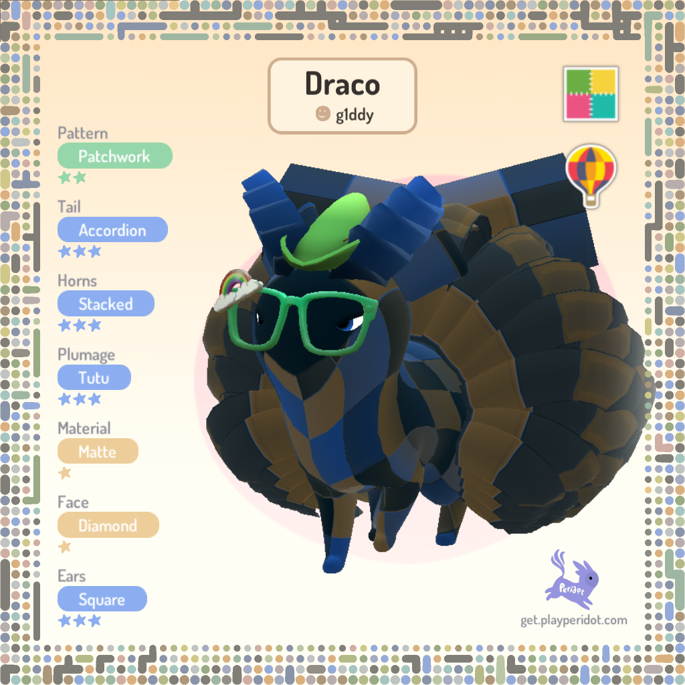

## Archetypes: Balloon, Rabbit, Count: 2
### Compatibility Table:
|Name|Ear|Face|Horn|Material|Pattern|Plumage|Tail|
|:--|:--|:--|:--|:--|:--|:--|:--|
|Balloon|||Stacked||Patchwork|Tutu||
|Rabbit|Rabbit||||||Rabbit|

### Example(s):
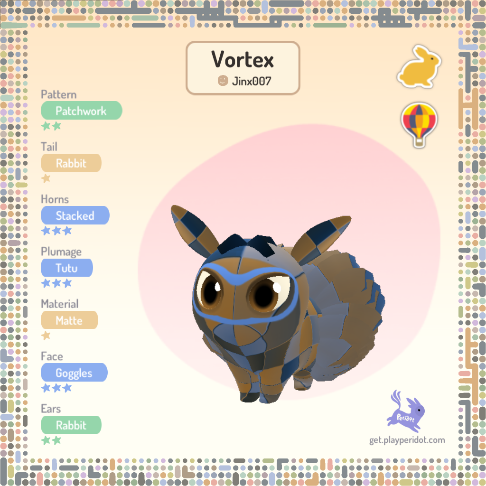

## Archetypes: Balloon, Static, Count: 2
### Compatibility Table:
|Name|Ear|Face|Horn|Material|Pattern|Plumage|Tail|
|:--|:--|:--|:--|:--|:--|:--|:--|
|Balloon|||Stacked||Patchwork|Tutu||
|Static||||Static||||

## Archetypes: Beach, Rabbit, Count: 2
### Compatibility Table:
|Name|Ear|Face|Horn|Material|Pattern|Plumage|Tail|
|:--|:--|:--|:--|:--|:--|:--|:--|
|Beach|||Shell|Geode|Beach|||
|Rabbit|Rabbit||||||Rabbit|

## Archetypes: Bee, Rabbit, Count: 2
### Compatibility Table:
|Name|Ear|Face|Horn|Material|Pattern|Plumage|Tail|
|:--|:--|:--|:--|:--|:--|:--|:--|
|Bee|||Antennae|Fuzzy|Bee|Bee Wings||
|Rabbit|Rabbit||||||Rabbit|

### Example(s):
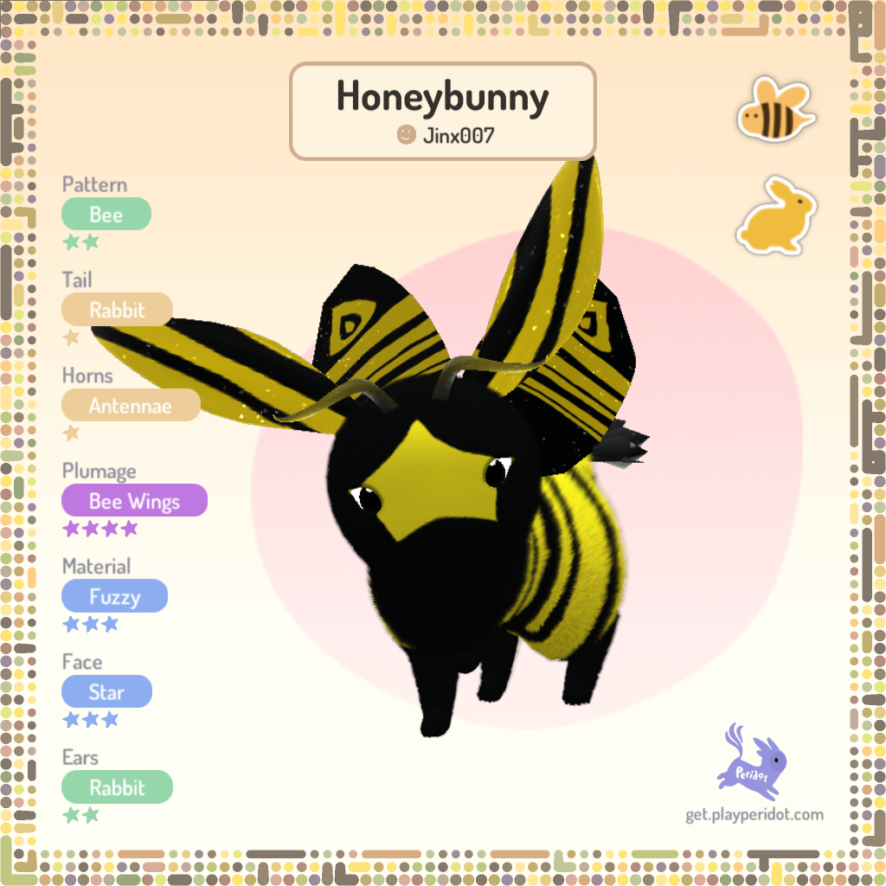

## Archetypes: Bismuth, Peacock, Count: 2
### Compatibility Table:
|Name|Ear|Face|Horn|Material|Pattern|Plumage|Tail|
|:--|:--|:--|:--|:--|:--|:--|:--|
|Bismuth|Square|Diamond||Iridescent|Circuit|||
|Peacock|||None|||Spades|Peacock|

### Example(s):
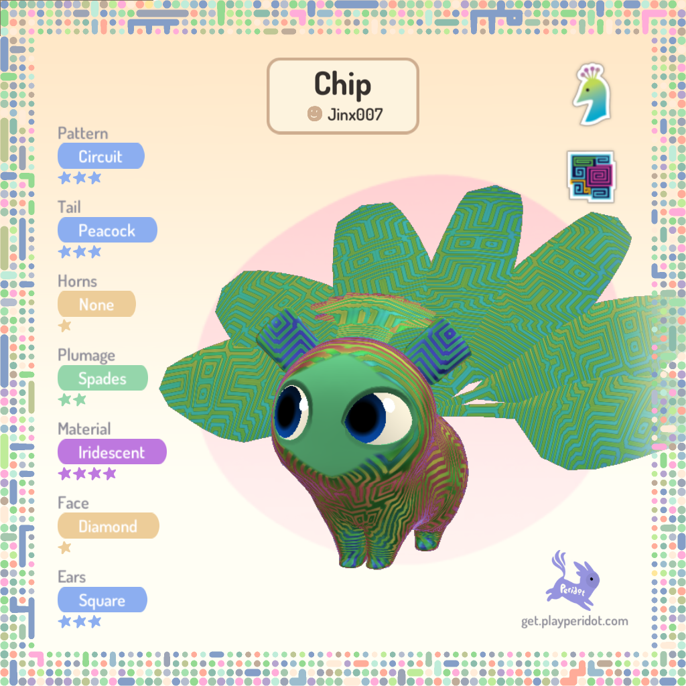

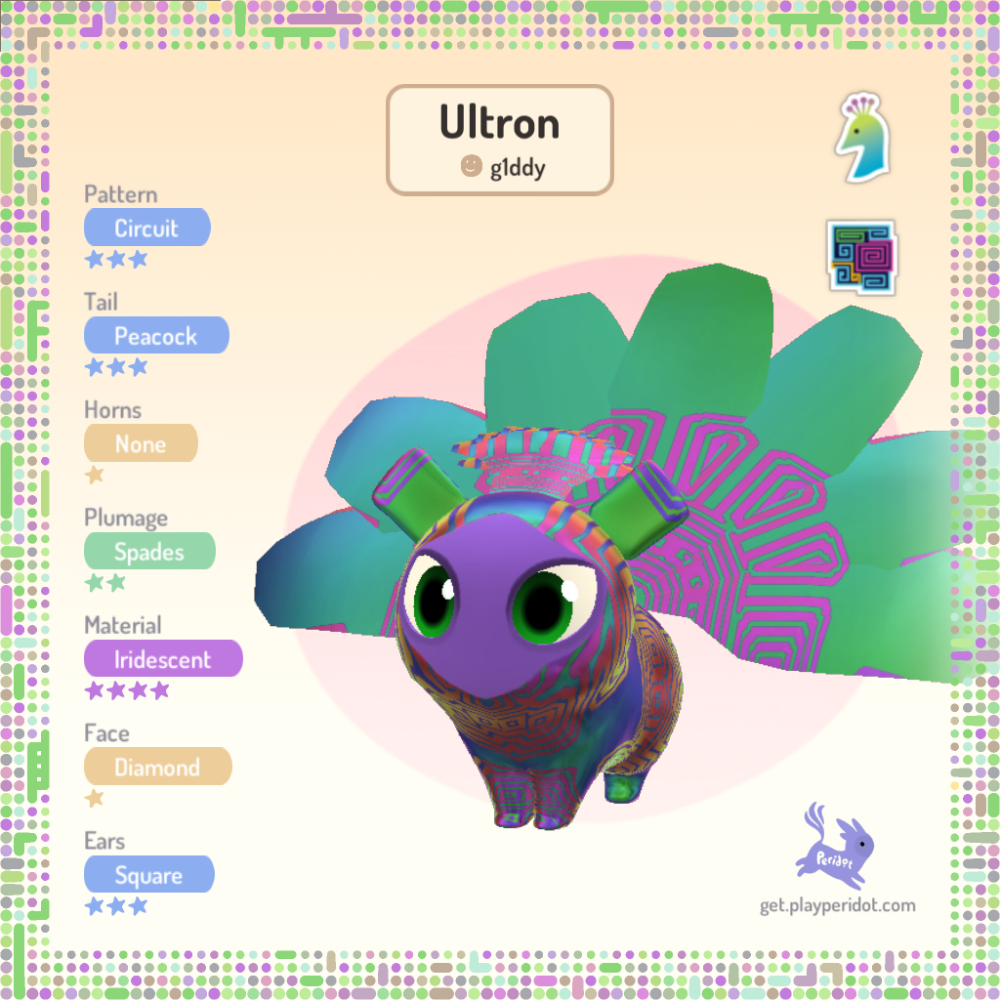

## Archetypes: Bismuth, Ram, Count: 2
### Compatibility Table:
|Name|Ear|Face|Horn|Material|Pattern|Plumage|Tail|
|:--|:--|:--|:--|:--|:--|:--|:--|
|Bismuth|Square|Diamond||Iridescent|Circuit|||
|Ram|||Ram||||Asparagus|

### Example(s):
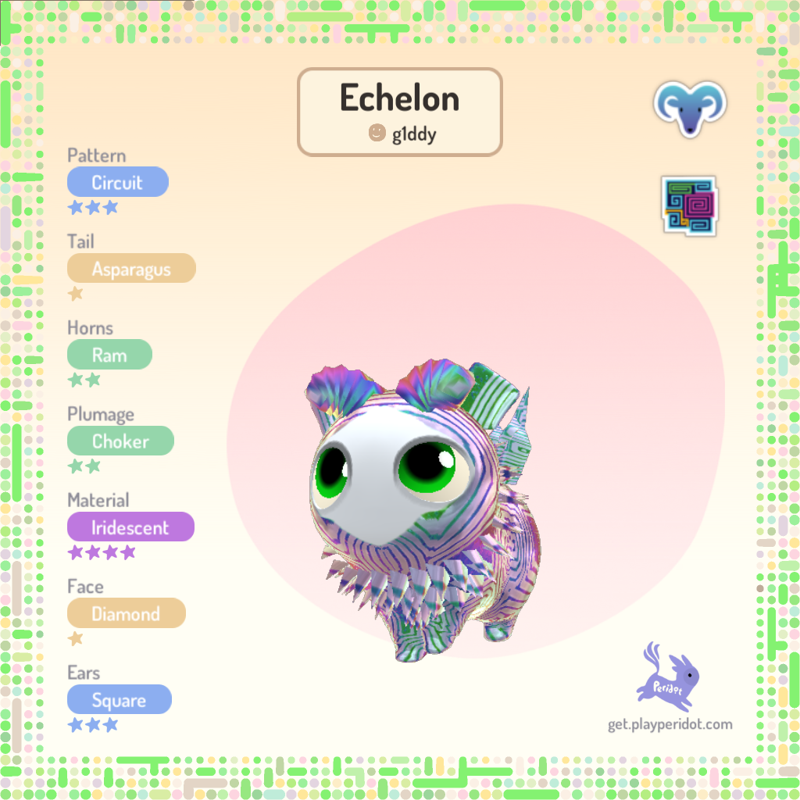

## Archetypes: Boba, Cactus, Count: 2
### Compatibility Table:
|Name|Ear|Face|Horn|Material|Pattern|Plumage|Tail|
|:--|:--|:--|:--|:--|:--|:--|:--|
|Boba|||Straw||Bubbles|||
|Cactus||||Matte||Thorns|None|

## Archetypes: Boba, Dandelion, Count: 2
### Compatibility Table:
|Name|Ear|Face|Horn|Material|Pattern|Plumage|Tail|
|:--|:--|:--|:--|:--|:--|:--|:--|
|Boba|||Straw||Bubbles|||
|Dandelion||||Furry||Dandelion|Dandelion|

## Archetypes: Boba, Glam, Count: 2
### Compatibility Table:
|Name|Ear|Face|Horn|Material|Pattern|Plumage|Tail|
|:--|:--|:--|:--|:--|:--|:--|:--|
|Boba|||Straw||Bubbles|||
|Glam|Picks|Star||Bedazzled||Curls|None|

### Example(s):
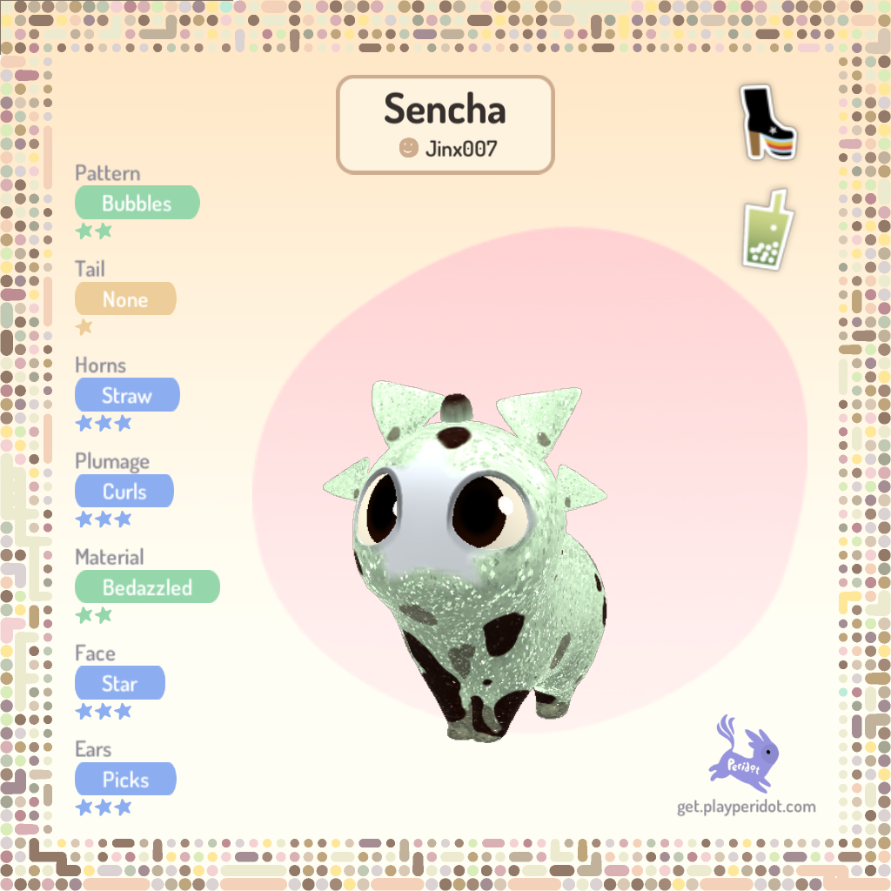

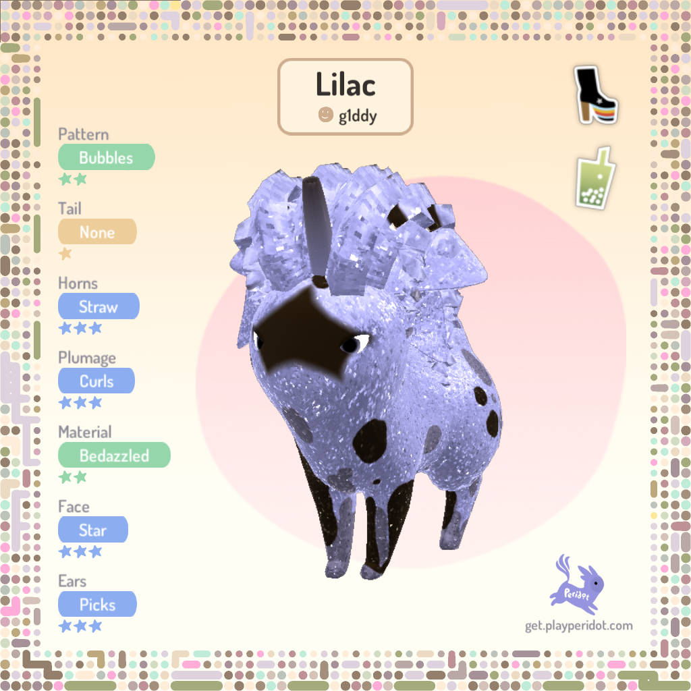

## Archetypes: Boba, Rabbit, Count: 2
### Compatibility Table:
|Name|Ear|Face|Horn|Material|Pattern|Plumage|Tail|
|:--|:--|:--|:--|:--|:--|:--|:--|
|Boba|||Straw||Bubbles|||
|Rabbit|Rabbit||||||Rabbit|

## Archetypes: Boba, Static, Count: 2
### Compatibility Table:
|Name|Ear|Face|Horn|Material|Pattern|Plumage|Tail|
|:--|:--|:--|:--|:--|:--|:--|:--|
|Boba|||Straw||Bubbles|||
|Static||||Static||||

### Example(s):
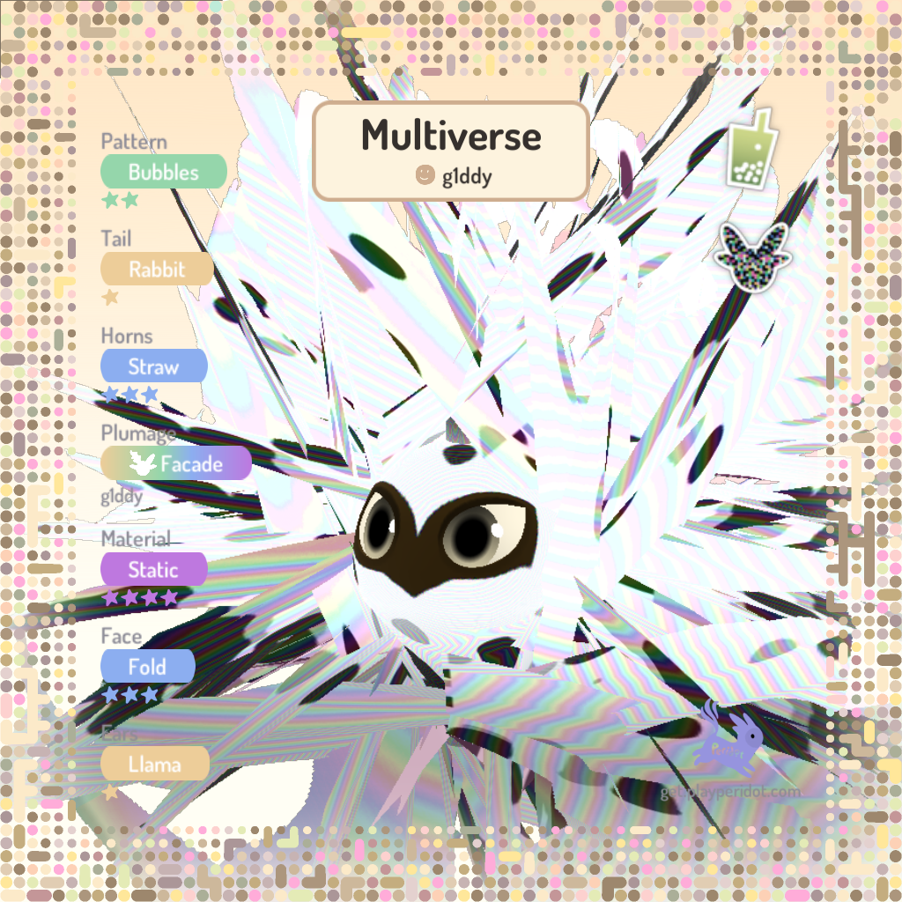

## Archetypes: Cactus, Clownfish, Count: 2
### Compatibility Table:
|Name|Ear|Face|Horn|Material|Pattern|Plumage|Tail|
|:--|:--|:--|:--|:--|:--|:--|:--|
|Cactus||||Matte||Thorns|None|
|Clownfish|||||Tropical Fish|||

## Archetypes: Candle, Clownfish, Count: 2
### Compatibility Table:
|Name|Ear|Face|Horn|Material|Pattern|Plumage|Tail|
|:--|:--|:--|:--|:--|:--|:--|:--|
|Candle|None||Spire|Waxy||None||
|Clownfish|||||Tropical Fish|||

### Example(s):
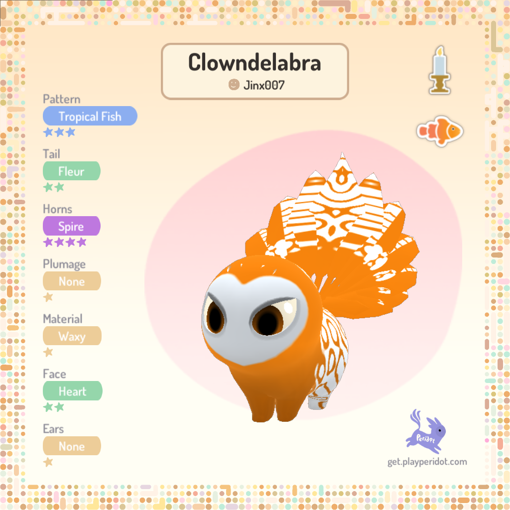

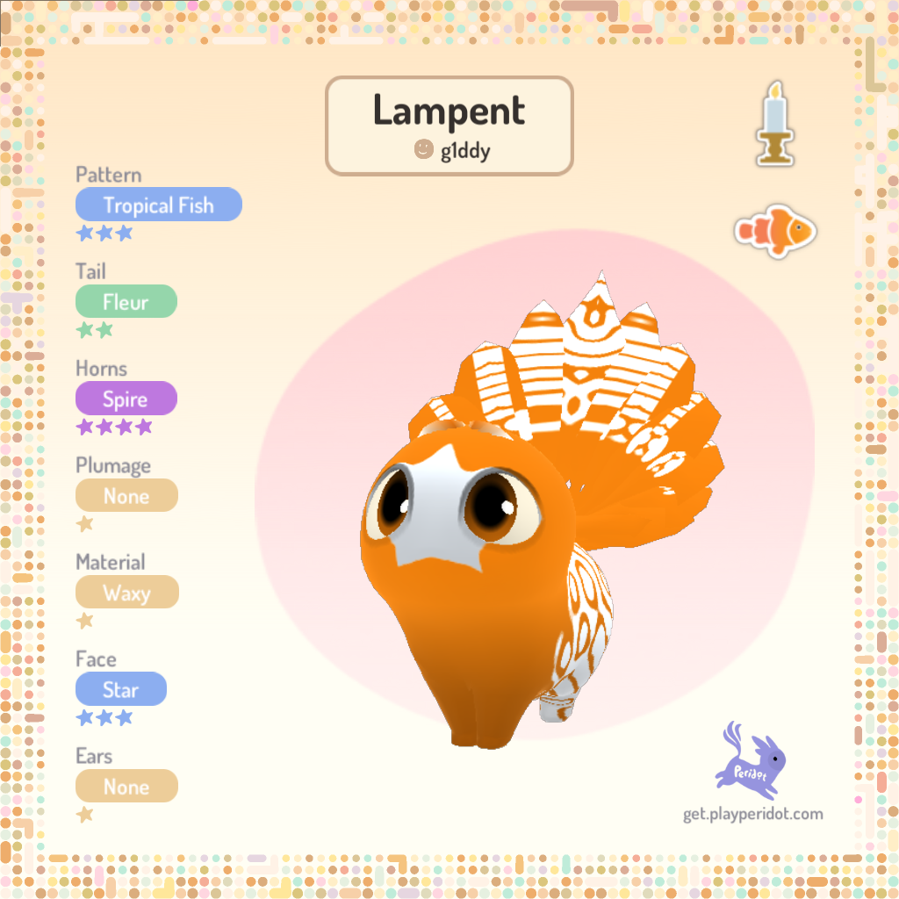

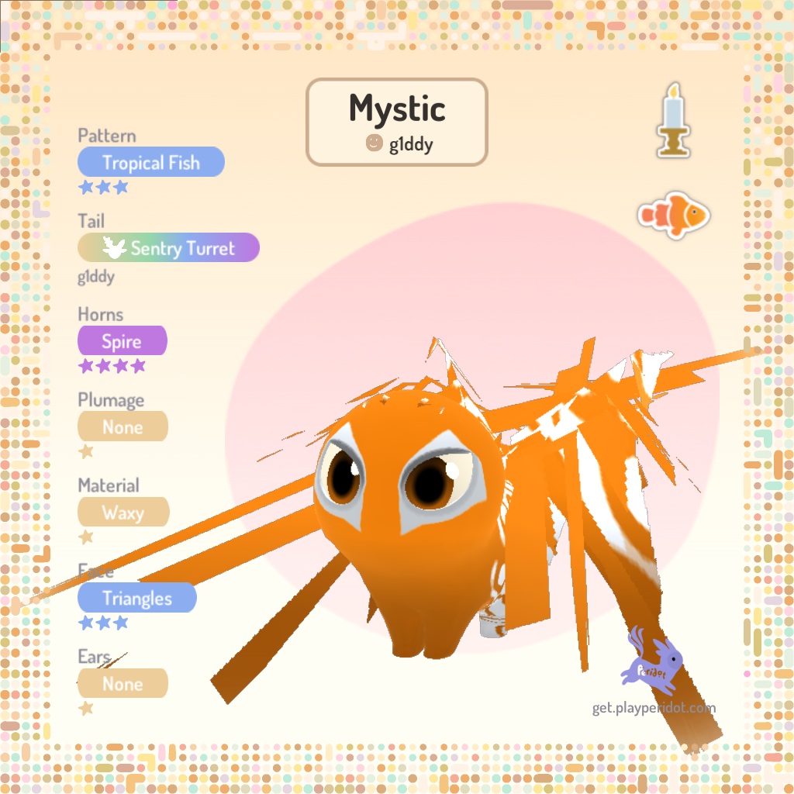

## Archetypes: Candle, Psychedelic, Count: 2
### Compatibility Table:
|Name|Ear|Face|Horn|Material|Pattern|Plumage|Tail|
|:--|:--|:--|:--|:--|:--|:--|:--|
|Candle|None||Spire|Waxy||None||
|Psychedelic||Octopus|||Breezy||Peacock|

## Archetypes: Candle, Snowfall, Count: 2
### Compatibility Table:
|Name|Ear|Face|Horn|Material|Pattern|Plumage|Tail|
|:--|:--|:--|:--|:--|:--|:--|:--|
|Candle|None||Spire|Waxy||None||
|Snowfall||Dots|||Snowfall||Snowflake|

## Archetypes: Candle, Sunset, Count: 2
### Compatibility Table:
|Name|Ear|Face|Horn|Material|Pattern|Plumage|Tail|
|:--|:--|:--|:--|:--|:--|:--|:--|
|Candle|None||Spire|Waxy||None||
|Sunset|||||Sunset||Fleur|

## Archetypes: Celestial, Cinnabon, Count: 2
### Compatibility Table:
|Name|Ear|Face|Horn|Material|Pattern|Plumage|Tail|
|:--|:--|:--|:--|:--|:--|:--|:--|
|Celestial||||Starry|Celestial|||
|Cinnabon|Mouse|Fangs|Buns||||Shell|

## Archetypes: Celestial, Gargoyle, Count: 2
### Compatibility Table:
|Name|Ear|Face|Horn|Material|Pattern|Plumage|Tail|
|:--|:--|:--|:--|:--|:--|:--|:--|
|Celestial||||Starry|Celestial|||
|Gargoyle|Slice||Demon|Starry||Bat Wings||

## Archetypes: Celestial, Peacock, Count: 2
### Compatibility Table:
|Name|Ear|Face|Horn|Material|Pattern|Plumage|Tail|
|:--|:--|:--|:--|:--|:--|:--|:--|
|Celestial||||Starry|Celestial|||
|Peacock|||None|||Spades|Peacock|

## Archetypes: Celestial, Rabbit, Count: 2
### Compatibility Table:
|Name|Ear|Face|Horn|Material|Pattern|Plumage|Tail|
|:--|:--|:--|:--|:--|:--|:--|:--|
|Celestial||||Starry|Celestial|||
|Rabbit|Rabbit||||||Rabbit|

## Archetypes: Celestial, Ram, Count: 2
### Compatibility Table:
|Name|Ear|Face|Horn|Material|Pattern|Plumage|Tail|
|:--|:--|:--|:--|:--|:--|:--|:--|
|Celestial||||Starry|Celestial|||
|Ram|||Ram||||Asparagus|

### Example(s):
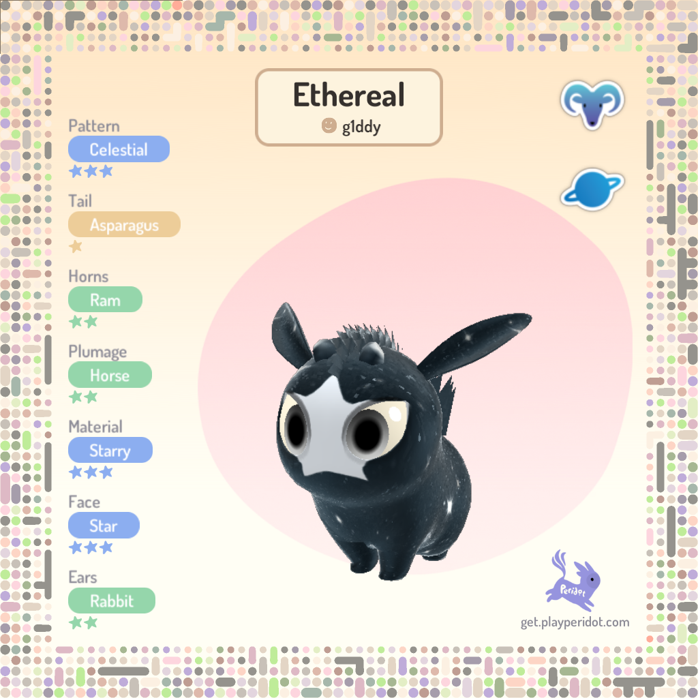

## Archetypes: Chameleon, Static, Count: 2
### Compatibility Table:
|Name|Ear|Face|Horn|Material|Pattern|Plumage|Tail|
|:--|:--|:--|:--|:--|:--|:--|:--|
|Chameleon|None||Buns||Breezy|Mohawk|Shell|
|Static||||Static||||

### Example(s):
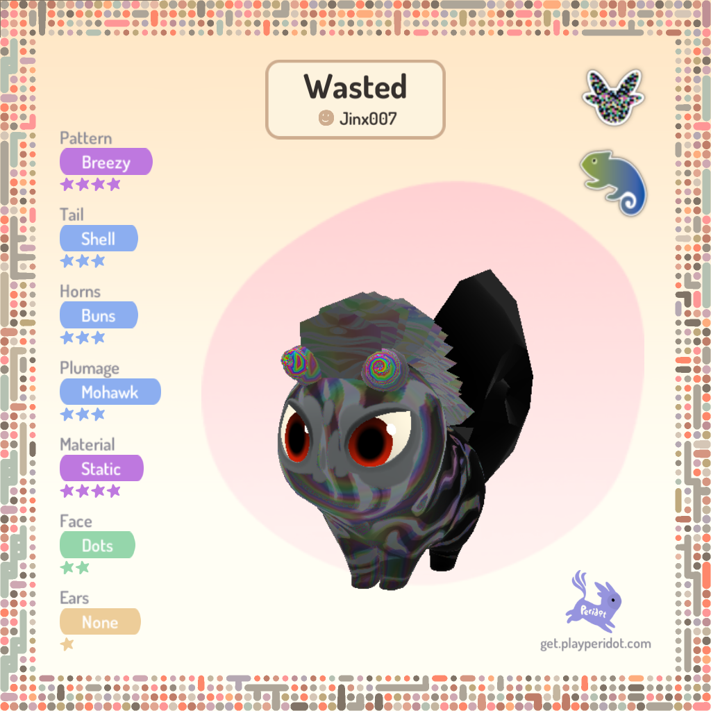

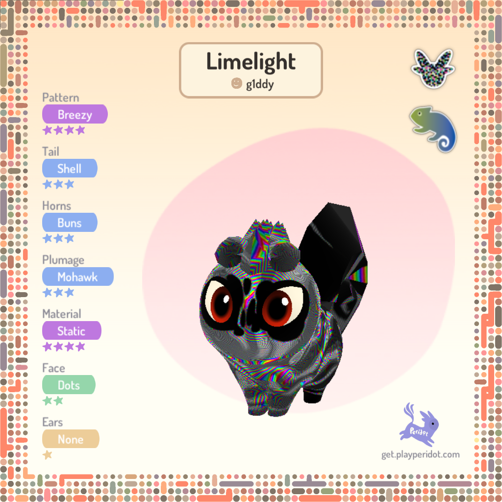

## Archetypes: Cinnabon, Clownfish, Count: 2
### Compatibility Table:
|Name|Ear|Face|Horn|Material|Pattern|Plumage|Tail|
|:--|:--|:--|:--|:--|:--|:--|:--|
|Cinnabon|Mouse|Fangs|Buns||||Shell|
|Clownfish|||||Tropical Fish|||

## Archetypes: Cinnabon, Kintsugi, Count: 2
### Compatibility Table:
|Name|Ear|Face|Horn|Material|Pattern|Plumage|Tail|
|:--|:--|:--|:--|:--|:--|:--|:--|
|Cinnabon|Mouse|Fangs|Buns||||Shell|
|Kintsugi||||Ore|Cracked|||

## Archetypes: Cinnabon, LED, Count: 2
### Compatibility Table:
|Name|Ear|Face|Horn|Material|Pattern|Plumage|Tail|
|:--|:--|:--|:--|:--|:--|:--|:--|
|Cinnabon|Mouse|Fangs|Buns||||Shell|
|LED||||LED|Pulse|||

## Archetypes: Cinnabon, Patina, Count: 2
### Compatibility Table:
|Name|Ear|Face|Horn|Material|Pattern|Plumage|Tail|
|:--|:--|:--|:--|:--|:--|:--|:--|
|Cinnabon|Mouse|Fangs|Buns||||Shell|
|Patina||||Rusty|Patina|||

## Archetypes: Cinnabon, Static, Count: 2
### Compatibility Table:
|Name|Ear|Face|Horn|Material|Pattern|Plumage|Tail|
|:--|:--|:--|:--|:--|:--|:--|:--|
|Cinnabon|Mouse|Fangs|Buns||||Shell|
|Static||||Static||||

### Example(s):
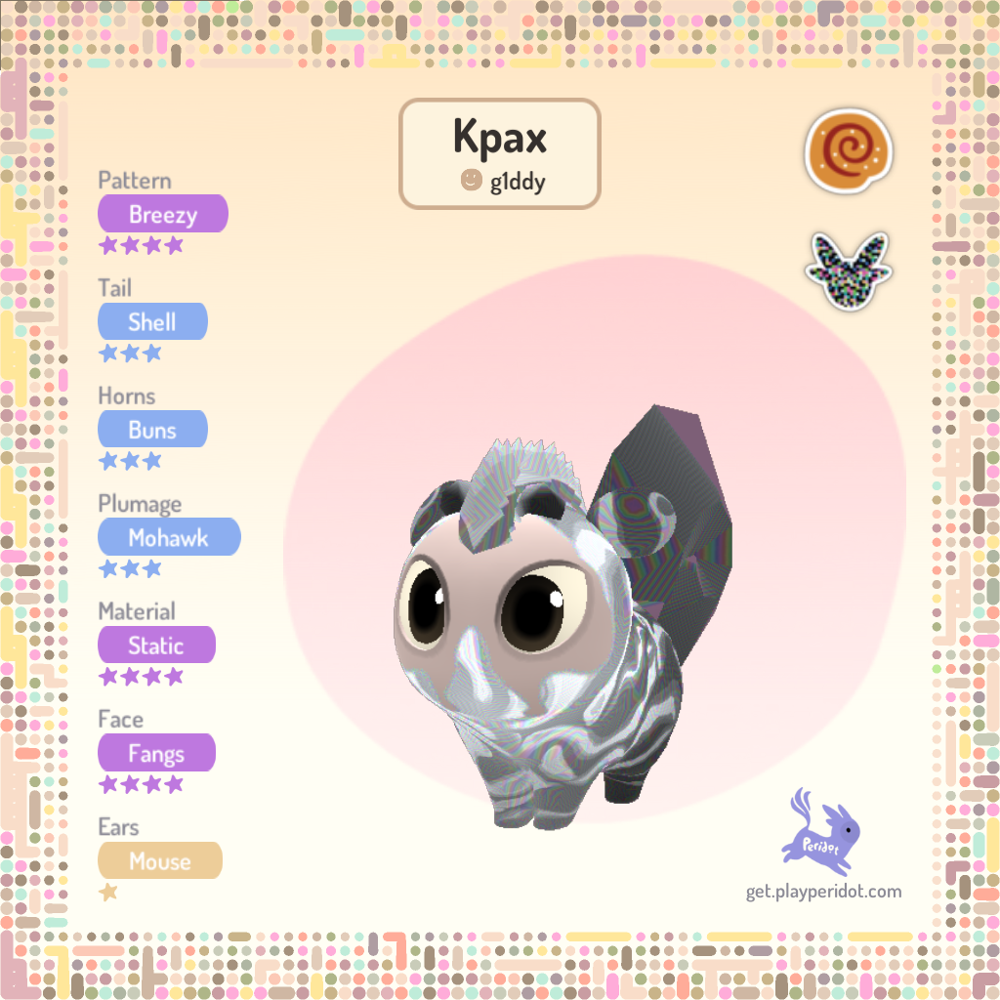

## Archetypes: Clownfish, Cotton Candy, Count: 2
### Compatibility Table:
|Name|Ear|Face|Horn|Material|Pattern|Plumage|Tail|
|:--|:--|:--|:--|:--|:--|:--|:--|
|Clownfish|||||Tropical Fish|||
|Cotton Candy|||Narwhal|Furry||||

## Archetypes: Clownfish, Dandelion, Count: 2
### Compatibility Table:
|Name|Ear|Face|Horn|Material|Pattern|Plumage|Tail|
|:--|:--|:--|:--|:--|:--|:--|:--|
|Clownfish|||||Tropical Fish|||
|Dandelion||||Furry||Dandelion|Dandelion|

### Example(s):
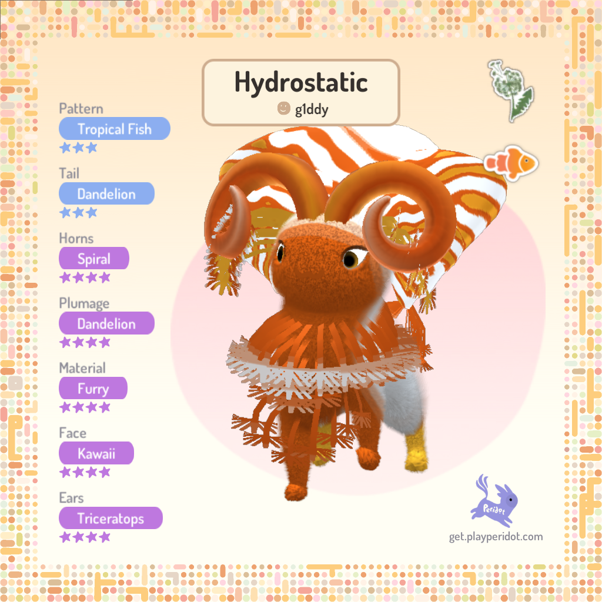

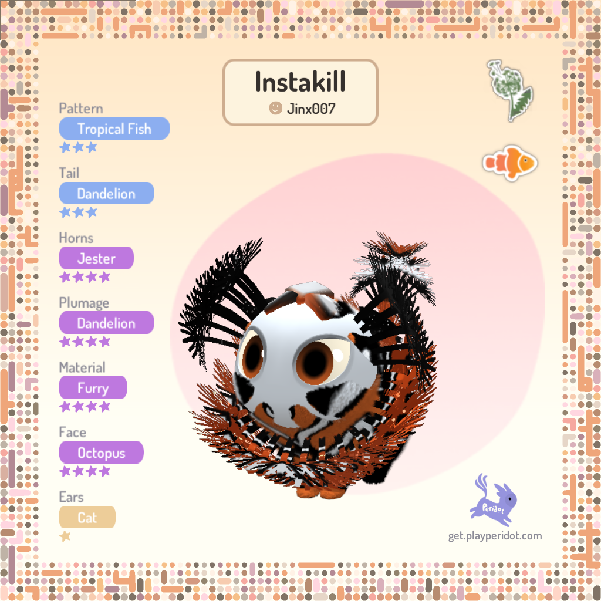

## Archetypes: Clownfish, Gargoyle, Count: 2
### Compatibility Table:
|Name|Ear|Face|Horn|Material|Pattern|Plumage|Tail|
|:--|:--|:--|:--|:--|:--|:--|:--|
|Clownfish|||||Tropical Fish|||
|Gargoyle|Slice||Demon|Starry||Bat Wings||

## Archetypes: Clownfish, Glam, Count: 2
### Compatibility Table:
|Name|Ear|Face|Horn|Material|Pattern|Plumage|Tail|
|:--|:--|:--|:--|:--|:--|:--|:--|
|Clownfish|||||Tropical Fish|||
|Glam|Picks|Star||Bedazzled||Curls|None|

### Example(s):
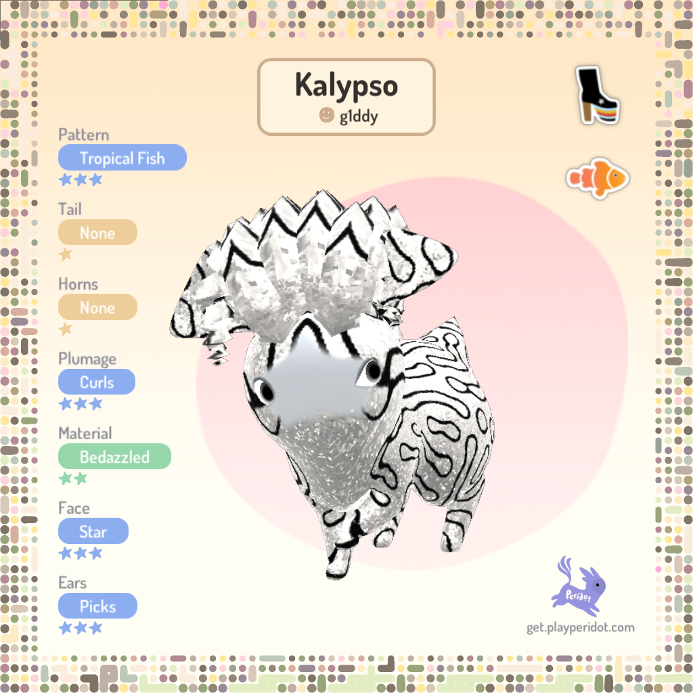

## Archetypes: Clownfish, Icicle, Count: 2
### Compatibility Table:
|Name|Ear|Face|Horn|Material|Pattern|Plumage|Tail|
|:--|:--|:--|:--|:--|:--|:--|:--|
|Clownfish|||||Tropical Fish|||
|Icicle|||Crown|Glimmer||Thorns||

## Archetypes: Clownfish, Lobster, Count: 2
### Compatibility Table:
|Name|Ear|Face|Horn|Material|Pattern|Plumage|Tail|
|:--|:--|:--|:--|:--|:--|:--|:--|
|Clownfish|||||Tropical Fish|||
|Lobster|Pincers||Antennae|Slimy|||Mermaid|

### Example(s):
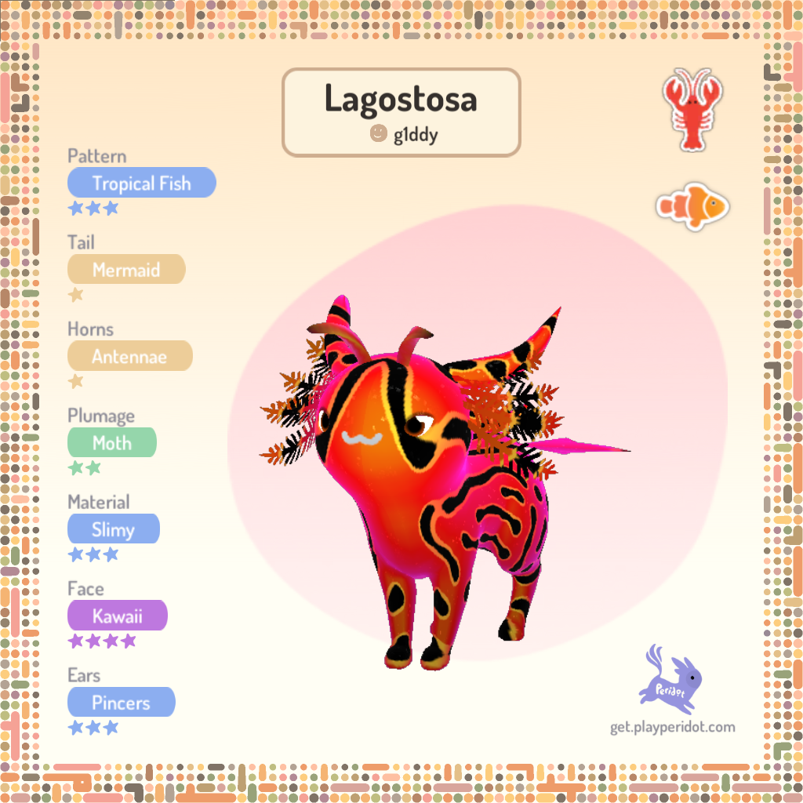

## Archetypes: Clownfish, Monkey, Count: 2
### Compatibility Table:
|Name|Ear|Face|Horn|Material|Pattern|Plumage|Tail|
|:--|:--|:--|:--|:--|:--|:--|:--|
|Clownfish|||||Tropical Fish|||
|Monkey|Monkey|Monkey|None|Fuzzy|||Mouse|

### Example(s):
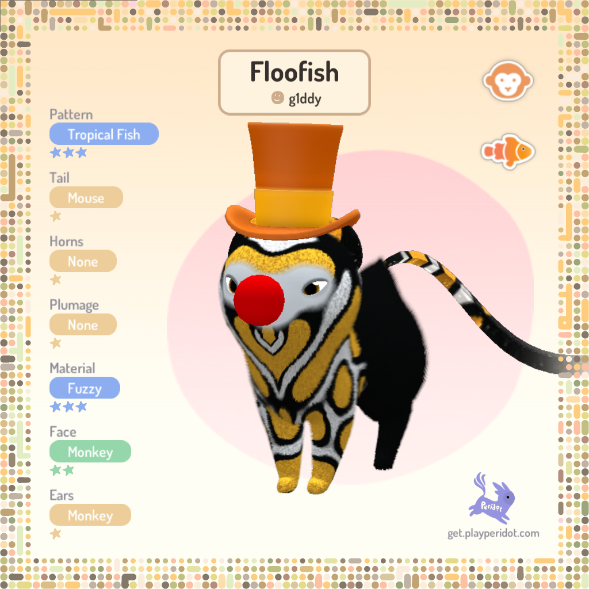

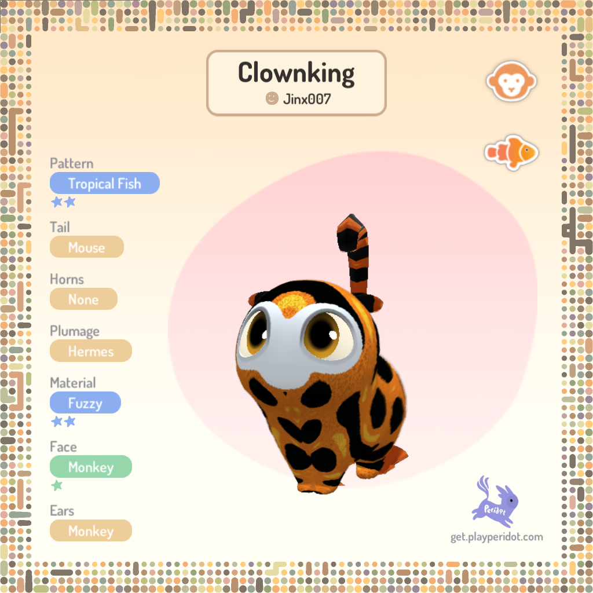

## Archetypes: Clownfish, Peacock, Count: 2
### Compatibility Table:
|Name|Ear|Face|Horn|Material|Pattern|Plumage|Tail|
|:--|:--|:--|:--|:--|:--|:--|:--|
|Clownfish|||||Tropical Fish|||
|Peacock|||None|||Spades|Peacock|

## Archetypes: Clownfish, Rabbit, Count: 2
### Compatibility Table:
|Name|Ear|Face|Horn|Material|Pattern|Plumage|Tail|
|:--|:--|:--|:--|:--|:--|:--|:--|
|Clownfish|||||Tropical Fish|||
|Rabbit|Rabbit||||||Rabbit|

### Example(s):
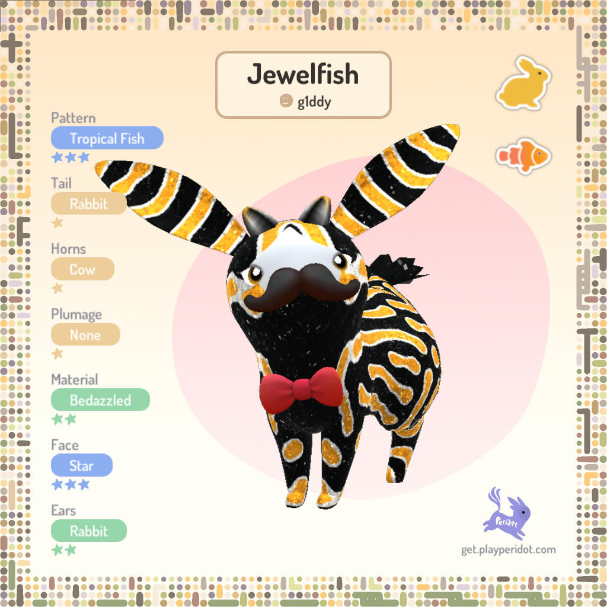

## Archetypes: Clownfish, Ram, Count: 2
### Compatibility Table:
|Name|Ear|Face|Horn|Material|Pattern|Plumage|Tail|
|:--|:--|:--|:--|:--|:--|:--|:--|
|Clownfish|||||Tropical Fish|||
|Ram|||Ram||||Asparagus|

### Example(s):
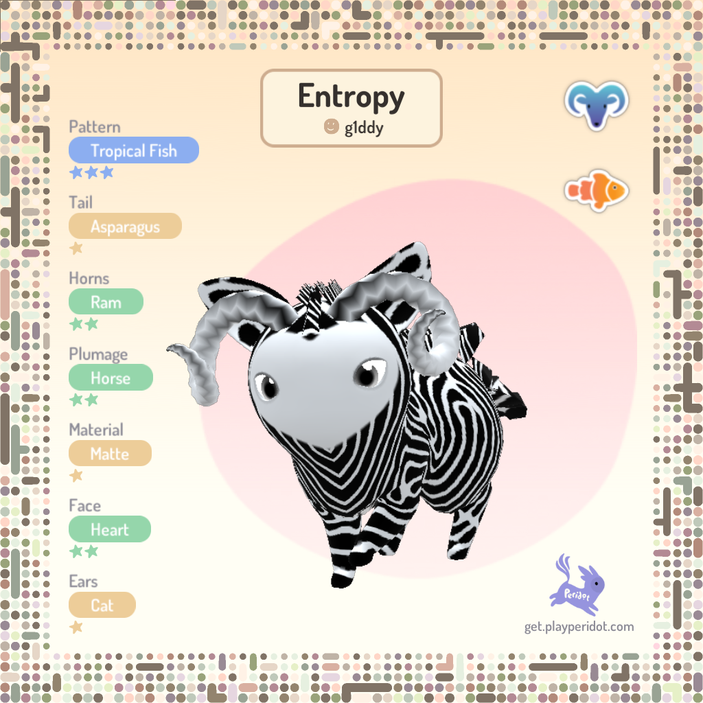

## Archetypes: Clownfish, Royalty, Count: 2
### Compatibility Table:
|Name|Ear|Face|Horn|Material|Pattern|Plumage|Tail|
|:--|:--|:--|:--|:--|:--|:--|:--|
|Clownfish|||||Tropical Fish|||
|Royalty||Countess|Crown|Ore||Tutu||

## Archetypes: Clownfish, Static, Count: 2
### Compatibility Table:
|Name|Ear|Face|Horn|Material|Pattern|Plumage|Tail|
|:--|:--|:--|:--|:--|:--|:--|:--|
|Clownfish|||||Tropical Fish|||
|Static||||Static||||

## Archetypes: Clownfish, Triton, Count: 2
### Compatibility Table:
|Name|Ear|Face|Horn|Material|Pattern|Plumage|Tail|
|:--|:--|:--|:--|:--|:--|:--|:--|
|Clownfish|||||Tropical Fish|||
|Triton|||Trident|Glimmer|||Whale|

## Archetypes: Clownfish, Unicorn, Count: 2
### Compatibility Table:
|Name|Ear|Face|Horn|Material|Pattern|Plumage|Tail|
|:--|:--|:--|:--|:--|:--|:--|:--|
|Clownfish|||||Tropical Fish|||
|Unicorn|||Narwhal|Glitter||Horse|Horse|

### Example(s):
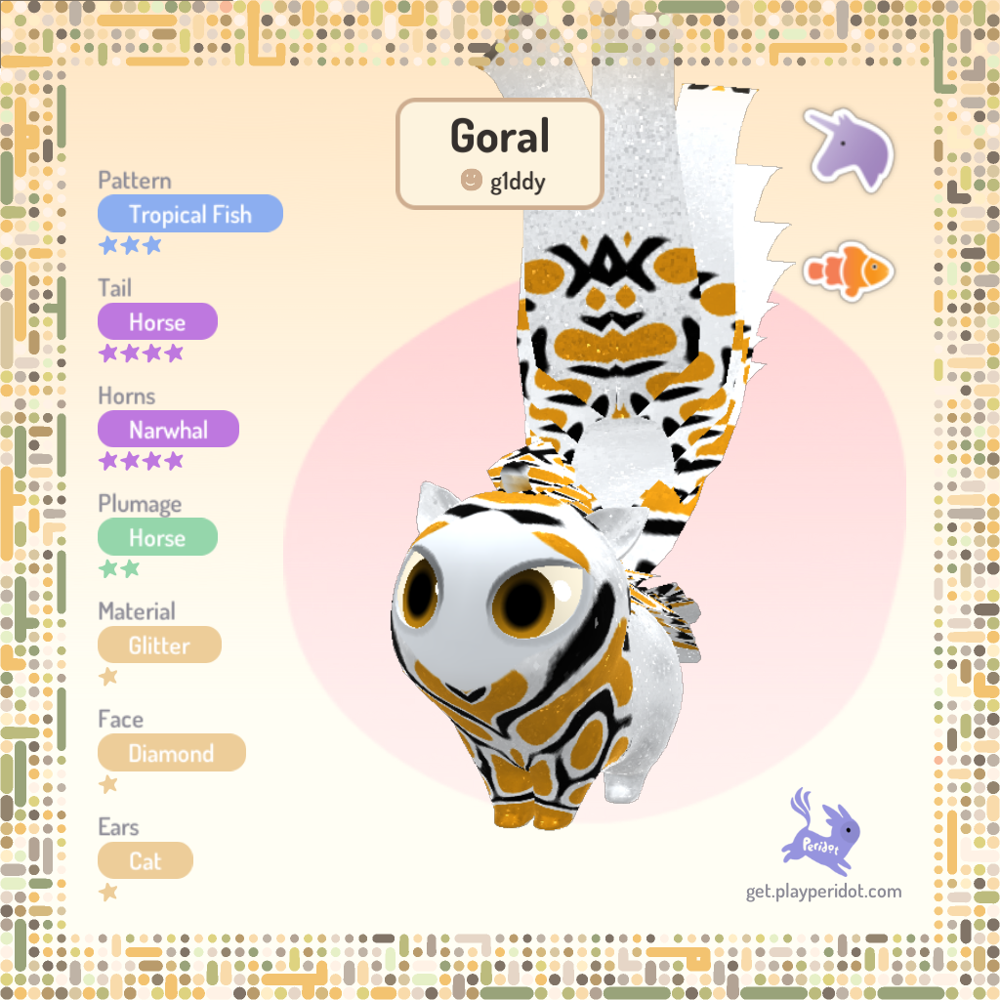

## Archetypes: Clownfish, Yeti, Count: 2
### Compatibility Table:
|Name|Ear|Face|Horn|Material|Pattern|Plumage|Tail|
|:--|:--|:--|:--|:--|:--|:--|:--|
|Clownfish|||||Tropical Fish|||
|Yeti|Llama|Heart|Devil|Furry||None|None|

### Example(s):
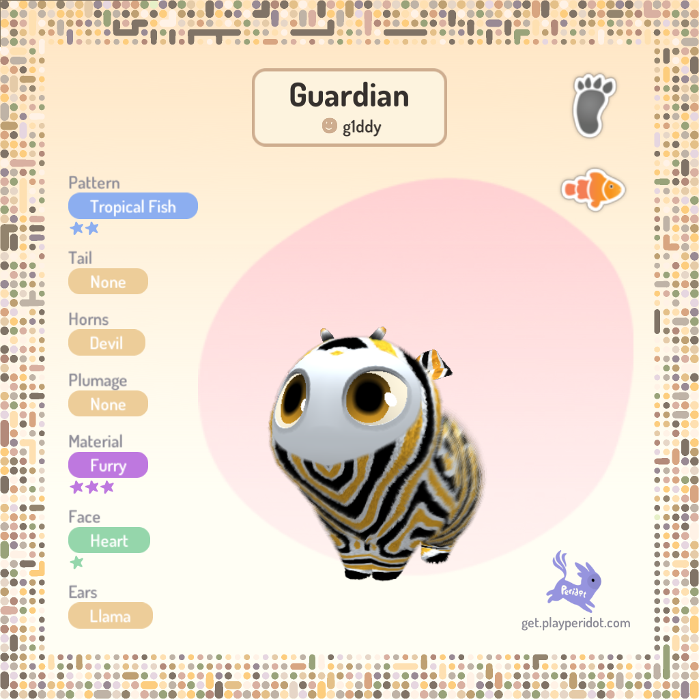

## Archetypes: Cotton Candy, Dandelion, Count: 2
### Compatibility Table:
|Name|Ear|Face|Horn|Material|Pattern|Plumage|Tail|
|:--|:--|:--|:--|:--|:--|:--|:--|
|Cotton Candy|||Narwhal|Furry||||
|Dandelion||||Furry||Dandelion|Dandelion|

## Archetypes: Cotton Candy, Psychedelic, Count: 2
### Compatibility Table:
|Name|Ear|Face|Horn|Material|Pattern|Plumage|Tail|
|:--|:--|:--|:--|:--|:--|:--|:--|
|Cotton Candy|||Narwhal|Furry||||
|Psychedelic||Octopus|||Breezy||Peacock|

## Archetypes: Cotton Candy, Rabbit, Count: 2
### Compatibility Table:
|Name|Ear|Face|Horn|Material|Pattern|Plumage|Tail|
|:--|:--|:--|:--|:--|:--|:--|:--|
|Cotton Candy|||Narwhal|Furry||||
|Rabbit|Rabbit||||||Rabbit|

### Example(s):
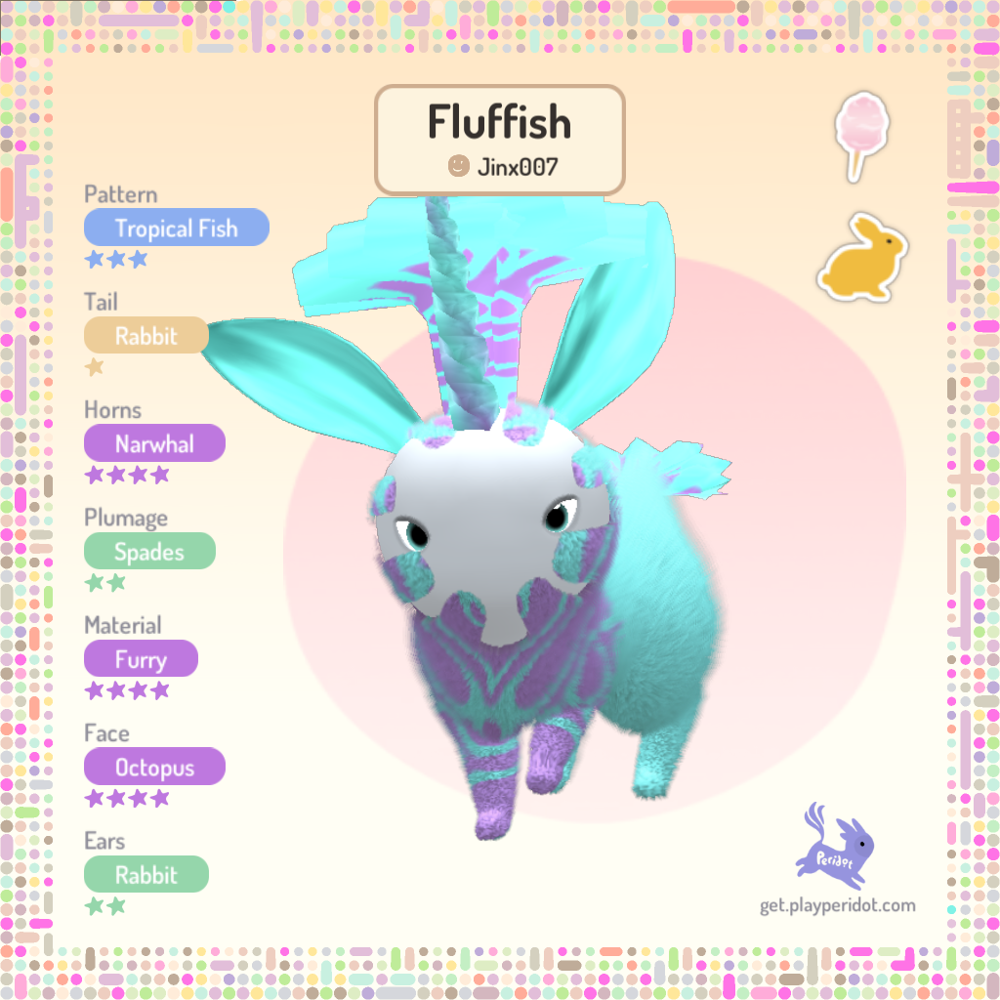

## Archetypes: Cotton Candy, Seal, Count: 2
### Compatibility Table:
|Name|Ear|Face|Horn|Material|Pattern|Plumage|Tail|
|:--|:--|:--|:--|:--|:--|:--|:--|
|Cotton Candy|||Narwhal|Furry||||
|Seal|None||||Cheetah|Whiskers|Mermaid|

## Archetypes: Cotton Candy, Snowfall, Count: 2
### Compatibility Table:
|Name|Ear|Face|Horn|Material|Pattern|Plumage|Tail|
|:--|:--|:--|:--|:--|:--|:--|:--|
|Cotton Candy|||Narwhal|Furry||||
|Snowfall||Dots|||Snowfall||Snowflake|

## Archetypes: Cotton Candy, Sunset, Count: 2
### Compatibility Table:
|Name|Ear|Face|Horn|Material|Pattern|Plumage|Tail|
|:--|:--|:--|:--|:--|:--|:--|:--|
|Cotton Candy|||Narwhal|Furry||||
|Sunset|||||Sunset||Fleur|

## Archetypes: Cotton Candy, Vampire, Count: 2
### Compatibility Table:
|Name|Ear|Face|Horn|Material|Pattern|Plumage|Tail|
|:--|:--|:--|:--|:--|:--|:--|:--|
|Cotton Candy|||Narwhal|Furry||||
|Vampire|Bat|Fangs|||Sunset|Ruff|Peacock|

## Archetypes: Dewdrop, Peacock, Count: 2
### Compatibility Table:
|Name|Ear|Face|Horn|Material|Pattern|Plumage|Tail|
|:--|:--|:--|:--|:--|:--|:--|:--|
|Dewdrop||Star||Gummy|Gradient|||
|Peacock|||None|||Spades|Peacock|

## Archetypes: Dewdrop, Rabbit, Count: 2
### Compatibility Table:
|Name|Ear|Face|Horn|Material|Pattern|Plumage|Tail|
|:--|:--|:--|:--|:--|:--|:--|:--|
|Dewdrop||Star||Gummy|Gradient|||
|Rabbit|Rabbit||||||Rabbit|

### Example(s):
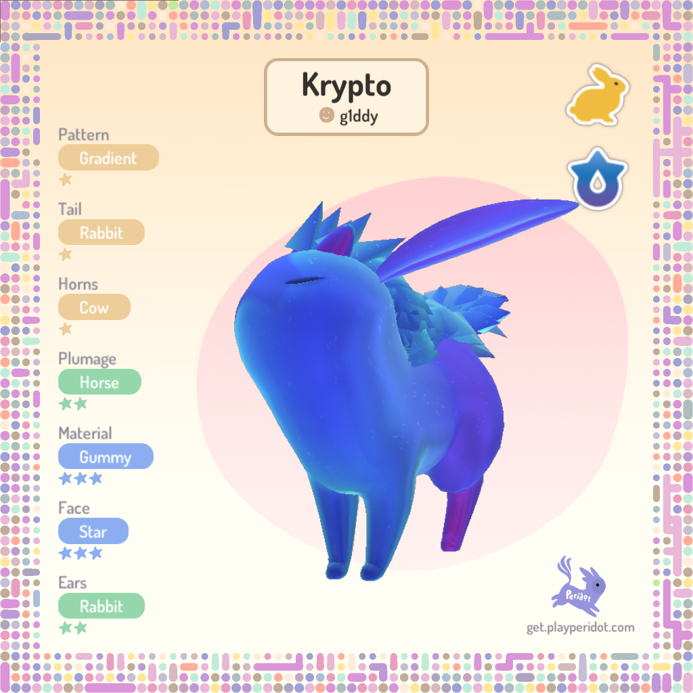

## Archetypes: Dewdrop, Ram, Count: 2
### Compatibility Table:
|Name|Ear|Face|Horn|Material|Pattern|Plumage|Tail|
|:--|:--|:--|:--|:--|:--|:--|:--|
|Dewdrop||Star||Gummy|Gradient|||
|Ram|||Ram||||Asparagus|

## Archetypes: Dragon, Static, Count: 2
### Compatibility Table:
|Name|Ear|Face|Horn|Material|Pattern|Plumage|Tail|
|:--|:--|:--|:--|:--|:--|:--|:--|
|Dragon|||Bull||Scales|Dragon|Flame|
|Static||||Static||||

### Example(s):
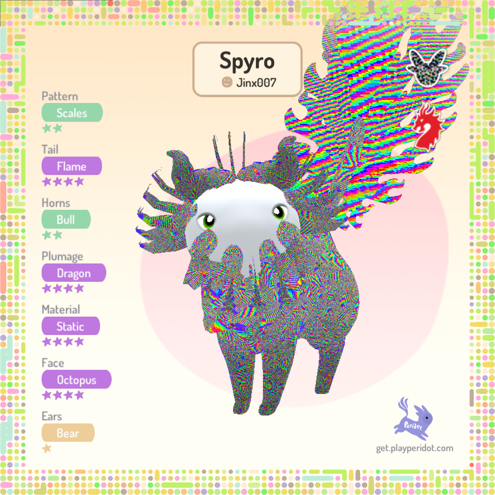

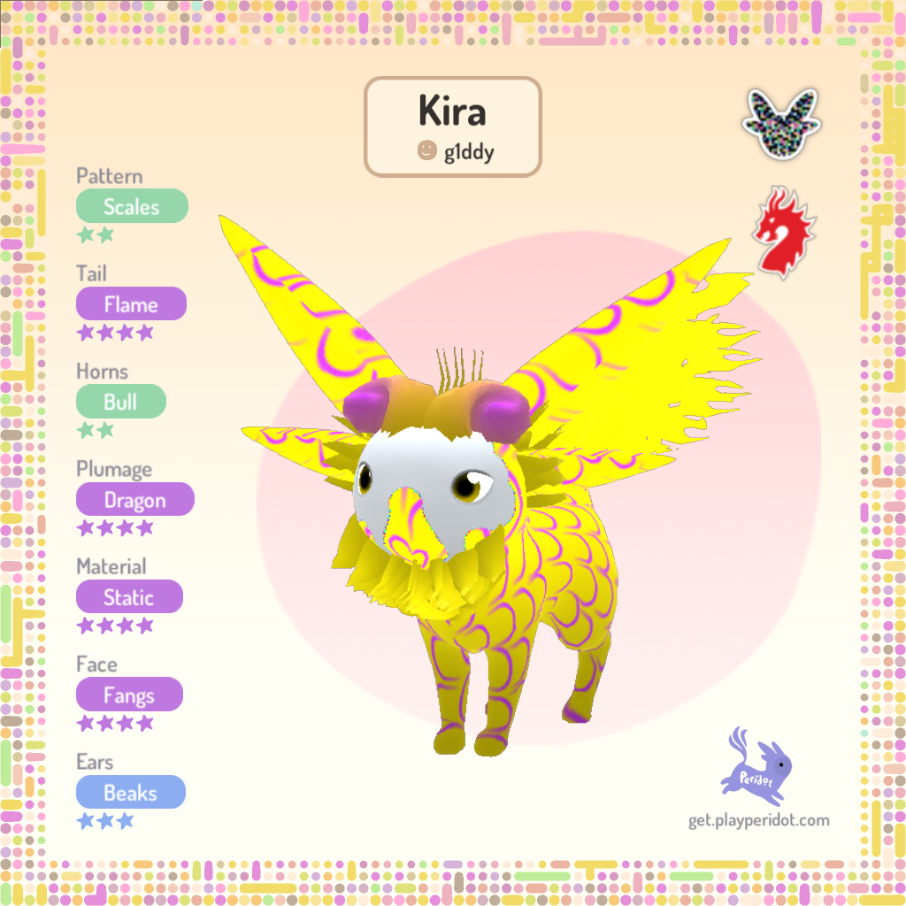

## Archetypes: Elixir, Rabbit, Count: 2
### Compatibility Table:
|Name|Ear|Face|Horn|Material|Pattern|Plumage|Tail|
|:--|:--|:--|:--|:--|:--|:--|:--|
|Elixir|||Spire|Glimmer|Puddle|Ruff||
|Rabbit|Rabbit||||||Rabbit|

### Example(s):
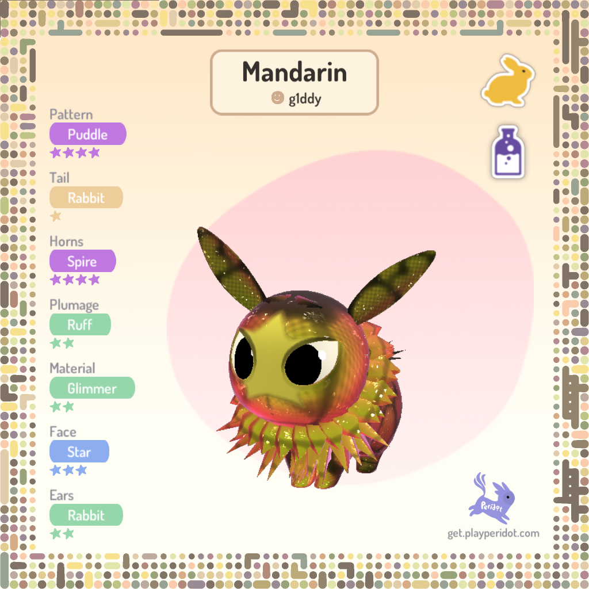

## Archetypes: Gargoyle, Psychedelic, Count: 2
### Compatibility Table:
|Name|Ear|Face|Horn|Material|Pattern|Plumage|Tail|
|:--|:--|:--|:--|:--|:--|:--|:--|
|Gargoyle|Slice||Demon|Starry||Bat Wings||
|Psychedelic||Octopus|||Breezy||Peacock|

## Archetypes: Gargoyle, Snowfall, Count: 2
### Compatibility Table:
|Name|Ear|Face|Horn|Material|Pattern|Plumage|Tail|
|:--|:--|:--|:--|:--|:--|:--|:--|
|Gargoyle|Slice||Demon|Starry||Bat Wings||
|Snowfall||Dots|||Snowfall||Snowflake|

## Archetypes: Gargoyle, Sunset, Count: 2
### Compatibility Table:
|Name|Ear|Face|Horn|Material|Pattern|Plumage|Tail|
|:--|:--|:--|:--|:--|:--|:--|:--|
|Gargoyle|Slice||Demon|Starry||Bat Wings||
|Sunset|||||Sunset||Fleur|

## Archetypes: Icicle, Psychedelic, Count: 2
### Compatibility Table:
|Name|Ear|Face|Horn|Material|Pattern|Plumage|Tail|
|:--|:--|:--|:--|:--|:--|:--|:--|
|Icicle|||Crown|Glimmer||Thorns||
|Psychedelic||Octopus|||Breezy||Peacock|

## Archetypes: Icicle, Rabbit, Count: 2
### Compatibility Table:
|Name|Ear|Face|Horn|Material|Pattern|Plumage|Tail|
|:--|:--|:--|:--|:--|:--|:--|:--|
|Icicle|||Crown|Glimmer||Thorns||
|Rabbit|Rabbit||||||Rabbit|

### Example(s):
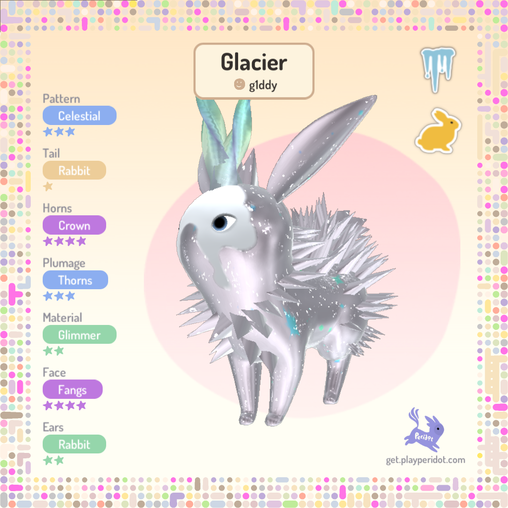

## Archetypes: Icicle, Snowfall, Count: 2
### Compatibility Table:
|Name|Ear|Face|Horn|Material|Pattern|Plumage|Tail|
|:--|:--|:--|:--|:--|:--|:--|:--|
|Icicle|||Crown|Glimmer||Thorns||
|Snowfall||Dots|||Snowfall||Snowflake|

### Example(s):
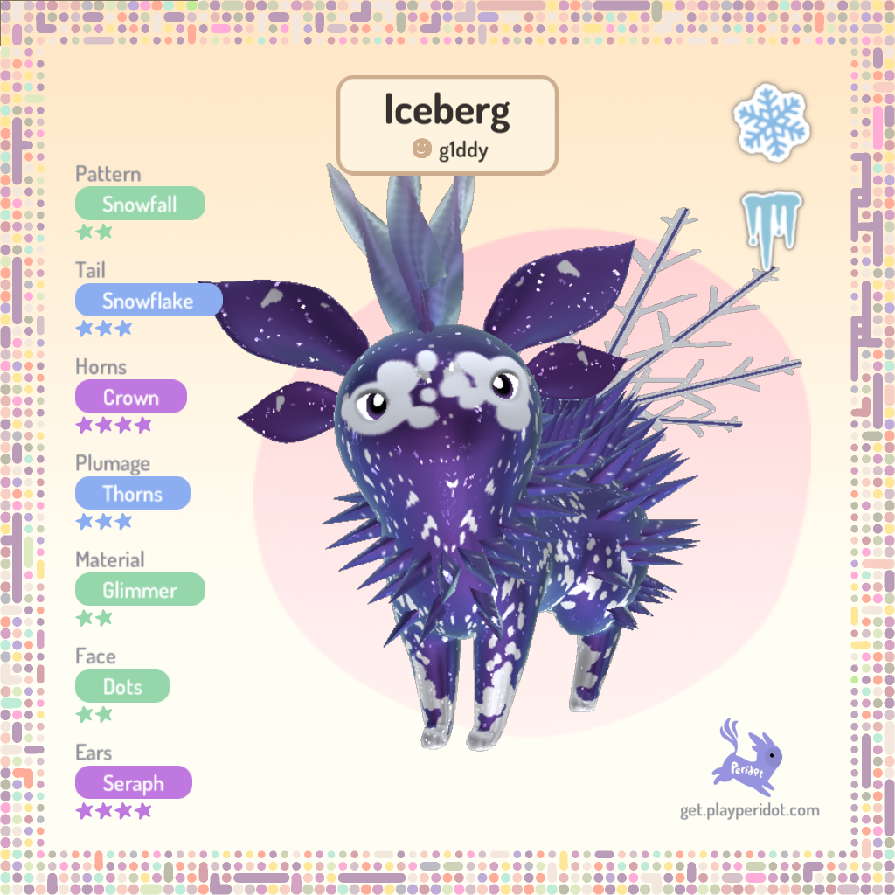

## Archetypes: Icicle, Sunset, Count: 2
### Compatibility Table:
|Name|Ear|Face|Horn|Material|Pattern|Plumage|Tail|
|:--|:--|:--|:--|:--|:--|:--|:--|
|Icicle|||Crown|Glimmer||Thorns||
|Sunset|||||Sunset||Fleur|

## Archetypes: Jester, Rabbit, Count: 2
### Compatibility Table:
|Name|Ear|Face|Horn|Material|Pattern|Plumage|Tail|
|:--|:--|:--|:--|:--|:--|:--|:--|
|Jester|||Jester|Ore|Diamonds|Ruff||
|Rabbit|Rabbit||||||Rabbit|

## Archetypes: Kintsugi, Peacock, Count: 2
### Compatibility Table:
|Name|Ear|Face|Horn|Material|Pattern|Plumage|Tail|
|:--|:--|:--|:--|:--|:--|:--|:--|
|Kintsugi||||Ore|Cracked|||
|Peacock|||None|||Spades|Peacock|

## Archetypes: Kintsugi, Rabbit, Count: 2
### Compatibility Table:
|Name|Ear|Face|Horn|Material|Pattern|Plumage|Tail|
|:--|:--|:--|:--|:--|:--|:--|:--|
|Kintsugi||||Ore|Cracked|||
|Rabbit|Rabbit||||||Rabbit|

### Example(s):
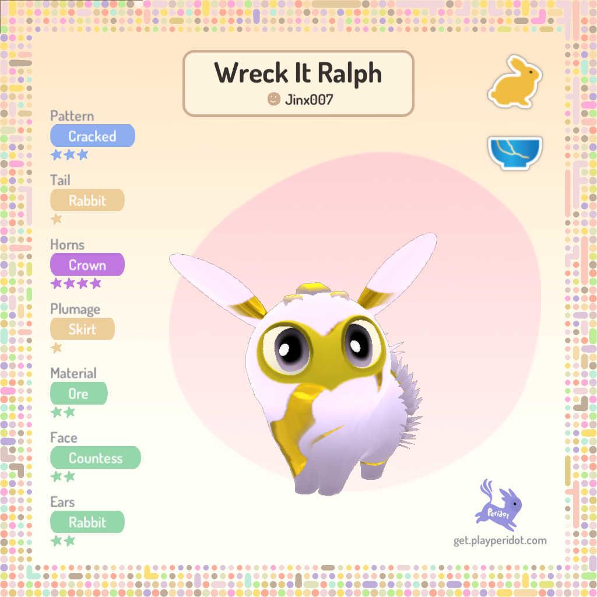

## Archetypes: Kintsugi, Ram, Count: 2
### Compatibility Table:
|Name|Ear|Face|Horn|Material|Pattern|Plumage|Tail|
|:--|:--|:--|:--|:--|:--|:--|:--|
|Kintsugi||||Ore|Cracked|||
|Ram|||Ram||||Asparagus|

### Example(s):
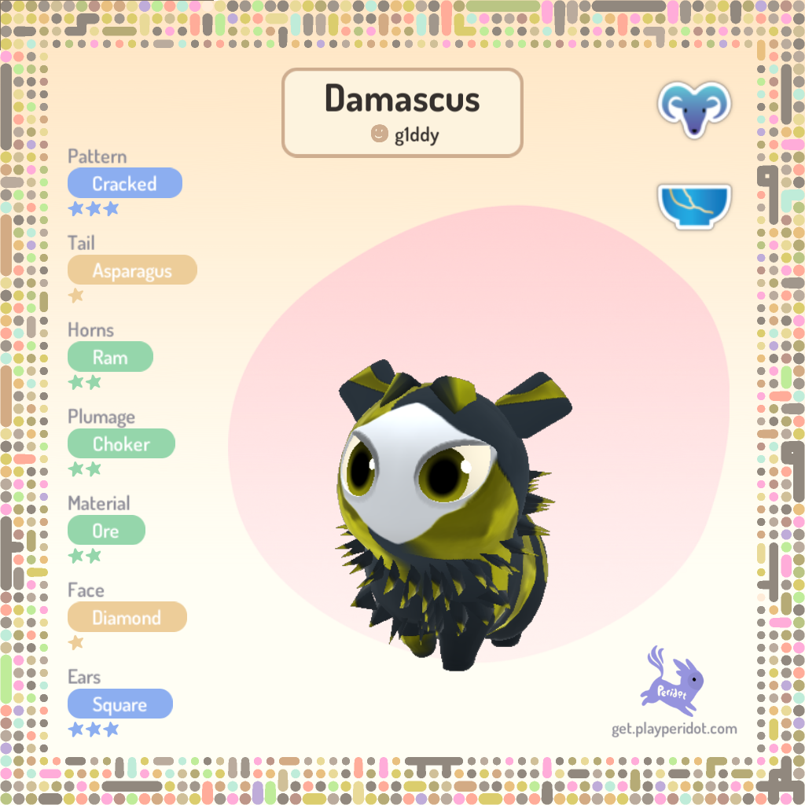

## Archetypes: Kintsugi, Royalty, Count: 2
### Compatibility Table:
|Name|Ear|Face|Horn|Material|Pattern|Plumage|Tail|
|:--|:--|:--|:--|:--|:--|:--|:--|
|Kintsugi||||Ore|Cracked|||
|Royalty||Countess|Crown|Ore||Tutu||

### Example(s):
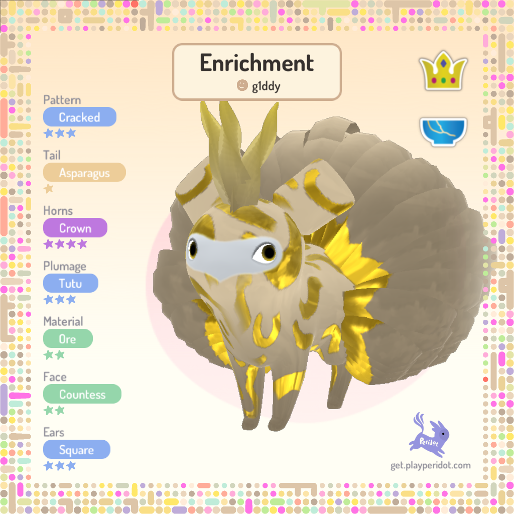

## Archetypes: LED, Peacock, Count: 2
### Compatibility Table:
|Name|Ear|Face|Horn|Material|Pattern|Plumage|Tail|
|:--|:--|:--|:--|:--|:--|:--|:--|
|LED||||LED|Pulse|||
|Peacock|||None|||Spades|Peacock|

### Example(s):
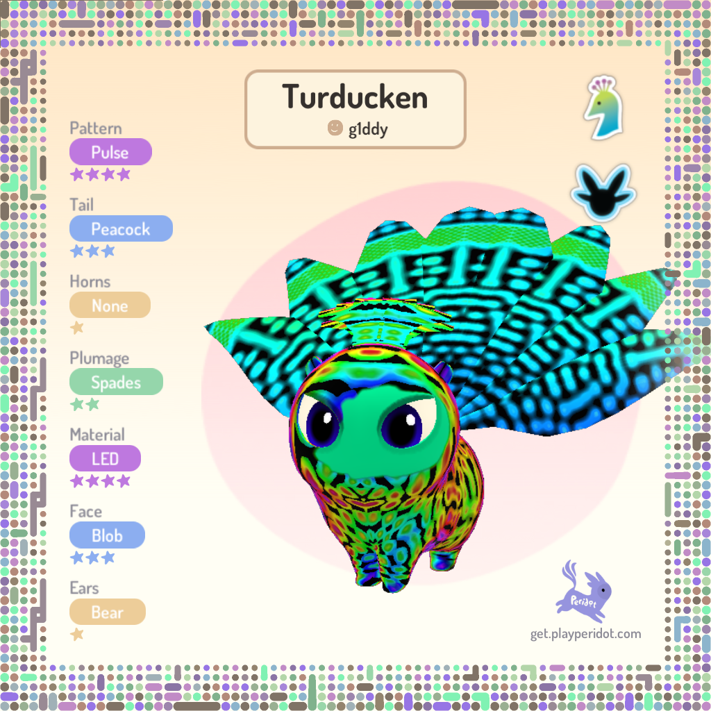

## Archetypes: LED, Rabbit, Count: 2
### Compatibility Table:
|Name|Ear|Face|Horn|Material|Pattern|Plumage|Tail|
|:--|:--|:--|:--|:--|:--|:--|:--|
|LED||||LED|Pulse|||
|Rabbit|Rabbit||||||Rabbit|

### Example(s):
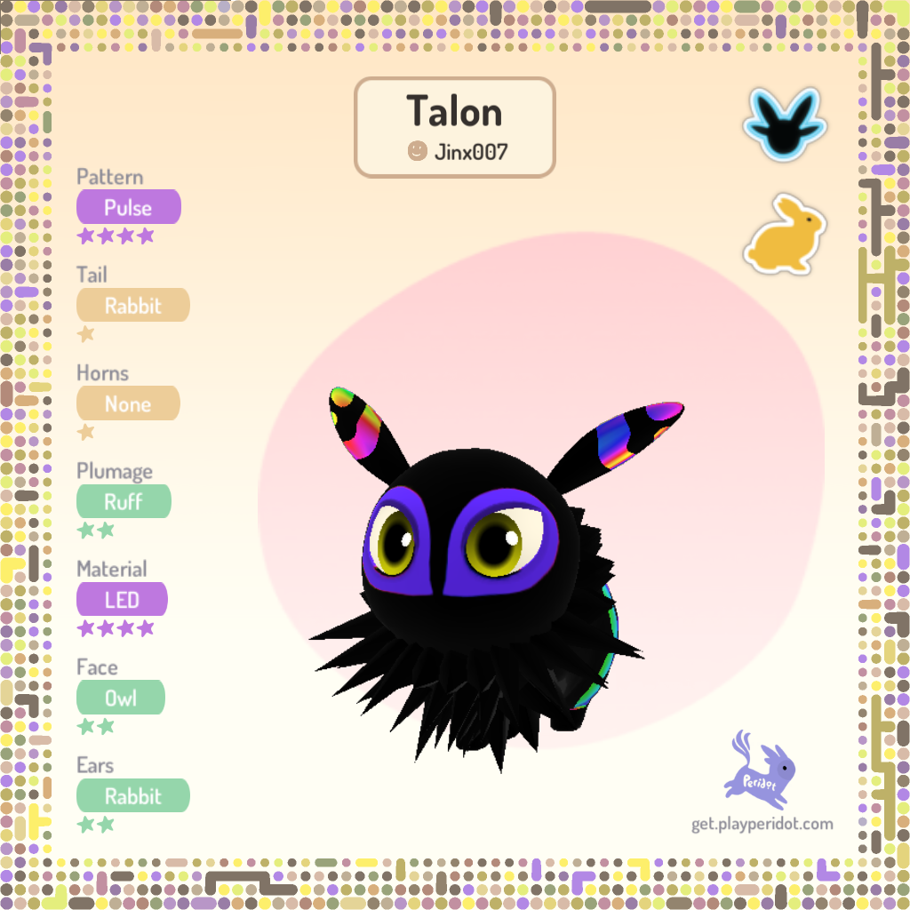

## Archetypes: LED, Ram, Count: 2
### Compatibility Table:
|Name|Ear|Face|Horn|Material|Pattern|Plumage|Tail|
|:--|:--|:--|:--|:--|:--|:--|:--|
|LED||||LED|Pulse|||
|Ram|||Ram||||Asparagus|

## Archetypes: Patchwork, Scarecrow, Count: 2
### Compatibility Table:
|Name|Ear|Face|Horn|Material|Pattern|Plumage|Tail|
|:--|:--|:--|:--|:--|:--|:--|:--|
|Patchwork|Square|||Matte|Patchwork||Accordion|
|Scarecrow|||Pitchfork||Patchwork|Quetzal||

### Example(s):
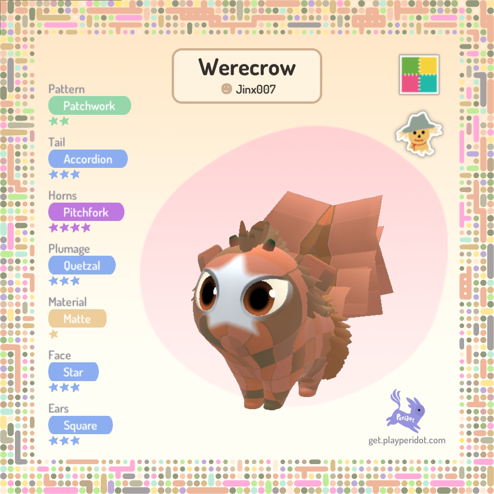

## Archetypes: Patina, Peacock, Count: 2
### Compatibility Table:
|Name|Ear|Face|Horn|Material|Pattern|Plumage|Tail|
|:--|:--|:--|:--|:--|:--|:--|:--|
|Patina||||Rusty|Patina|||
|Peacock|||None|||Spades|Peacock|

## Archetypes: Patina, Rabbit, Count: 2
### Compatibility Table:
|Name|Ear|Face|Horn|Material|Pattern|Plumage|Tail|
|:--|:--|:--|:--|:--|:--|:--|:--|
|Patina||||Rusty|Patina|||
|Rabbit|Rabbit||||||Rabbit|

## Archetypes: Patina, Ram, Count: 2
### Compatibility Table:
|Name|Ear|Face|Horn|Material|Pattern|Plumage|Tail|
|:--|:--|:--|:--|:--|:--|:--|:--|
|Patina||||Rusty|Patina|||
|Ram|||Ram||||Asparagus|

### Example(s):
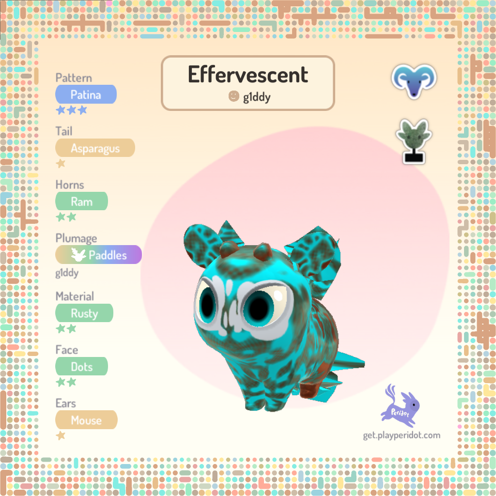

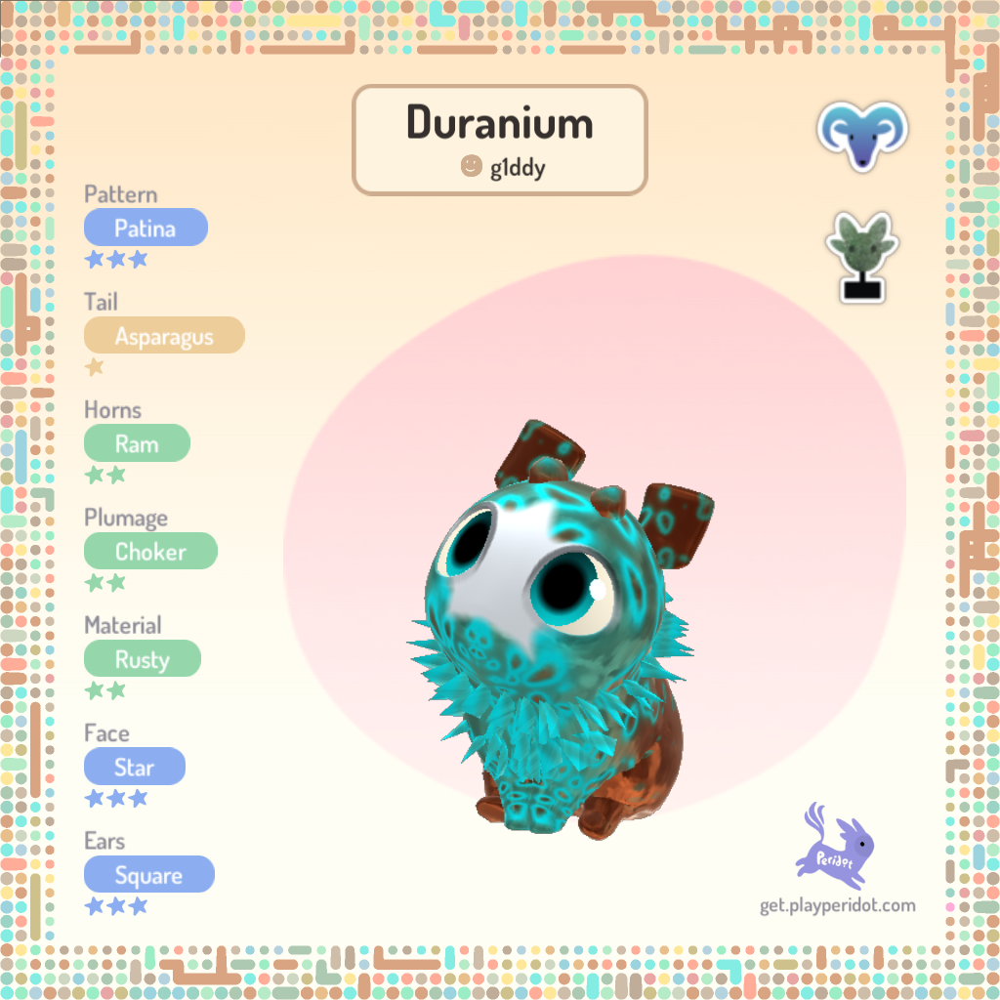

## Archetypes: Peacock, Psychedelic, Count: 2
### Compatibility Table:
|Name|Ear|Face|Horn|Material|Pattern|Plumage|Tail|
|:--|:--|:--|:--|:--|:--|:--|:--|
|Peacock|||None|||Spades|Peacock|
|Psychedelic||Octopus|||Breezy||Peacock|

### Example(s):
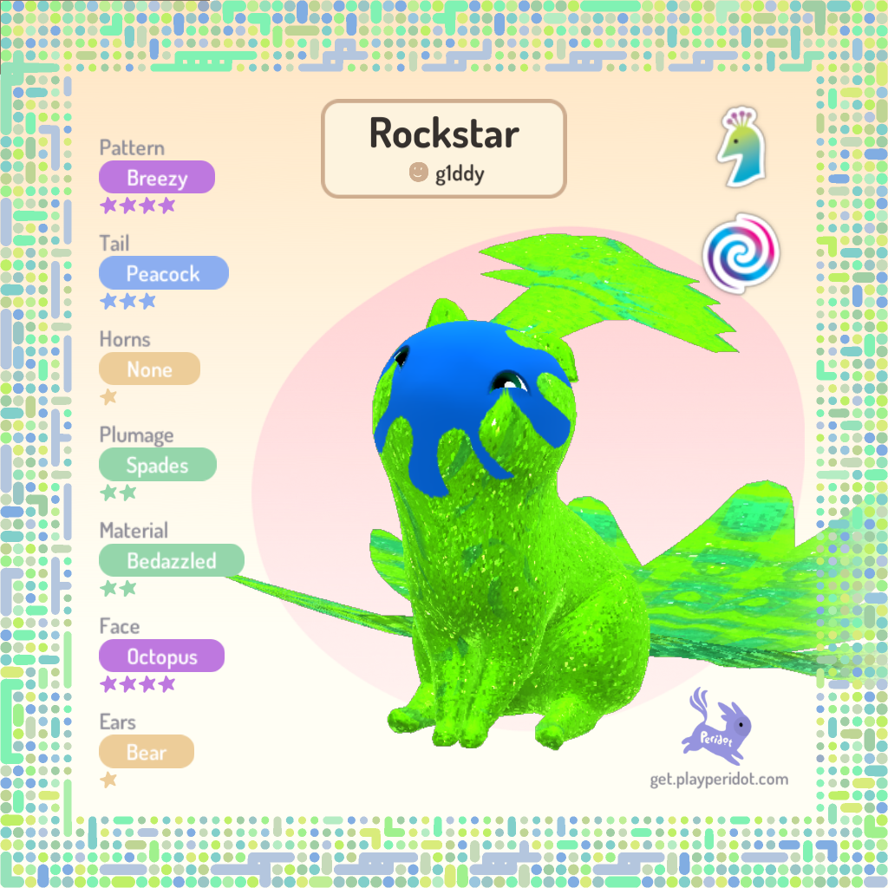

## Archetypes: Peacock, Static, Count: 2
### Compatibility Table:
|Name|Ear|Face|Horn|Material|Pattern|Plumage|Tail|
|:--|:--|:--|:--|:--|:--|:--|:--|
|Peacock|||None|||Spades|Peacock|
|Static||||Static||||

### Example(s):
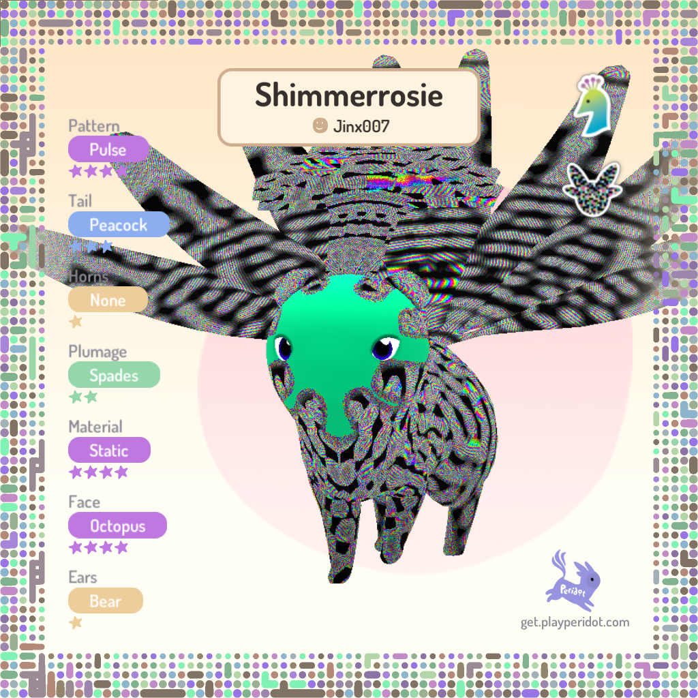

## Archetypes: Peacock, Watermelon, Count: 2
### Compatibility Table:
|Name|Ear|Face|Horn|Material|Pattern|Plumage|Tail|
|:--|:--|:--|:--|:--|:--|:--|:--|
|Peacock|||None|||Spades|Peacock|
|Watermelon|Slice|||Pulp|Watermelon|||

## Archetypes: Psychedelic, Static, Count: 2
### Compatibility Table:
|Name|Ear|Face|Horn|Material|Pattern|Plumage|Tail|
|:--|:--|:--|:--|:--|:--|:--|:--|
|Psychedelic||Octopus|||Breezy||Peacock|
|Static||||Static||||

## Archetypes: Rabbit, Royalty, Count: 2
### Compatibility Table:
|Name|Ear|Face|Horn|Material|Pattern|Plumage|Tail|
|:--|:--|:--|:--|:--|:--|:--|:--|
|Rabbit|Rabbit||||||Rabbit|
|Royalty||Countess|Crown|Ore||Tutu||

## Archetypes: Rabbit, Scarecrow, Count: 2
### Compatibility Table:
|Name|Ear|Face|Horn|Material|Pattern|Plumage|Tail|
|:--|:--|:--|:--|:--|:--|:--|:--|
|Rabbit|Rabbit||||||Rabbit|
|Scarecrow|||Pitchfork||Patchwork|Quetzal||

## Archetypes: Rabbit, Static, Count: 2
### Compatibility Table:
|Name|Ear|Face|Horn|Material|Pattern|Plumage|Tail|
|:--|:--|:--|:--|:--|:--|:--|:--|
|Rabbit|Rabbit||||||Rabbit|
|Static||||Static||||

### Example(s):
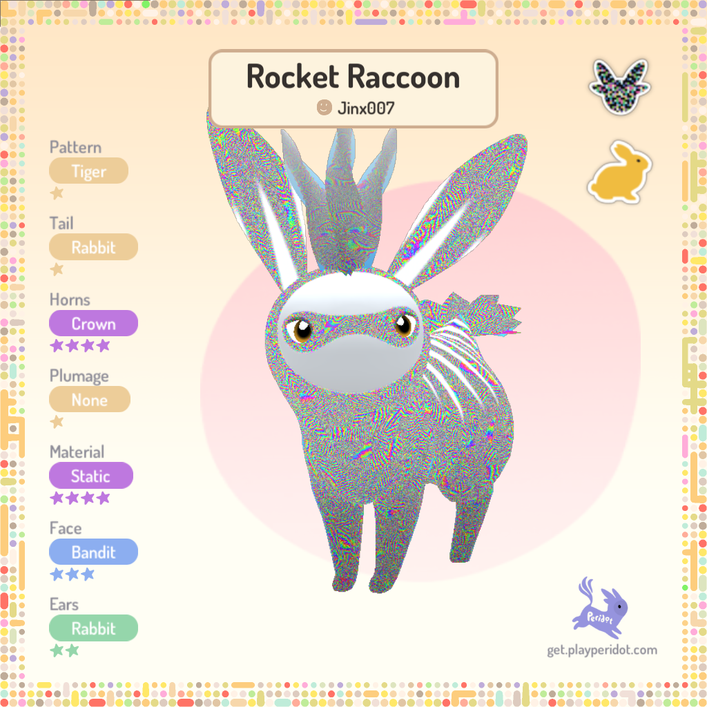

## Archetypes: Ram, Static, Count: 2
### Compatibility Table:
|Name|Ear|Face|Horn|Material|Pattern|Plumage|Tail|
|:--|:--|:--|:--|:--|:--|:--|:--|
|Ram|||Ram||||Asparagus|
|Static||||Static||||

### Example(s):
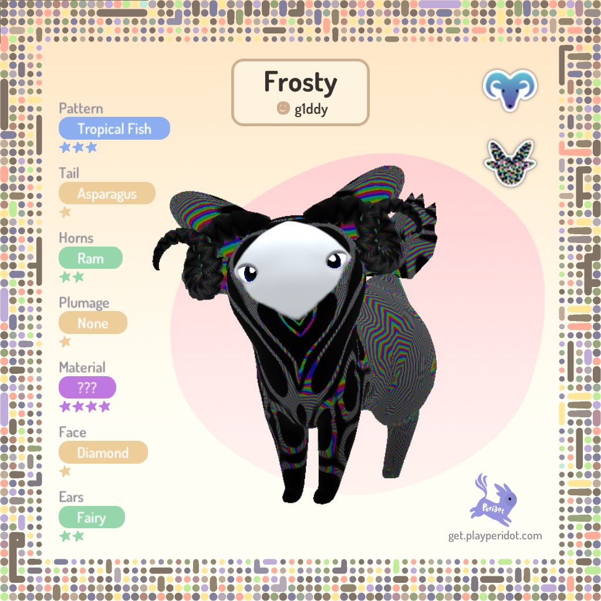

## Archetypes: Ram, Watermelon, Count: 2
### Compatibility Table:
|Name|Ear|Face|Horn|Material|Pattern|Plumage|Tail|
|:--|:--|:--|:--|:--|:--|:--|:--|
|Ram|||Ram||||Asparagus|
|Watermelon|Slice|||Pulp|Watermelon|||

### Example(s):
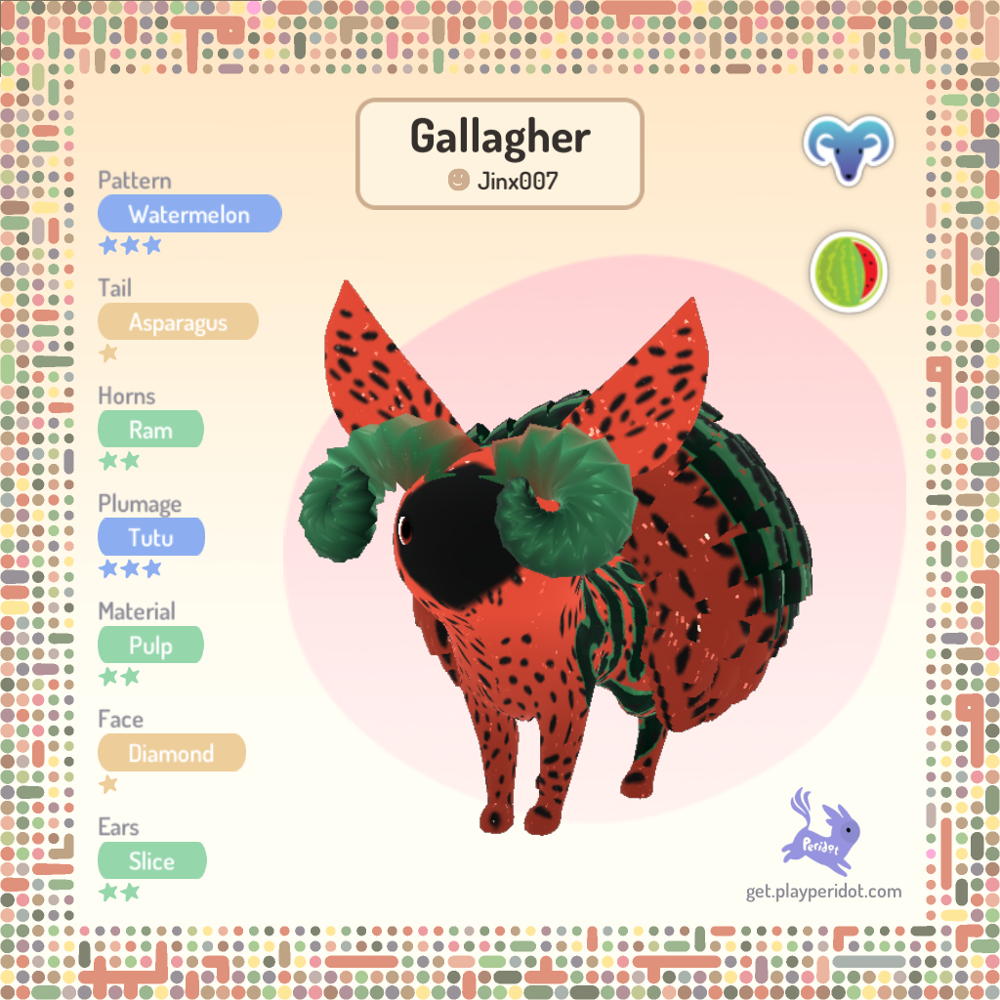

## Archetypes: Royalty, Sunset, Count: 2
### Compatibility Table:
|Name|Ear|Face|Horn|Material|Pattern|Plumage|Tail|
|:--|:--|:--|:--|:--|:--|:--|:--|
|Royalty||Countess|Crown|Ore||Tutu||
|Sunset|||||Sunset||Fleur|

### Example(s):
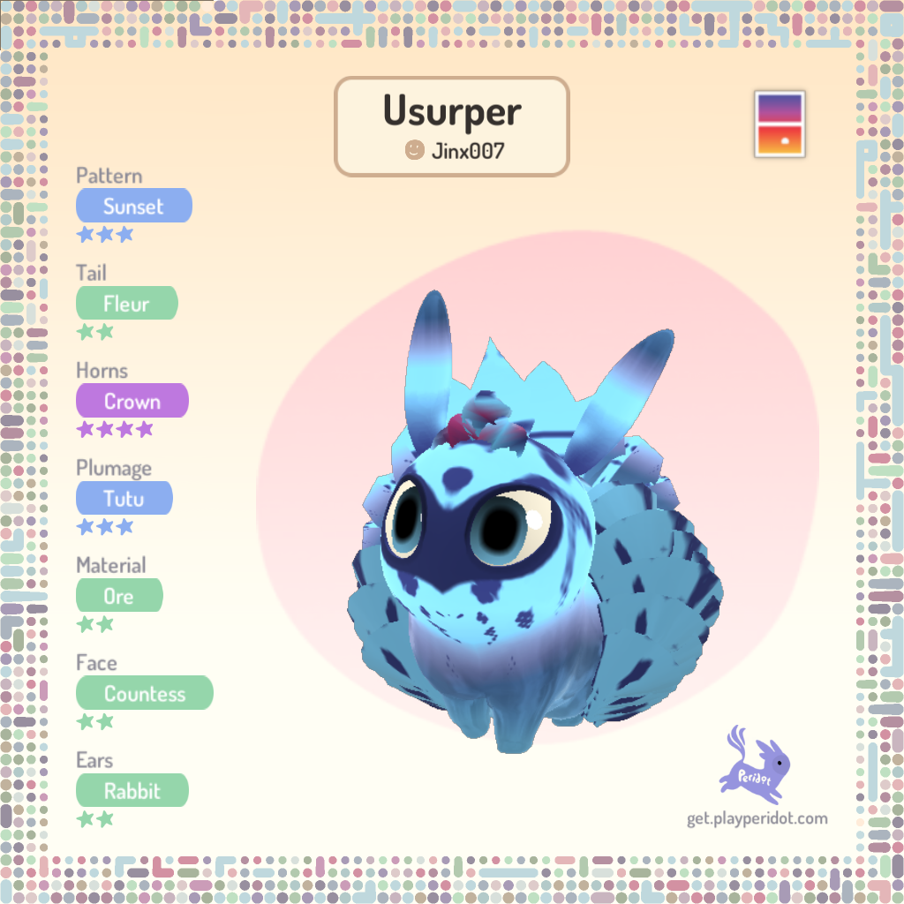

## Archetypes: Scarecrow, Static, Count: 2
### Compatibility Table:
|Name|Ear|Face|Horn|Material|Pattern|Plumage|Tail|
|:--|:--|:--|:--|:--|:--|:--|:--|
|Scarecrow|||Pitchfork||Patchwork|Quetzal||
|Static||||Static||||

## Archetypes: Seal, Static, Count: 2
### Compatibility Table:
|Name|Ear|Face|Horn|Material|Pattern|Plumage|Tail|
|:--|:--|:--|:--|:--|:--|:--|:--|
|Seal|None||||Cheetah|Whiskers|Mermaid|
|Static||||Static||||

### Example(s):
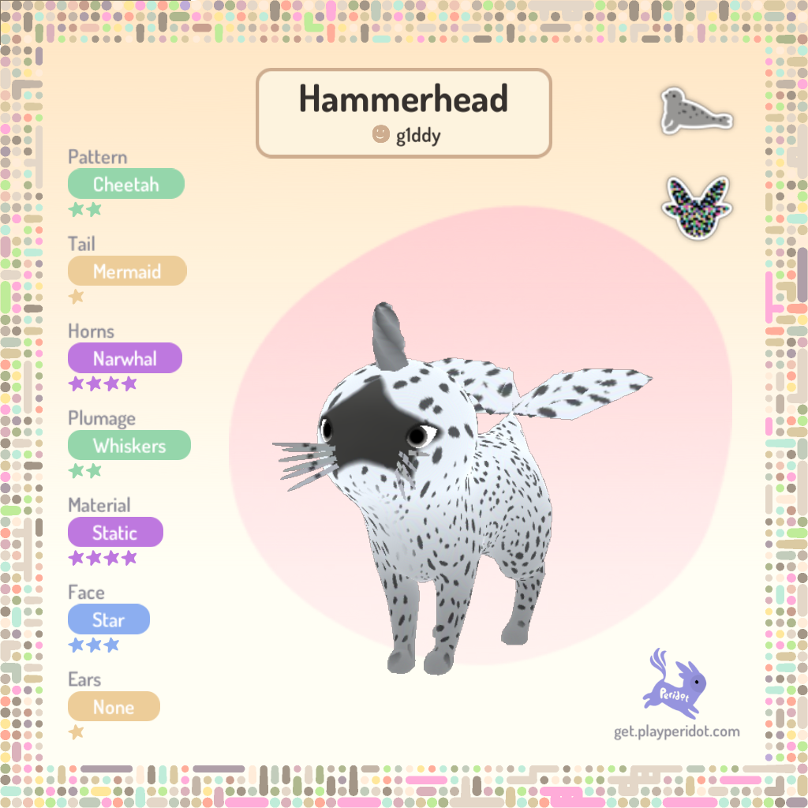

## Archetypes: Snowfall, Static, Count: 2
### Compatibility Table:
|Name|Ear|Face|Horn|Material|Pattern|Plumage|Tail|
|:--|:--|:--|:--|:--|:--|:--|:--|
|Snowfall||Dots|||Snowfall||Snowflake|
|Static||||Static||||

## Archetypes: Static, Sunset, Count: 2
### Compatibility Table:
|Name|Ear|Face|Horn|Material|Pattern|Plumage|Tail|
|:--|:--|:--|:--|:--|:--|:--|:--|
|Static||||Static||||
|Sunset|||||Sunset||Fleur|

### Example(s):
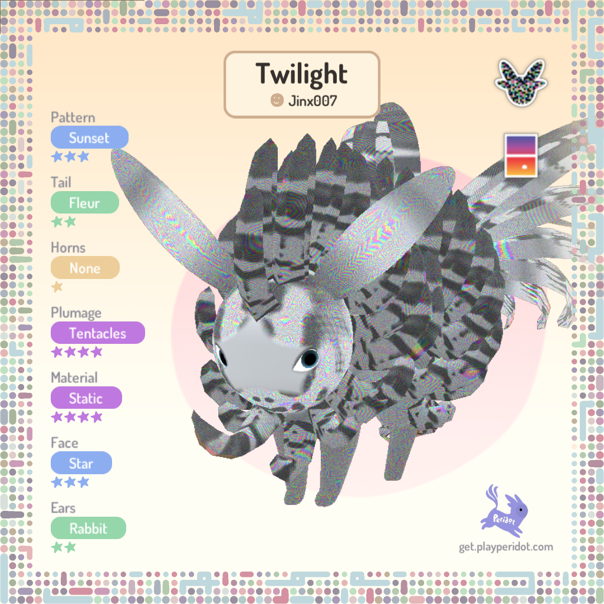

## Archetypes: Static, Triceratops, Count: 2
### Compatibility Table:
|Name|Ear|Face|Horn|Material|Pattern|Plumage|Tail|
|:--|:--|:--|:--|:--|:--|:--|:--|
|Static||||Static||||
|Triceratops|Triceratops||Triceratops||Baguette||Asparagus|

### Example(s):
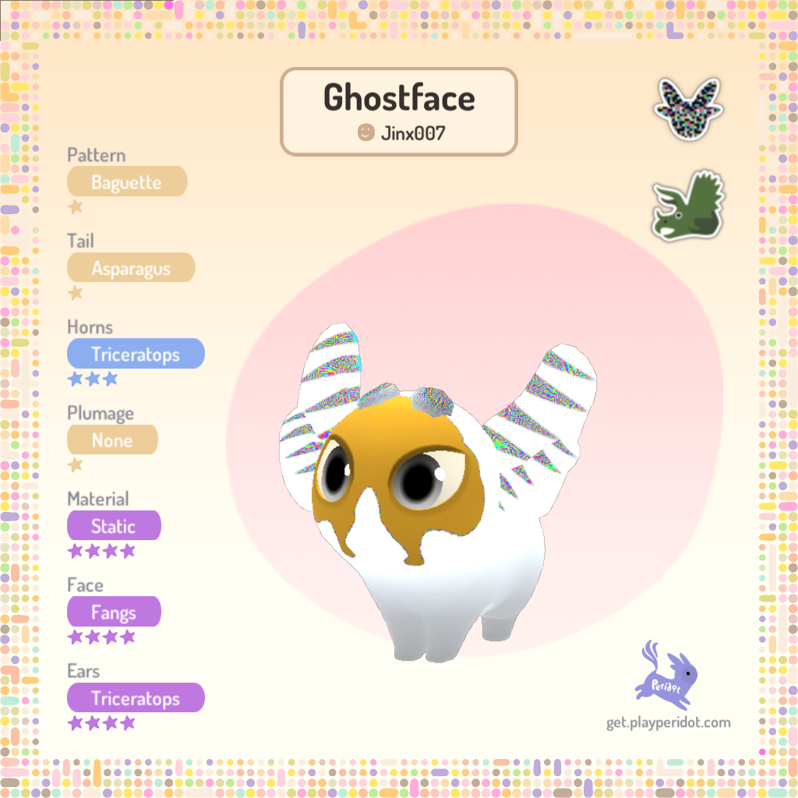

## Archetypes: Static, Vampire, Count: 2
### Compatibility Table:
|Name|Ear|Face|Horn|Material|Pattern|Plumage|Tail|
|:--|:--|:--|:--|:--|:--|:--|:--|
|Static||||Static||||
|Vampire|Bat|Fangs|||Sunset|Ruff|Peacock|

