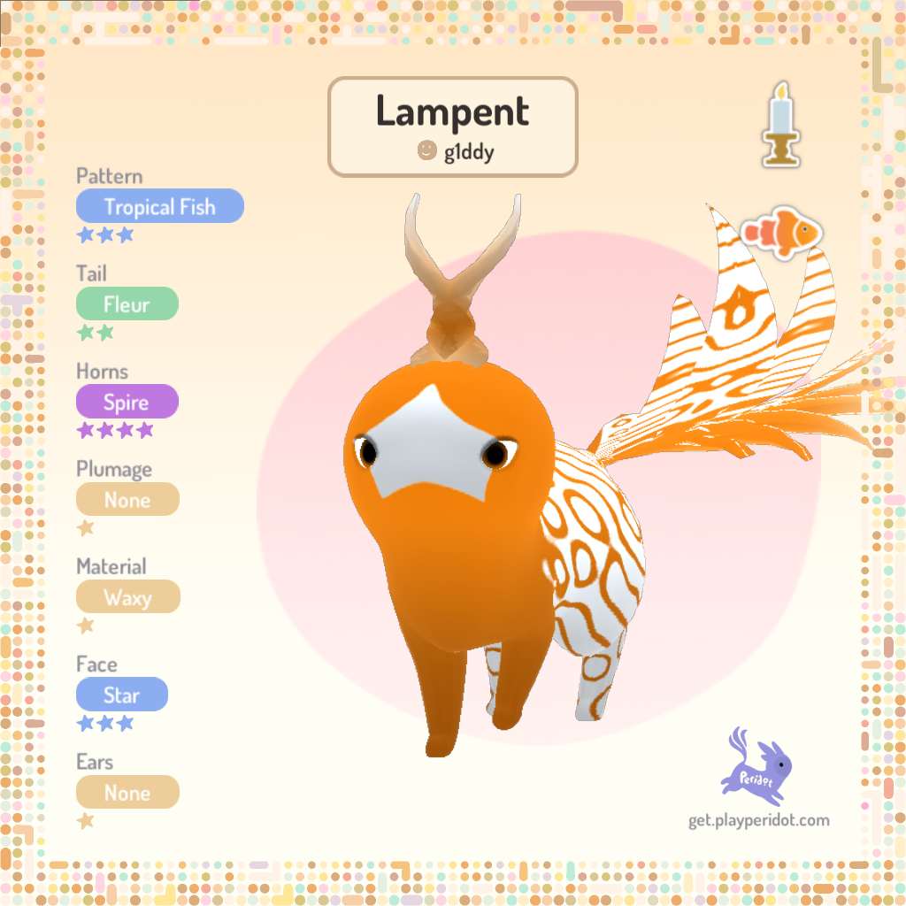

# Peridot with Multi Archetype

## Archetypes: Anemone, Clownfish, Rabbit, Count: 3
### Compatibility Table:
| Name      | Ear    | Face | Horn  | Material | Pattern       | Plumage   | Tail   |
| :-------- | :----- | :--- | :---- | :------- | :------------ | :-------- | :----- |
| Anemone   |        |      | Demon | Slimy    |               | Tentacles |        |
| Clownfish |        |      |       |          | Tropical Fish |           |        |
| Rabbit    | Rabbit |      |       |          |               |           | Rabbit |

### Examples:

## Archetypes: Balloon, Rabbit, Static, Count: 3
### Compatibility Table:
| Name    | Ear    | Face | Horn    | Material | Pattern   | Plumage | Tail   |
| :------ | :----- | :--- | :------ | :------- | :-------- | :------ | :----- |
| Balloon |        |      | Stacked |          | Patchwork | Tutu    |        |
| Rabbit  | Rabbit |      |         |          |           |         | Rabbit |
| Static  |        |      |         | ???      |           |         |        |

### Examples:

## Archetypes: Boba, Rabbit, Static, Count: 3
### Compatibility Table:
| Name   | Ear    | Face | Horn  | Material | Pattern | Plumage | Tail   |
| :----- | :----- | :--- | :---- | :------- | :------ | :------ | :----- |
| Boba   |        |      | Straw |          | Bubbles |         |        |
| Rabbit | Rabbit |      |       |          |         |         | Rabbit |
| Static |        |      |       | ???      |         |         |        |

### Examples:

## Archetypes: Clownfish, Cotton Candy, Rabbit, Count: 3
### Compatibility Table:
| Name         | Ear    | Face | Horn    | Material | Pattern       | Plumage | Tail   |
| :----------- | :----- | :--- | :------ | :------- | :------------ | :------ | :----- |
| Clownfish    |        |      |         |          | Tropical Fish |         |        |
| Cotton Candy |        |      | Narwhal | Furry    |               |         |        |
| Rabbit       | Rabbit |      |         |          |               |         | Rabbit |

### Examples:

## Archetypes: Clownfish, Icicle, Rabbit, Count: 3
### Compatibility Table:
| Name      | Ear    | Face | Horn  | Material | Pattern       | Plumage | Tail   |
| :-------- | :----- | :--- | :---- | :------- | :------------ | :------ | :----- |
| Clownfish |        |      |       |          | Tropical Fish |         |        |
| Icicle    |        |      | Crown | Glimmer  |               | Thorns  |        |
| Rabbit    | Rabbit |      |       |          |               |         | Rabbit |

### Examples:

## Archetypes: Clownfish, Peacock, Static, Count: 3
### Compatibility Table:
| Name      | Ear  | Face | Horn | Material | Pattern       | Plumage | Tail    |
| :-------- | :--- | :--- | :--- | :------- | :------------ | :------ | :------ |
| Clownfish |      |      |      |          | Tropical Fish |         |         |
| Peacock   |      |      | None |          |               | Spades  | Peacock |
| Static    |      |      |      | ???      |               |         |         |

### Examples:

## Archetypes: Clownfish, Rabbit, Royalty, Count: 3
### Compatibility Table:
| Name      | Ear    | Face     | Horn  | Material | Pattern       | Plumage | Tail   |
| :-------- | :----- | :------- | :---- | :------- | :------------ | :------ | :----- |
| Clownfish |        |          |       |          | Tropical Fish |         |        |
| Rabbit    | Rabbit |          |       |          |               |         | Rabbit |
| Royalty   |        | Countess | Crown | Ore      |               | Tutu    |        |

### Examples:

## Archetypes: Clownfish, Rabbit, Static, Count: 3
### Compatibility Table:
| Name      | Ear    | Face | Horn | Material | Pattern       | Plumage | Tail   |
| :-------- | :----- | :--- | :--- | :------- | :------------ | :------ | :----- |
| Clownfish |        |      |      |          | Tropical Fish |         |        |
| Rabbit    | Rabbit |      |      |          |               |         | Rabbit |
| Static    |        |      |      | ???      |               |         |        |

### Examples:

## Archetypes: Clownfish, Ram, Static, Count: 3
### Compatibility Table:
| Name      | Ear  | Face | Horn | Material | Pattern       | Plumage | Tail      |
| :-------- | :--- | :--- | :--- | :------- | :------------ | :------ | :-------- |
| Clownfish |      |      |      |          | Tropical Fish |         |           |
| Ram       |      |      | Ram  |          |               |         | Asparagus |
| Static    |      |      |      | ???      |               |         |           |

### Examples:

## Archetypes: Kintsugi, Rabbit, Royalty, Count: 3
### Compatibility Table:
| Name     | Ear    | Face     | Horn  | Material | Pattern | Plumage | Tail   |
| :------- | :----- | :------- | :---- | :------- | :------ | :------ | :----- |
| Kintsugi |        |          |       | Ore      | Cracked |         |        |
| Rabbit   | Rabbit |          |       |          |         |         | Rabbit |
| Royalty  |        | Countess | Crown | Ore      |         | Tutu    |        |

### Examples:

## Archetypes: Peacock, Psychedelic, Static, Count: 3
### Compatibility Table:
| Name        | Ear  | Face    | Horn | Material | Pattern | Plumage | Tail    |
| :---------- | :--- | :------ | :--- | :------- | :------ | :------ | :------ |
| Peacock     |      |         | None |          |         | Spades  | Peacock |
| Psychedelic |      | Octopus |      |          | Breezy  |         | Peacock |
| Static      |      |         |      | ???      |         |         |         |

### Examples:

## Archetypes: 24Karat, Peacock, Count: 2
### Compatibility Table:
| Name    | Ear  | Face | Horn | Material | Pattern | Plumage | Tail    |
| :------ | :--- | :--- | :--- | :------- | :------ | :------ | :------ |
| 24Karat |      |      |      | Chrome   | Solid   |         |         |
| Peacock |      |      | None |          |         | Spades  | Peacock |

### Examples:

## Archetypes: 24Karat, Rabbit, Count: 2
### Compatibility Table:
| Name    | Ear    | Face | Horn | Material | Pattern | Plumage | Tail   |
| :------ | :----- | :--- | :--- | :------- | :------ | :------ | :----- |
| 24Karat |        |      |      | Chrome   | Solid   |         |        |
| Rabbit  | Rabbit |      |      |          |         |         | Rabbit |

### Examples:

## Archetypes: 24Karat, Ram, Count: 2
### Compatibility Table:
| Name    | Ear  | Face | Horn | Material | Pattern | Plumage | Tail      |
| :------ | :--- | :--- | :--- | :------- | :------ | :------ | :-------- |
| 24Karat |      |      |      | Chrome   | Solid   |         |           |
| Ram     |      |      | Ram  |          |         |         | Asparagus |

### Examples:

## Archetypes: Anemone, Clownfish, Count: 2
### Compatibility Table:
| Name      | Ear  | Face | Horn  | Material | Pattern       | Plumage   | Tail |
| :-------- | :--- | :--- | :---- | :------- | :------------ | :-------- | :--- |
| Anemone   |      |      | Demon | Slimy    |               | Tentacles |      |
| Clownfish |      |      |       |          | Tropical Fish |           |      |

### Examples:

## Archetypes: Anemone, Psychedelic, Count: 2
### Compatibility Table:
| Name        | Ear  | Face    | Horn  | Material | Pattern | Plumage   | Tail    |
| :---------- | :--- | :------ | :---- | :------- | :------ | :-------- | :------ |
| Anemone     |      |         | Demon | Slimy    |         | Tentacles |         |
| Psychedelic |      | Octopus |       |          | Breezy  |           | Peacock |

### Examples:

## Archetypes: Anemone, Rabbit, Count: 2
### Compatibility Table:
| Name    | Ear    | Face | Horn  | Material | Pattern | Plumage   | Tail   |
| :------ | :----- | :--- | :---- | :------- | :------ | :-------- | :----- |
| Anemone |        |      | Demon | Slimy    |         | Tentacles |        |
| Rabbit  | Rabbit |      |       |          |         |           | Rabbit |

### Examples:

## Archetypes: Anemone, Sunset, Count: 2
### Compatibility Table:
| Name    | Ear  | Face | Horn  | Material | Pattern | Plumage   | Tail  |
| :------ | :--- | :--- | :---- | :------- | :------ | :-------- | :---- |
| Anemone |      |      | Demon | Slimy    |         | Tentacles |       |
| Sunset  |      |      |       |          | Sunset  |           | Fleur |

### Examples:

## Archetypes: Aurora, Sunset, Count: 2
### Compatibility Table:
| Name   | Ear    | Face | Horn   | Material | Pattern | Plumage | Tail  |
| :----- | :----- | :--- | :----- | :------- | :------ | :------ | :---- |
| Aurora | Seraph |      | Bharal | Starry   | Sunset  |         |       |
| Sunset |        |      |        |          | Sunset  |         | Fleur |

### Examples:

## Archetypes: Balloon, Patchwork, Count: 2
### Compatibility Table:
| Name      | Ear    | Face | Horn    | Material | Pattern   | Plumage | Tail      |
| :-------- | :----- | :--- | :------ | :------- | :-------- | :------ | :-------- |
| Balloon   |        |      | Stacked |          | Patchwork | Tutu    |           |
| Patchwork | Square |      |         | Matte    | Patchwork |         | Accordion |

### Examples:

## Archetypes: Balloon, Rabbit, Count: 2
### Compatibility Table:
| Name    | Ear    | Face | Horn    | Material | Pattern   | Plumage | Tail   |
| :------ | :----- | :--- | :------ | :------- | :-------- | :------ | :----- |
| Balloon |        |      | Stacked |          | Patchwork | Tutu    |        |
| Rabbit  | Rabbit |      |         |          |           |         | Rabbit |

### Examples:

## Archetypes: Balloon, Static, Count: 2
### Compatibility Table:
| Name    | Ear  | Face | Horn    | Material | Pattern   | Plumage | Tail |
| :------ | :--- | :--- | :------ | :------- | :-------- | :------ | :--- |
| Balloon |      |      | Stacked |          | Patchwork | Tutu    |      |
| Static  |      |      |         | ???      |           |         |      |

### Examples:

## Archetypes: Bee, Rabbit, Count: 2
### Compatibility Table:
| Name   | Ear    | Face | Horn     | Material | Pattern | Plumage  | Tail   |
| :----- | :----- | :--- | :------- | :------- | :------ | :------- | :----- |
| Bee    |        |      | Antennae | Fuzzy    | Bee     | BeeWings |        |
| Rabbit | Rabbit |      |          |          |         |          | Rabbit |

### Examples:

## Archetypes: Bismuth, Peacock, Count: 2
### Compatibility Table:
| Name    | Ear    | Face    | Horn | Material   | Pattern | Plumage | Tail    |
| :------ | :----- | :------ | :--- | :--------- | :------ | :------ | :------ |
| Bismuth | Square | Diamond |      | Iridescent | Circuit |         |         |
| Peacock |        |         | None |            |         | Spades  | Peacock |

### Examples:

## Archetypes: Bismuth, Ram, Count: 2
### Compatibility Table:
| Name    | Ear    | Face    | Horn | Material   | Pattern | Plumage | Tail      |
| :------ | :----- | :------ | :--- | :--------- | :------ | :------ | :-------- |
| Bismuth | Square | Diamond |      | Iridescent | Circuit |         |           |
| Ram     |        |         | Ram  |            |         |         | Asparagus |

### Examples:

## Archetypes: Boba, Cactus, Count: 2
### Compatibility Table:
| Name   | Ear  | Face | Horn  | Material | Pattern | Plumage | Tail |
| :----- | :--- | :--- | :---- | :------- | :------ | :------ | :--- |
| Boba   |      |      | Straw |          | Bubbles |         |      |
| Cactus |      |      |       | Matte    |         | Thorns  | None |

### Examples:

## Archetypes: Boba, Glam, Count: 2
### Compatibility Table:
| Name | Ear   | Face | Horn  | Material  | Pattern | Plumage | Tail |
| :--- | :---- | :--- | :---- | :-------- | :------ | :------ | :--- |
| Boba |       |      | Straw |           | Bubbles |         |      |
| Glam | Picks | Star |       | Bedazzled |         | Curls   | None |

### Examples:

## Archetypes: Boba, Rabbit, Count: 2
### Compatibility Table:
| Name   | Ear    | Face | Horn  | Material | Pattern | Plumage | Tail   |
| :----- | :----- | :--- | :---- | :------- | :------ | :------ | :----- |
| Boba   |        |      | Straw |          | Bubbles |         |        |
| Rabbit | Rabbit |      |       |          |         |         | Rabbit |

### Examples:

## Archetypes: Boba, Static, Count: 2
### Compatibility Table:
| Name   | Ear  | Face | Horn  | Material | Pattern | Plumage | Tail |
| :----- | :--- | :--- | :---- | :------- | :------ | :------ | :--- |
| Boba   |      |      | Straw |          | Bubbles |         |      |
| Static |      |      |       | ???      |         |         |      |

### Examples:

## Archetypes: Cactus, Clownfish, Count: 2
### Compatibility Table:
| Name      | Ear  | Face | Horn | Material | Pattern       | Plumage | Tail |
| :-------- | :--- | :--- | :--- | :------- | :------------ | :------ | :--- |
| Cactus    |      |      |      | Matte    |               | Thorns  | None |
| Clownfish |      |      |      |          | Tropical Fish |         |      |

### Examples:

## Archetypes: Candle, Clownfish, Count: 2
### Compatibility Table:
| Name      | Ear  | Face | Horn  | Material | Pattern       | Plumage | Tail |
| :-------- | :--- | :--- | :---- | :------- | :------------ | :------ | :--- |
| Candle    | None |      | Spire | Waxy     |               | None    |      |
| Clownfish |      |      |       |          | Tropical Fish |         |      |

### Examples:

## Archetypes: Candle, Psychedelic, Count: 2
### Compatibility Table:
| Name        | Ear  | Face    | Horn  | Material | Pattern | Plumage | Tail    |
| :---------- | :--- | :------ | :---- | :------- | :------ | :------ | :------ |
| Candle      | None |         | Spire | Waxy     |         | None    |         |
| Psychedelic |      | Octopus |       |          | Breezy  |         | Peacock |

### Examples:

## Archetypes: Candle, Sunset, Count: 2
### Compatibility Table:
| Name   | Ear  | Face | Horn  | Material | Pattern | Plumage | Tail  |
| :----- | :--- | :--- | :---- | :------- | :------ | :------ | :---- |
| Candle | None |      | Spire | Waxy     |         | None    |       |
| Sunset |      |      |       |          | Sunset  |         | Fleur |

### Examples:

## Archetypes: Celestial, Peacock, Count: 2
### Compatibility Table:
| Name      | Ear  | Face | Horn | Material | Pattern   | Plumage | Tail    |
| :-------- | :--- | :--- | :--- | :------- | :-------- | :------ | :------ |
| Celestial |      |      |      | Starry   | Celestial |         |         |
| Peacock   |      |      | None |          |           | Spades  | Peacock |

### Examples:

## Archetypes: Celestial, Rabbit, Count: 2
### Compatibility Table:
| Name      | Ear    | Face | Horn | Material | Pattern   | Plumage | Tail   |
| :-------- | :----- | :--- | :--- | :------- | :-------- | :------ | :----- |
| Celestial |        |      |      | Starry   | Celestial |         |        |
| Rabbit    | Rabbit |      |      |          |           |         | Rabbit |

### Examples:

## Archetypes: Celestial, Ram, Count: 2
### Compatibility Table:
| Name      | Ear  | Face | Horn | Material | Pattern   | Plumage | Tail      |
| :-------- | :--- | :--- | :--- | :------- | :-------- | :------ | :-------- |
| Celestial |      |      |      | Starry   | Celestial |         |           |
| Ram       |      |      | Ram  |          |           |         | Asparagus |

### Examples:

## Archetypes: Chameleon, Static, Count: 2
### Compatibility Table:
| Name      | Ear  | Face | Horn | Material | Pattern | Plumage | Tail  |
| :-------- | :--- | :--- | :--- | :------- | :------ | :------ | :---- |
| Chameleon | None |      | Buns |          | Breezy  | Mohawk  | Shell |
| Static    |      |      |      | ???      |         |         |       |

### Examples:

## Archetypes: Clownfish, Cotton Candy, Count: 2
### Compatibility Table:
| Name         | Ear  | Face | Horn    | Material | Pattern       | Plumage | Tail |
| :----------- | :--- | :--- | :------ | :------- | :------------ | :------ | :--- |
| Clownfish    |      |      |         |          | Tropical Fish |         |      |
| Cotton Candy |      |      | Narwhal | Furry    |               |         |      |

### Examples:

## Archetypes: Clownfish, Glam, Count: 2
### Compatibility Table:
| Name      | Ear   | Face | Horn | Material  | Pattern       | Plumage | Tail |
| :-------- | :---- | :--- | :--- | :-------- | :------------ | :------ | :--- |
| Clownfish |       |      |      |           | Tropical Fish |         |      |
| Glam      | Picks | Star |      | Bedazzled |               | Curls   | None |

### Examples:

## Archetypes: Clownfish, Icicle, Count: 2
### Compatibility Table:
| Name      | Ear  | Face | Horn  | Material | Pattern       | Plumage | Tail |
| :-------- | :--- | :--- | :---- | :------- | :------------ | :------ | :--- |
| Clownfish |      |      |       |          | Tropical Fish |         |      |
| Icicle    |      |      | Crown | Glimmer  |               | Thorns  |      |

### Examples:

## Archetypes: Clownfish, Monkey, Count: 2
### Compatibility Table:
| Name      | Ear    | Face   | Horn | Material | Pattern       | Plumage | Tail  |
| :-------- | :----- | :----- | :--- | :------- | :------------ | :------ | :---- |
| Clownfish |        |        |      |          | Tropical Fish |         |       |
| Monkey    | Monkey | Monkey | None | Fuzzy    |               |         | Mouse |

### Examples:

## Archetypes: Clownfish, Peacock, Count: 2
### Compatibility Table:
| Name      | Ear  | Face | Horn | Material | Pattern       | Plumage | Tail    |
| :-------- | :--- | :--- | :--- | :------- | :------------ | :------ | :------ |
| Clownfish |      |      |      |          | Tropical Fish |         |         |
| Peacock   |      |      | None |          |               | Spades  | Peacock |

### Examples:

## Archetypes: Clownfish, Rabbit, Count: 2
### Compatibility Table:
| Name      | Ear    | Face | Horn | Material | Pattern       | Plumage | Tail   |
| :-------- | :----- | :--- | :--- | :------- | :------------ | :------ | :----- |
| Clownfish |        |      |      |          | Tropical Fish |         |        |
| Rabbit    | Rabbit |      |      |          |               |         | Rabbit |

### Examples:

## Archetypes: Clownfish, Ram, Count: 2
### Compatibility Table:
| Name      | Ear  | Face | Horn | Material | Pattern       | Plumage | Tail      |
| :-------- | :--- | :--- | :--- | :------- | :------------ | :------ | :-------- |
| Clownfish |      |      |      |          | Tropical Fish |         |           |
| Ram       |      |      | Ram  |          |               |         | Asparagus |

### Examples:

## Archetypes: Clownfish, Royalty, Count: 2
### Compatibility Table:
| Name      | Ear  | Face     | Horn  | Material | Pattern       | Plumage | Tail |
| :-------- | :--- | :------- | :---- | :------- | :------------ | :------ | :--- |
| Clownfish |      |          |       |          | Tropical Fish |         |      |
| Royalty   |      | Countess | Crown | Ore      |               | Tutu    |      |

### Examples:

## Archetypes: Clownfish, Static, Count: 2
### Compatibility Table:
| Name      | Ear  | Face | Horn | Material | Pattern       | Plumage | Tail |
| :-------- | :--- | :--- | :--- | :------- | :------------ | :------ | :--- |
| Clownfish |      |      |      |          | Tropical Fish |         |      |
| Static    |      |      |      | ???      |               |         |      |

### Examples:

## Archetypes: Clownfish, Triton, Count: 2
### Compatibility Table:
| Name      | Ear  | Face | Horn    | Material | Pattern       | Plumage | Tail  |
| :-------- | :--- | :--- | :------ | :------- | :------------ | :------ | :---- |
| Clownfish |      |      |         |          | Tropical Fish |         |       |
| Triton    |      |      | Trident | Glimmer  |               |         | Whale |

### Examples:

## Archetypes: Clownfish, Unicorn, Count: 2
### Compatibility Table:
| Name      | Ear  | Face | Horn    | Material | Pattern       | Plumage | Tail  |
| :-------- | :--- | :--- | :------ | :------- | :------------ | :------ | :---- |
| Clownfish |      |      |         |          | Tropical Fish |         |       |
| Unicorn   |      |      | Narwhal | Glitter  |               | Horse   | Horse |

### Examples:

## Archetypes: Clownfish, Yeti, Count: 2
### Compatibility Table:
| Name      | Ear   | Face  | Horn  | Material | Pattern       | Plumage | Tail |
| :-------- | :---- | :---- | :---- | :------- | :------------ | :------ | :--- |
| Clownfish |       |       |       |          | Tropical Fish |         |      |
| Yeti      | Llama | Heart | Devil | Furry    |               | None    | None |

### Examples:

## Archetypes: Cotton Candy, Psychedelic, Count: 2
### Compatibility Table:
| Name         | Ear  | Face    | Horn    | Material | Pattern | Plumage | Tail    |
| :----------- | :--- | :------ | :------ | :------- | :------ | :------ | :------ |
| Cotton Candy |      |         | Narwhal | Furry    |         |         |         |
| Psychedelic  |      | Octopus |         |          | Breezy  |         | Peacock |

### Examples:

## Archetypes: Cotton Candy, Rabbit, Count: 2
### Compatibility Table:
| Name         | Ear    | Face | Horn    | Material | Pattern | Plumage | Tail   |
| :----------- | :----- | :--- | :------ | :------- | :------ | :------ | :----- |
| Cotton Candy |        |      | Narwhal | Furry    |         |         |        |
| Rabbit       | Rabbit |      |         |          |         |         | Rabbit |

### Examples:

## Archetypes: Cotton Candy, Sunset, Count: 2
### Compatibility Table:
| Name         | Ear  | Face | Horn    | Material | Pattern | Plumage | Tail  |
| :----------- | :--- | :--- | :------ | :------- | :------ | :------ | :---- |
| Cotton Candy |      |      | Narwhal | Furry    |         |         |       |
| Sunset       |      |      |         |          | Sunset  |         | Fleur |

### Examples:

## Archetypes: Cotton Candy, Vampire, Count: 2
### Compatibility Table:
| Name         | Ear  | Face  | Horn    | Material | Pattern | Plumage | Tail    |
| :----------- | :--- | :---- | :------ | :------- | :------ | :------ | :------ |
| Cotton Candy |      |       | Narwhal | Furry    |         |         |         |
| Vampire      | Bat  | Fangs |         |          | Sunset  | Ruff    | Peacock |

### Examples:

## Archetypes: Dewdrop, Peacock, Count: 2
### Compatibility Table:
| Name    | Ear  | Face | Horn | Material | Pattern  | Plumage | Tail    |
| :------ | :--- | :--- | :--- | :------- | :------- | :------ | :------ |
| Dewdrop |      | Star |      | Gummy    | Gradient |         |         |
| Peacock |      |      | None |          |          | Spades  | Peacock |

### Examples:

## Archetypes: Dewdrop, Rabbit, Count: 2
### Compatibility Table:
| Name    | Ear    | Face | Horn | Material | Pattern  | Plumage | Tail   |
| :------ | :----- | :--- | :--- | :------- | :------- | :------ | :----- |
| Dewdrop |        | Star |      | Gummy    | Gradient |         |        |
| Rabbit  | Rabbit |      |      |          |          |         | Rabbit |

### Examples:

## Archetypes: Dewdrop, Ram, Count: 2
### Compatibility Table:
| Name    | Ear  | Face | Horn | Material | Pattern  | Plumage | Tail      |
| :------ | :--- | :--- | :--- | :------- | :------- | :------ | :-------- |
| Dewdrop |      | Star |      | Gummy    | Gradient |         |           |
| Ram     |      |      | Ram  |          |          |         | Asparagus |

### Examples:

## Archetypes: Dinosaur, Static, Count: 2
### Compatibility Table:
| Name     | Ear         | Face | Horn        | Material | Pattern  | Plumage | Tail      |
| :------- | :---------- | :--- | :---------- | :------- | :------- | :------ | :-------- |
| Dinosaur | Triceratops |      | Triceratops |          | Baguette |         | Asparagus |
| Static   |             |      |             | ???      |          |         |           |

### Examples:

## Archetypes: Icicle, Psychedelic, Count: 2
### Compatibility Table:
| Name        | Ear  | Face    | Horn  | Material | Pattern | Plumage | Tail    |
| :---------- | :--- | :------ | :---- | :------- | :------ | :------ | :------ |
| Icicle      |      |         | Crown | Glimmer  |         | Thorns  |         |
| Psychedelic |      | Octopus |       |          | Breezy  |         | Peacock |

### Examples:

## Archetypes: Icicle, Rabbit, Count: 2
### Compatibility Table:
| Name   | Ear    | Face | Horn  | Material | Pattern | Plumage | Tail   |
| :----- | :----- | :--- | :---- | :------- | :------ | :------ | :----- |
| Icicle |        |      | Crown | Glimmer  |         | Thorns  |        |
| Rabbit | Rabbit |      |       |          |         |         | Rabbit |

### Examples:

## Archetypes: Icicle, Sunset, Count: 2
### Compatibility Table:
| Name   | Ear  | Face | Horn  | Material | Pattern | Plumage | Tail  |
| :----- | :--- | :--- | :---- | :------- | :------ | :------ | :---- |
| Icicle |      |      | Crown | Glimmer  |         | Thorns  |       |
| Sunset |      |      |       |          | Sunset  |         | Fleur |

### Examples:

## Archetypes: Jester, Rabbit, Count: 2
### Compatibility Table:
| Name   | Ear    | Face | Horn   | Material | Pattern  | Plumage | Tail   |
| :----- | :----- | :--- | :----- | :------- | :------- | :------ | :----- |
| Jester |        |      | Jester | Ore      | Diamonds | Ruff    |        |
| Rabbit | Rabbit |      |        |          |          |         | Rabbit |

### Examples:

## Archetypes: Kintsugi, Peacock, Count: 2
### Compatibility Table:
| Name     | Ear  | Face | Horn | Material | Pattern | Plumage | Tail    |
| :------- | :--- | :--- | :--- | :------- | :------ | :------ | :------ |
| Kintsugi |      |      |      | Ore      | Cracked |         |         |
| Peacock  |      |      | None |          |         | Spades  | Peacock |

### Examples:

## Archetypes: Kintsugi, Rabbit, Count: 2
### Compatibility Table:
| Name     | Ear    | Face | Horn | Material | Pattern | Plumage | Tail   |
| :------- | :----- | :--- | :--- | :------- | :------ | :------ | :----- |
| Kintsugi |        |      |      | Ore      | Cracked |         |        |
| Rabbit   | Rabbit |      |      |          |         |         | Rabbit |

### Examples:

## Archetypes: Kintsugi, Ram, Count: 2
### Compatibility Table:
| Name     | Ear  | Face | Horn | Material | Pattern | Plumage | Tail      |
| :------- | :--- | :--- | :--- | :------- | :------ | :------ | :-------- |
| Kintsugi |      |      |      | Ore      | Cracked |         |           |
| Ram      |      |      | Ram  |          |         |         | Asparagus |

### Examples:

## Archetypes: Kintsugi, Royalty, Count: 2
### Compatibility Table:
| Name     | Ear  | Face     | Horn  | Material | Pattern | Plumage | Tail |
| :------- | :--- | :------- | :---- | :------- | :------ | :------ | :--- |
| Kintsugi |      |          |       | Ore      | Cracked |         |      |
| Royalty  |      | Countess | Crown | Ore      |         | Tutu    |      |

### Examples:

## Archetypes: LED, Peacock, Count: 2
### Compatibility Table:
| Name    | Ear  | Face | Horn | Material | Pattern | Plumage | Tail    |
| :------ | :--- | :--- | :--- | :------- | :------ | :------ | :------ |
| LED     |      |      |      | LED      | Pulse   |         |         |
| Peacock |      |      | None |          |         | Spades  | Peacock |

### Examples:

## Archetypes: LED, Rabbit, Count: 2
### Compatibility Table:
| Name   | Ear    | Face | Horn | Material | Pattern | Plumage | Tail   |
| :----- | :----- | :--- | :--- | :------- | :------ | :------ | :----- |
| LED    |        |      |      | LED      | Pulse   |         |        |
| Rabbit | Rabbit |      |      |          |         |         | Rabbit |

### Examples:

## Archetypes: LED, Ram, Count: 2
### Compatibility Table:
| Name | Ear  | Face | Horn | Material | Pattern | Plumage | Tail      |
| :--- | :--- | :--- | :--- | :------- | :------ | :------ | :-------- |
| LED  |      |      |      | LED      | Pulse   |         |           |
| Ram  |      |      | Ram  |          |         |         | Asparagus |

### Examples:

## Archetypes: Patina, Peacock, Count: 2
### Compatibility Table:
| Name    | Ear  | Face | Horn | Material | Pattern | Plumage | Tail    |
| :------ | :--- | :--- | :--- | :------- | :------ | :------ | :------ |
| Patina  |      |      |      | Rusty    | Patina  |         |         |
| Peacock |      |      | None |          |         | Spades  | Peacock |

### Examples:

## Archetypes: Patina, Rabbit, Count: 2
### Compatibility Table:
| Name   | Ear    | Face | Horn | Material | Pattern | Plumage | Tail   |
| :----- | :----- | :--- | :--- | :------- | :------ | :------ | :----- |
| Patina |        |      |      | Rusty    | Patina  |         |        |
| Rabbit | Rabbit |      |      |          |         |         | Rabbit |

### Examples:

## Archetypes: Patina, Ram, Count: 2
### Compatibility Table:
| Name   | Ear  | Face | Horn | Material | Pattern | Plumage | Tail      |
| :----- | :--- | :--- | :--- | :------- | :------ | :------ | :-------- |
| Patina |      |      |      | Rusty    | Patina  |         |           |
| Ram    |      |      | Ram  |          |         |         | Asparagus |

### Examples:

## Archetypes: Peacock, Psychedelic, Count: 2
### Compatibility Table:
| Name        | Ear  | Face    | Horn | Material | Pattern | Plumage | Tail    |
| :---------- | :--- | :------ | :--- | :------- | :------ | :------ | :------ |
| Peacock     |      |         | None |          |         | Spades  | Peacock |
| Psychedelic |      | Octopus |      |          | Breezy  |         | Peacock |

### Examples:

## Archetypes: Peacock, Static, Count: 2
### Compatibility Table:
| Name    | Ear  | Face | Horn | Material | Pattern | Plumage | Tail    |
| :------ | :--- | :--- | :--- | :------- | :------ | :------ | :------ |
| Peacock |      |      | None |          |         | Spades  | Peacock |
| Static  |      |      |      | ???      |         |         |         |

### Examples:

## Archetypes: Peacock, Watermelon, Count: 2
### Compatibility Table:
| Name       | Ear    | Face | Horn | Material | Pattern    | Plumage | Tail    |
| :--------- | :----- | :--- | :--- | :------- | :--------- | :------ | :------ |
| Peacock    |        |      | None |          |            | Spades  | Peacock |
| Watermelon | Slices |      |      | Pulp     | Watermelon |         |         |

### Examples:

## Archetypes: Psychedelic, Static, Count: 2
### Compatibility Table:
| Name        | Ear  | Face    | Horn | Material | Pattern | Plumage | Tail    |
| :---------- | :--- | :------ | :--- | :------- | :------ | :------ | :------ |
| Psychedelic |      | Octopus |      |          | Breezy  |         | Peacock |
| Static      |      |         |      | ???      |         |         |         |

### Examples:

## Archetypes: Rabbit, Royalty, Count: 2
### Compatibility Table:
| Name    | Ear    | Face     | Horn  | Material | Pattern | Plumage | Tail   |
| :------ | :----- | :------- | :---- | :------- | :------ | :------ | :----- |
| Rabbit  | Rabbit |          |       |          |         |         | Rabbit |
| Royalty |        | Countess | Crown | Ore      |         | Tutu    |        |

### Examples:

## Archetypes: Rabbit, Static, Count: 2
### Compatibility Table:
| Name   | Ear    | Face | Horn | Material | Pattern | Plumage | Tail   |
| :----- | :----- | :--- | :--- | :------- | :------ | :------ | :----- |
| Rabbit | Rabbit |      |      |          |         |         | Rabbit |
| Static |        |      |      | ???      |         |         |        |

### Examples:

## Archetypes: Ram, Static, Count: 2
### Compatibility Table:
| Name   | Ear  | Face | Horn | Material | Pattern | Plumage | Tail      |
| :----- | :--- | :--- | :--- | :------- | :------ | :------ | :-------- |
| Ram    |      |      | Ram  |          |         |         | Asparagus |
| Static |      |      |      | ???      |         |         |           |

### Examples:

## Archetypes: Ram, Watermelon, Count: 2
### Compatibility Table:
| Name       | Ear    | Face | Horn | Material | Pattern    | Plumage | Tail      |
| :--------- | :----- | :--- | :--- | :------- | :--------- | :------ | :-------- |
| Ram        |        |      | Ram  |          |            |         | Asparagus |
| Watermelon | Slices |      |      | Pulp     | Watermelon |         |           |

### Examples:

## Archetypes: Royalty, Sunset, Count: 2
### Compatibility Table:
| Name    | Ear  | Face     | Horn  | Material | Pattern | Plumage | Tail  |
| :------ | :--- | :------- | :---- | :------- | :------ | :------ | :---- |
| Royalty |      | Countess | Crown | Ore      |         | Tutu    |       |
| Sunset  |      |          |       |          | Sunset  |         | Fleur |

### Examples:

## Archetypes: Static, Sunset, Count: 2
### Compatibility Table:
| Name   | Ear  | Face | Horn | Material | Pattern | Plumage | Tail  |
| :----- | :--- | :--- | :--- | :------- | :------ | :------ | :---- |
| Static |      |      |      | ???      |         |         |       |
| Sunset |      |      |      |          | Sunset  |         | Fleur |

### Examples:

## Archetypes: Static, Vampire, Count: 2
### Compatibility Table:
| Name    | Ear  | Face  | Horn | Material | Pattern | Plumage | Tail    |
| :------ | :--- | :---- | :--- | :------- | :------ | :------ | :------ |
| Static  |      |       |      | ???      |         |         |         |
| Vampire | Bat  | Fangs |      |          | Sunset  | Ruff    | Peacock |

### Examples:
