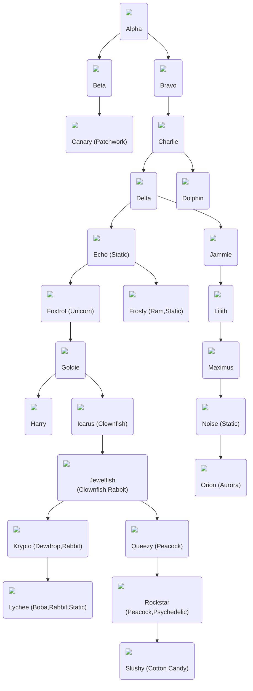

# Peridot Family Tree

```mermaid
flowchart

alpha-1("<img src='./assets/Peridots/alpha-1.jpg'> <br /> Alpha")
alpha-1 --> beta-2("<img src='./assets/Peridots/beta-2.jpg'> <br /> Beta")
alpha-1 --> bravo-2("<img src='./assets/Peridots/bravo-2.jpg'> <br /> Bravo")
beta-2 --> canary-3("<img src='./assets/Peridots/canary-3.jpg'> <br /> Canary (Patchwork)")
bravo-2 --> charlie-3("<img src='./assets/Peridots/charlie-3.jpg'> <br /> Charlie")
charlie-3 --> delta-4("<img src='./assets/Peridots/delta-4.jpg'> <br /> Delta")
charlie-3 --> dolphin-4("<img src='./assets/Peridots/dolphin-4.jpg'> <br /> Dolphin")
delta-4 --> echo-5("<img src='./assets/Peridots/echo-5.jpg'> <br /> Echo (Static)")
delta-4 --> jammie-5("<img src='./assets/Peridots/jammie-5.jpg'> <br /> Jammie")
echo-5 --> foxtrot-6("<img src='./assets/Peridots/foxtrot-6.jpg'> <br /> Foxtrot (Unicorn)")
echo-5 --> frosty-6("<img src='./assets/Peridots/frosty-6.jpg'> <br /> Frosty (Ram,Static)")
jammie-5 --> lilith-6("<img src='./assets/Peridots/lilith-6.jpg'> <br /> Lilith")
foxtrot-6 --> goldie-7("<img src='./assets/Peridots/goldie-7.jpg'> <br /> Goldie")
lilith-6 --> maximus-7("<img src='./assets/Peridots/maximus-7.jpg'> <br /> Maximus")
goldie-7 --> harry-8("<img src='./assets/Peridots/harry-8.jpg'> <br /> Harry")
goldie-7 --> icarus-8("<img src='./assets/Peridots/icarus-8.jpg'> <br /> Icarus (Clownfish)")
maximus-7 --> noise-8("<img src='./assets/Peridots/noise-8.jpg'> <br /> Noise (Static)")
icarus-8 --> jewelfish-9("<img src='./assets/Peridots/jewelfish-9.jpg'> <br /> Jewelfish (Clownfish,Rabbit)")
noise-8 --> orion-9("<img src='./assets/Peridots/orion-9.jpg'> <br /> Orion (Aurora)")
jewelfish-9 --> krypto-10("<img src='./assets/Peridots/krypto-10.jpg'> <br /> Krypto (Dewdrop,Rabbit)")
jewelfish-9 --> queezy-10("<img src='./assets/Peridots/queezy-10.jpg'> <br /> Queezy (Peacock)")
krypto-10 --> lychee-11("<img src='./assets/Peridots/lychee-11.jpg'> <br /> Lychee (Boba,Rabbit,Static)")
queezy-10 --> rockstar-11("<img src='./assets/Peridots/rockstar-11.jpg'> <br /> Rockstar (Peacock,Psychedelic)")
rockstar-11 --> slushy-12("<img src='./assets/Peridots/slushy-12.jpg'> <br /> Slushy (Cotton Candy)")
```
