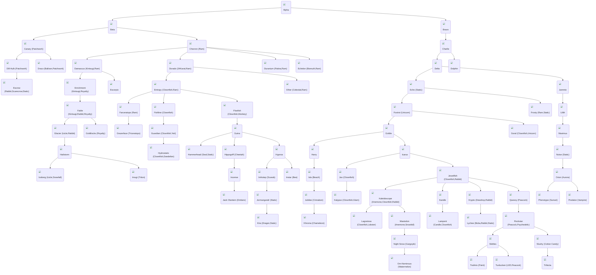

# Peridot Family Tree

```mermaid
flowchart

alpha-1("<img src='./assets/Peridots/alpha-1.jpg'> <br /> Alpha")
alpha-1 --> beta-2("<img src='./assets/Peridots/beta-2.jpg'> <br /> Beta")
alpha-1 --> bravo-2("<img src='./assets/Peridots/bravo-2.jpg'> <br /> Bravo")
beta-2 --> canary-3("<img src='./assets/Peridots/canary-3.jpg'> <br /> Canary (Patchwork)")
beta-2 --> chevron-3("<img src='./assets/Peridots/chevron-3.jpg'> <br /> Chevron (Ram)")
bravo-2 --> charlie-3("<img src='./assets/Peridots/charlie-3.jpg'> <br /> Charlie")
canary-3 --> dill-hulk-4("<img src='./assets/Peridots/dill-hulk-4.jpg'> <br /> Dill-Hulk (Patchwork)")
canary-3 --> draco-4("<img src='./assets/Peridots/draco-4.jpg'> <br /> Draco (Balloon,Patchwork)")
charlie-3 --> delta-4("<img src='./assets/Peridots/delta-4.jpg'> <br /> Delta")
charlie-3 --> dolphin-4("<img src='./assets/Peridots/dolphin-4.jpg'> <br /> Dolphin")
chevron-3 --> damascus-4("<img src='./assets/Peridots/damascus-4.jpg'> <br /> Damascus (Kintsugi,Ram)")
chevron-3 --> dorado-4("<img src='./assets/Peridots/dorado-4.jpg'> <br /> Dorado (24Karat,Ram)")
chevron-3 --> duranium-4("<img src='./assets/Peridots/duranium-4.jpg'> <br /> Duranium (Patina,Ram)")
chevron-3 --> echelon-4("<img src='./assets/Peridots/echelon-4.jpg'> <br /> Echelon (Bismuth,Ram)")
damascus-4 --> enrichment-5("<img src='./assets/Peridots/enrichment-5.jpg'> <br /> Enrichment (Kintsugi,Royalty)")
damascus-4 --> escorpio-5("<img src='./assets/Peridots/escorpio-5.jpg'> <br /> Escorpio")
delta-4 --> echo-5("<img src='./assets/Peridots/echo-5.jpg'> <br /> Echo (Static)")
delta-4 --> jammie-5("<img src='./assets/Peridots/jammie-5.jpg'> <br /> Jammie")
dill-hulk-4 --> escrow-5("<img src='./assets/Peridots/escrow-5.jpg'> <br /> Escrow (Rabbit,Scarecrow,Static)")
dorado-4 --> entropy-5("<img src='./assets/Peridots/entropy-5.jpg'> <br /> Entropy (Clownfish,Ram)")
dorado-4 --> ether-5("<img src='./assets/Peridots/ether-5.jpg'> <br /> Ether (Celestial,Ram)")
echo-5 --> foxtrot-6("<img src='./assets/Peridots/foxtrot-6.jpg'> <br /> Foxtrot (Unicorn)")
echo-5 --> frosty-6("<img src='./assets/Peridots/frosty-6.jpg'> <br /> Frosty (Ram,Static)")
enrichment-5 --> fable-6("<img src='./assets/Peridots/fable-6.jpg'> <br /> Fable (Kintsugi,Rabbit,Royalty)")
entropy-5 --> farceratops-6("<img src='./assets/Peridots/farceratops-6.jpg'> <br /> Farceratops (Ram)")
entropy-5 --> fishline-6("<img src='./assets/Peridots/fishline-6.jpg'> <br /> Fishline (Clownfish)")
entropy-5 --> floofish-6("<img src='./assets/Peridots/floofish-6.jpg'> <br /> Floofish (Clownfish,Monkey)")
jammie-5 --> lilith-6("<img src='./assets/Peridots/lilith-6.jpg'> <br /> Lilith")
fable-6 --> glacier-7("<img src='./assets/Peridots/glacier-7.jpg'> <br /> Glacier (Icicle,Rabbit)")
fable-6 --> goldilocks-7("<img src='./assets/Peridots/goldilocks-7.jpg'> <br /> Goldilocks (Royalty)")
farceratops-6 --> grazerface-7("<img src='./assets/Peridots/grazerface-7.jpg'> <br /> Grazerface (Triceratops)")
fishline-6 --> guardian-7("<img src='./assets/Peridots/guardian-7.jpg'> <br /> Guardian (Clownfish,Yeti)")
floofish-6 --> guina-7("<img src='./assets/Peridots/guina-7.jpg'> <br /> Guina")
foxtrot-6 --> goldie-7("<img src='./assets/Peridots/goldie-7.jpg'> <br /> Goldie")
foxtrot-6 --> goral-7("<img src='./assets/Peridots/goral-7.jpg'> <br /> Goral (Clownfish,Unicorn)")
lilith-6 --> maximus-7("<img src='./assets/Peridots/maximus-7.jpg'> <br /> Maximus")
glacier-7 --> hailstorm-8("<img src='./assets/Peridots/hailstorm-8.jpg'> <br /> Hailstorm")
goldie-7 --> harry-8("<img src='./assets/Peridots/harry-8.jpg'> <br /> Harry")
goldie-7 --> icarus-8("<img src='./assets/Peridots/icarus-8.jpg'> <br /> Icarus")
guardian-7 --> hydrostatic-8("<img src='./assets/Peridots/hydrostatic-8.jpg'> <br /> Hydrostatic (Clownfish,Dandelion)")
guina-7 --> hammerhead-8("<img src='./assets/Peridots/hammerhead-8.jpg'> <br /> Hammerhead (Seal,Static)")
guina-7 --> hippogriff-8("<img src='./assets/Peridots/hippogriff-8.jpg'> <br /> Hippogriff (Cheetah)")
guina-7 --> hypnos-8("<img src='./assets/Peridots/hypnos-8.jpg'> <br /> Hypnos")
maximus-7 --> noise-8("<img src='./assets/Peridots/noise-8.jpg'> <br /> Noise (Static)")
hailstorm-8 --> iceberg-9("<img src='./assets/Peridots/iceberg-9.jpg'> <br /> Iceberg (Icicle,Snowfall)")
hailstorm-8 --> imugi-9("<img src='./assets/Peridots/imugi-9.jpg'> <br /> Imugi (Triton)")
harry-8 --> isla-9("<img src='./assets/Peridots/isla-9.jpg'> <br /> Isla (Beach)")
hippogriff-8 --> incense-9("<img src='./assets/Peridots/incense-9.jpg'> <br /> Incense")
hypnos-8 --> imhotep-9("<img src='./assets/Peridots/imhotep-9.jpg'> <br /> Imhotep (Scarab)")
hypnos-8 --> instar-9("<img src='./assets/Peridots/instar-9.jpg'> <br /> Instar (Bee)")
icarus-8 --> jax-9("<img src='./assets/Peridots/jax-9.jpg'> <br /> Jax (Clownfish)")
icarus-8 --> jewelfish-9("<img src='./assets/Peridots/jewelfish-9.jpg'> <br /> Jewelfish (Clownfish,Rabbit)")
noise-8 --> orion-9("<img src='./assets/Peridots/orion-9.jpg'> <br /> Orion (Aurora)")
imhotep-9 --> jormungandr-10("<img src='./assets/Peridots/jormungandr-10.jpg'> <br /> Jormungandr (Static)")
incense-9 --> jack-olantern-10("<img src='./assets/Peridots/jack-olantern-10.jpg'> <br /> Jack Olantern (Embers)")
isla-9 --> jubilee-10("<img src='./assets/Peridots/jubilee-10.jpg'> <br /> Jubilee (Cinnabon)")
jax-9 --> kalypso-10("<img src='./assets/Peridots/kalypso-10.jpg'> <br /> Kalypso (Clownfish,Glam)")
jewelfish-9 --> kaleidoscope-10("<img src='./assets/Peridots/kaleidoscope-10.jpg'> <br /> Kaleidoscope (Anemone,Clownfish,Rabbit)")
jewelfish-9 --> kandle-10("<img src='./assets/Peridots/kandle-10.jpg'> <br /> Kandle")
jewelfish-9 --> krypto-10("<img src='./assets/Peridots/krypto-10.jpg'> <br /> Krypto (Dewdrop,Rabbit)")
jewelfish-9 --> queezy-10("<img src='./assets/Peridots/queezy-10.jpg'> <br /> Queezy (Peacock)")
orion-9 --> phenotype-10("<img src='./assets/Peridots/phenotype-10.jpg'> <br /> Phenotype (Sunset)")
orion-9 --> predator-10("<img src='./assets/Peridots/predator-10.jpg'> <br /> Predator (Vampire)")
jormungandr-10 --> kira-11("<img src='./assets/Peridots/kira-11.jpg'> <br /> Kira (Dragon,Static)")
jubilee-10 --> khroma-11("<img src='./assets/Peridots/khroma-11.jpg'> <br /> Khroma (Chameleon)")
kaleidoscope-10 --> lagostosa-11("<img src='./assets/Peridots/lagostosa-11.jpg'> <br /> Lagostosa (Clownfish,Lobster)")
kaleidoscope-10 --> mastodon-11("<img src='./assets/Peridots/mastodon-11.jpg'> <br /> Mastodon (Anemone,Snowfall)")
kandle-10 --> lampent-11("<img src='./assets/Peridots/lampent-11.jpg'> <br /> Lampent (Candle,Clownfish)")
krypto-10 --> lychee-11("<img src='./assets/Peridots/lychee-11.jpg'> <br /> Lychee (Boba,Rabbit,Static)")
queezy-10 --> rockstar-11("<img src='./assets/Peridots/rockstar-11.jpg'> <br /> Rockstar (Peacock,Psychedelic)")
mastodon-11 --> night-snow-12("<img src='./assets/Peridots/night-snow-12.jpg'> <br /> Night Snow (Gargoyle)")
rockstar-11 --> skittles-12("<img src='./assets/Peridots/skittles-12.jpg'> <br /> Skittles")
rockstar-11 --> slushy-12("<img src='./assets/Peridots/slushy-12.jpg'> <br /> Slushy (Cotton Candy)")
night-snow-12 --> om-nominous-13("<img src='./assets/Peridots/om-nominous-13.jpg'> <br /> Om-Nominous (Watermelon)")
skittles-12 --> trailmix-13("<img src='./assets/Peridots/trailmix-13.jpg'> <br /> Trailmix (Paint)")
skittles-12 --> turducken-13("<img src='./assets/Peridots/turducken-13.jpg'> <br /> Turducken (LED,Peacock)")
slushy-12 --> trifecta-13("<img src='./assets/Peridots/trifecta-13.jpg'> <br /> Trifecta")
```

